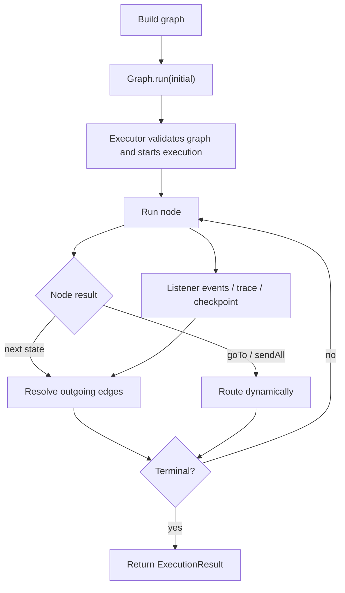
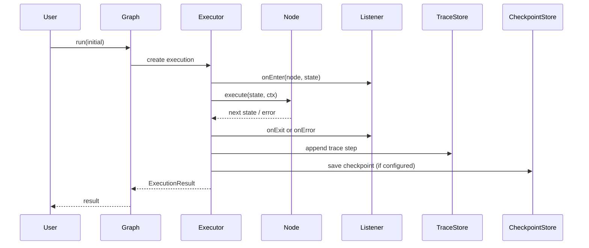

# TraceGraph

[](https://central.sonatype.com/artifact/site.tracegraph/tracegraph-core)
[](LICENSE)

TraceGraph is a JVM-native agent runtime for building typed execution graphs with durable state, retries, checkpoints, memory, and observability hooks.

---

Documentation languages: English (default) and 中文（Chinese AI-draft）。

- English README: [README.md](README.md)
- 中文: [README.zh.md](README.zh.md)

If you prefer Chinese docs, open the `docs` site and select `中文` in the navigation to view the AI-translated pages (machine drafts require review).

The project is aimed at teams that want graph-style orchestration on the JVM without giving up strong typing, testability, or production control. It is not trying to be a line-by-line clone of LangGraph. The focus here is reliability, debuggability, and clean integration with Java and Spring ecosystems.

## Contents

- [Why TraceGraph](#why-tracegraph)
- [Project Status](#project-status)
- [Modules](#modules)
- [Requirements](#requirements)
- [Installation](#installation)
- [Getting Started](#getting-started)
- [Choose Your Path](#choose-your-path)
- [Quick Start](#quick-start)
- [Execution Model](#execution-model)
- [Core Concepts](#core-concepts)
- [Runtime Features](#runtime-features)
- [Spring Boot Integration](#spring-boot-integration)
- [LLM Connectors](#llm-connectors)
- [Examples](#examples)
- [Documentation](#documentation)
- [Build and Test](#build-and-test)
- [Compatibility and Guarantees](#compatibility-and-guarantees)
- [FAQ](#faq)
- [Contributing](#contributing)

## Why TraceGraph

- Typed graph definitions with plain Java functions
- Deterministic execution paths and explicit state transitions
- Built-in support for retries, async nodes, and parallel fan-out
- Checkpointing and resume hooks for long-running flows
- Trace recording and replay support for debugging
- OpenTelemetry integration for production observability
- Spring Boot auto-configuration for application integration
- Connector modules for LLM-style adapters on the JVM

TraceGraph is a good fit when you want:

- graph-shaped orchestration with explicit control over node boundaries
- predictable state transitions that stay easy to test
- production hooks such as retries, checkpoints, trace replay, and OpenTelemetry
- a JVM-first library that stays friendly to ordinary Java and Spring idioms

TraceGraph is probably not the right fit when you want:

- a no-code orchestration UI
- hidden control flow driven mainly by prompts instead of application code
- a batteries-included hosted platform that owns runtime, storage, and tracing for you

## Project Status

TraceGraph is under active development.

- `tracegraph-core` is the most mature module and already covers core graph construction and execution behavior.
- `tracegraph-runtime`, `tracegraph-memory`, `tracegraph-observability`, and `tracegraph-spring-boot-starter` are implemented and tested, but are still evolving.
- `tracegraph-connectors` is intentionally early-stage and should be treated as experimental integration code.

Until the API settles, expect breaking changes between pre-1.0 releases.

## Modules

| Module | Purpose |
|---|---|
| `tracegraph-core` | Typed graphs, nodes, edges, execution results, retries, async nodes, and parallel execution primitives |
| `tracegraph-runtime` | Checkpoint store implementations and runtime-oriented resume behavior |
| `tracegraph-memory` | In-memory and file-backed memory store implementations |
| `tracegraph-observability` | OpenTelemetry listeners, trace recording, replay, diffing, and trace store implementations |
| `tracegraph-spring-boot-starter` | Spring Boot auto-configuration and web integration pieces |
| `tracegraph-connectors` | Connector adapters such as OpenAI and Anthropic HTTP clients |

## Requirements

- JDK 21
- Maven 3.9+

GitHub Actions is also configured around JDK 21, so local and CI environments should match.

## Installation

Pick the smallest module set that matches your use case:

```xml
<dependency>
    <groupId>site.tracegraph</groupId>
    <artifactId>tracegraph-core</artifactId>
    <version>0.3.0-SNAPSHOT</version>
</dependency>
```

Add supporting modules as needed:

- `tracegraph-runtime` for checkpoint persistence and resume flows
- `tracegraph-memory` for memory store implementations
- `tracegraph-observability` for traces, replay, and OpenTelemetry listeners
- `tracegraph-connectors` for LLM, prompt, structured output, and MCP adapters
- `tracegraph-rag` for retrieval and RAG helpers
- `tracegraph-spring-boot-starter` for Spring Boot auto-configuration

If you are consuming the repository before a stable public release is available, install from source:

```bash
mvn -B -ntp install
```

## Getting Started

Clone the repository and run the full verification build:

```bash
mvn -B -ntp verify
```

If Maven is picking up the wrong JDK locally, verify `mvn -version` and make sure `JAVA_HOME` points to a Java 21 installation.

The quickest way to get oriented is:

1. Build the repo with `mvn -B -ntp verify`.
2. Run `examples/quickstart` for a small pure-Java graph.
3. Move to `examples/spring-boot-app` if you want HTTP endpoints and autoconfiguration.
4. Add observability, replay, memory, or connectors module-by-module instead of all at once.

## Choose Your Path

Start with the narrowest setup that solves the problem you have today:

- Choose `tracegraph-core` if you want typed orchestration, retries, routing, and parallel execution in plain Java.
- Add `tracegraph-runtime` if executions must survive process boundaries or resume from checkpoints.
- Add `tracegraph-memory` if nodes need scoped cross-run memory.
- Add `tracegraph-observability` if you need trace replay, debugging artifacts, or OpenTelemetry spans.
- Add `tracegraph-connectors` if graph nodes need LLM, prompt, structured output, or MCP helpers.
- Add `tracegraph-rag` if you want retrieval and reranking utilities instead of assembling them from the SPIs yourself.
- Use `tracegraph-spring-boot-starter` when the runtime should plug into a Spring Boot application with minimal wiring.

For many teams, the best adoption sequence is `core` first, `observability` second, then only the storage and connector modules you actually need.

## Quick Start

The core API uses plain Java records and functions. A graph is assembled explicitly and returns a typed `ExecutionResult`.

```java
import io.tracegraph.core.ExecutionResult;
import io.tracegraph.core.Graph;

record OrderState(String id, boolean valid, boolean charged, boolean shipped) {
    OrderState withValid(boolean value) {
        return new OrderState(id, value, charged, shipped);
    }

    OrderState withCharged(boolean value) {
        return new OrderState(id, valid, value, shipped);
    }

    OrderState withShipped(boolean value) {
        return new OrderState(id, valid, charged, value);
    }
}

Graph<OrderState> graph = Graph.<OrderState>builder()
        .node("validate", (state, ctx) -> state.withValid(true))
        .node("charge", (state, ctx) -> state.withCharged(true))
        .node("ship", (state, ctx) -> state.withShipped(true))
        .entry("validate")
        .edge("validate", "charge", OrderState::valid)
        .edge("charge", "ship")
        .terminal("ship")
        .build();

ExecutionResult<OrderState> result = graph.run(
        new OrderState("o-1", false, false, false)
);
```

For the runtime and integration modules, the same graph can be extended with durability and observability:

```java
Graph<OrderState> durableGraph = Graph.<OrderState>builder()
        .node("validate", (state, ctx) -> state.withValid(true))
        .node("charge", (state, ctx) -> state.withCharged(true), RetryPolicy.fixed(3, Duration.ofMillis(100)))
        .entry("validate")
        .edge("validate", "charge", OrderState::valid)
        .terminal("charge")
        .traceRecorder(new RecordingTraceRecorder(new InMemoryTraceStore()))
        .listener(OtelNodeListener.usingGlobal())
        .build();
```

## Execution Model

TraceGraph keeps execution semantics explicit:

1. A graph starts at one named entry node.
2. Each node receives the current typed state plus a `Context`.
3. The node returns a new state, or a routing result in the case of a routing node.
4. The executor resolves outgoing edges, retries if configured, and records listener or trace events.
5. Execution stops when a terminal node is reached, an interrupt is requested, or an error ends the run.

There is no hidden scheduler or opaque agent loop behind `Graph.run(...)`. The graph definition is the control flow.

## Diagrams

These Mermaid diagrams show the two main viewpoints of TraceGraph: how a run flows through the executor, and how the runtime pieces interact around a single execution.





## Retries

Attach a `RetryPolicy` per node, or set a graph default. The executor handles backoff and emits `NodeListener.onRetry`.

```java
RetryPolicy policy = RetryPolicy.exponential(
        3,
        Duration.ofMillis(100),
        2.0,
        Duration.ofSeconds(2)
);

Graph<OrderState> graph = Graph.<OrderState>builder()
        .node("charge", chargeNode, policy)
        .entry("charge").terminal("charge")
        .build();
```

`Error` and `InterruptedException` always short-circuit retries. Use `ctx.idempotencyKey()` inside the node for your own dedup.

## Replay

Plug in a `TraceRecorder` and replay any past execution step-by-step.

```java
TraceStore store = new InMemoryTraceStore();    // or JsonFileTraceStore / JdbcTraceStore
Graph<OrderState> graph = Graph.<OrderState>builder()
        /* ... */
        .traceRecorder(new RecordingTraceRecorder(store))
        .build();

ExecutionResult<OrderState> r = graph.run(seed);

ExecutionTrace<OrderState> trace =
        (ExecutionTrace<OrderState>) store.load(r.executionId()).orElseThrow();

Replayer<OrderState> replay = Replayer.of(trace);
for (int i = 0; i < replay.stepCount(); i++) {
    TraceStep<OrderState> step = replay.stepAt(i);
    System.out.printf("%d %s : %s -> %s%n",
            step.index(), step.nodeName(), step.before(), step.after());
}

// Re-execute from a chosen step against a (possibly modified) graph
ReplayRunner<OrderState> runner = ReplayRunner.of(trace, graph);
ExecutionResult<OrderState> fork = runner.reRunFrom(1);
// fork.executionId() != r.executionId(); the new trace records forkedFromExecutionId/forkedFromStepIndex
```

## Async + parallel

```java
Graph<OrderState> graph = Graph.<OrderState>builder()
        .asyncNode("score", (state, ctx) -> CompletableFuture.supplyAsync(() -> score(state)))
        .parallel("enrich",
                List.of(
                        (s, ctx) -> withCustomerProfile(s),
                        (s, ctx) -> withFraudCheck(s),
                        (s, ctx) -> withInventory(s)
                ),
                (input, branchResults) -> {
                    OrderState merged = input;
                    for (OrderState branch : branchResults) {
                        merged = merged.merge(branch);
                    }
                    return merged;
                })
        .entry("score").edge("score", "enrich").terminal("enrich")
        .build();
```

The default executor is virtual-thread-per-task, lazily created per `run` and shut down on completion. First-by-declaration-order failure wins inside `parallel(...)`.

## Observability (OpenTelemetry)

```java
Graph<OrderState> graph = Graph.<OrderState>builder()
        /* ... */
        .listener(OtelNodeListener.usingGlobal())
        .build();
```

One span per node, retries as span events on the same span, errors set `StatusCode.ERROR`. State diffs flow as `state` span events with rendered before/after attributes (renderer is pluggable via `StateRenderer`). Compose multiple listeners with `Listeners.compose(...)`.

## Core Concepts

### Graphs

`Graph<S>` is the main runtime abstraction. You define:

- named nodes
- directed edges
- an entry node
- one or more terminal nodes
- optional retry, checkpoint, trace, listener, memory, and executor behavior

### Nodes

TraceGraph supports several execution styles:

- synchronous nodes via `node(...)`
- asynchronous nodes via `asyncNode(...)`
- parallel branches via `parallel(...)`
- parallel async branches via `parallelAsync(...)`

### Execution Results

Execution returns an `ExecutionResult<S>` that includes:

- `executionId`
- `finalState`
- `path`
- `status`
- `error`

This makes the runtime straightforward to test and inspect.

## Runtime Features

### Retries

Retry policies can be applied per-node or as a graph default. The runtime supports fixed and exponential backoff strategies.

### Checkpointing and Resume

Graphs can be wired to a `CheckpointStore` and resumed later by execution ID:

```java
Optional<ExecutionResult<OrderState>> resumed = graph.resume("execution-123");
```

The `tracegraph-runtime` module includes an `InMemoryCheckpointStore`, and the extension points are designed for external durable stores such as JDBC-backed implementations.

### Memory

The memory SPI supports scoped key-value persistence for agent-style workflows. Current implementations include:

- `InMemoryMemoryStore`
- `FileMemoryStore`

```java
MemoryStore memory = new InMemoryMemoryStore();
memory.put("session:demo", "customer", Map.of("tier", "gold"));
```

For durable storage, the JDBC implementation can be created from a `DataSource` and initialized once:

```java
JdbcMemoryStore store = JdbcMemoryStore.of(dataSource);
store.initSchema();
```

### Observability and Replay

The observability module includes:

- OpenTelemetry node listeners
- state rendering hooks
- trace recording
- in-memory and JSON file trace stores
- replay and trace diff utilities

This is useful for post-run inspection, debugging, and deterministic replay workflows.

```java
TraceStore store = new InMemoryTraceStore();
TraceRecorder recorder = new RecordingTraceRecorder(store);
Graph<OrderState> graph = Graph.<OrderState>builder()
        .traceRecorder(recorder)
        .build();
```

## Spring Boot Integration

The Spring Boot starter auto-configures default beans for:

- `NodeListener`
- `CheckpointStore`
- `TraceRecorder`
- `MemoryStore`

That gives applications a clean way to override infrastructure concerns while keeping graph code simple.

```yaml
tracegraph:
        web:
                enabled: true
        memory:
                jdbc:
                        enabled: true
                        init-schema: true
        llm:
                enabled: false
```

The starter also exposes trace inspection endpoints once the observability module is present:

- `GET /tracegraph/traces`
- `GET /tracegraph/traces/{id}`
- `GET /tracegraph/traces/{a}/diff/{b}`
- `DELETE /tracegraph/traces/{id}`

## LLM Connectors

The connectors module ships thin HTTP adapters for OpenAI-compatible and Anthropic-compatible chat APIs.

```java
LlmClient client = OpenAiLlmClient.builder()
        .apiKey(System.getenv("OPENAI_API_KEY"))
        .build();

LlmResponse response = client.complete(LlmRequest.builder()
        .model("gpt-4.1-mini")
        .messages(List.of(ChatMessage.user("Summarize the graph state")))
        .build());
```

The connector layer is intentionally low-level. It is meant to give graph nodes clean Java types and test seams rather than hide provider differences completely.

## Examples

The repository includes small runnable examples for common adoption paths:

- `examples/quickstart` for the smallest graph setup
- `examples/spring-boot-app` for starter-based HTTP integration
- `examples/rag-agent` for retrieval-augmented flows
- `examples/react-agent` for ReAct-style tool use
- `examples/hitl-approval` for human-in-the-loop approval patterns

Run them directly from the repo root:

```bash
mvn -f examples/quickstart/pom.xml exec:java
mvn -f examples/spring-boot-app/pom.xml spring-boot:run
mvn -f examples/rag-agent/pom.xml exec:java
mvn -f examples/react-agent/pom.xml exec:java
mvn -f examples/hitl-approval/pom.xml exec:java
```

## Documentation

Besides this README, there is a fuller docs site source under `docs/site/docs`:

- `docs/site/docs/index.md` for the high-level landing page
- `docs/site/docs/getting-started` for installation and quickstart material
- `docs/site/docs/concepts` for graph, routing, memory, observability, and RAG concepts
- `docs/site/docs/cookbook` for example-driven patterns

The example READMEs under `examples/*/README.md` are also worth using as runnable reference material.

## Build and Test

Useful local commands:

```bash
mvn test
mvn verify
```

The build uses strict compiler settings, including warnings-as-errors via the Maven compiler plugin.

For local verification on Windows, make sure Maven is actually running on Java 21:

```bash
mvn -version
```

If that reports Java 17 or lower, update `JAVA_HOME` before running the build.

## Compatibility and Guarantees

Current expectations for users:

- JDK 21 is required for build and test.
- Public APIs are still pre-1.0 and may change between releases.
- `tracegraph-core` is the safest module to build against first.
- connector modules should be treated as integration helpers, not a provider-abstraction promise.
- generated docs and examples aim to track main branch closely, but release artifacts are the real compatibility boundary.

## CI/CD

GitHub Actions is configured for:

- cross-platform CI on Ubuntu and Windows
- pull request security review for dependency changes
- scheduled and main-branch CodeQL analysis
- weekly Dependabot updates for Maven and GitHub Actions
- automated release drafting
- release publishing to GitHub Packages
- GitHub Release creation for tagged versions

Release tags follow the `v*` convention, for example:

```text
v0.1.0
```

## Versioning and Publishing

The project is currently in pre-1.0 development and uses snapshot versions in source control.

Release automation is configured in GitHub Actions. If you are consuming the project before a public package distribution is finalized, the safest option is to build from source and install locally:

```bash
mvn install
```

## Roadmap

Near-term priorities are:

- hardening the graph runtime API
- improving durability and checkpoint integrations
- expanding observability and replay ergonomics
- maturing Spring Boot integration
- stabilizing connector interfaces

## FAQ

### Is TraceGraph a LangGraph clone?

No. It borrows the graph-runtime idea space, but it is intentionally designed around Java typing, explicit runtime control, and JVM integration points.

### Can I use it without LLMs?

Yes. The core runtime has no dependency on model providers. You can use it for any typed workflow or orchestration graph.

### Can I use it with Spring Boot only?

Yes, but the starter is additive. Under the hood you are still working with the same `Graph<S>` runtime and SPI abstractions.

### Does it support durable resume today?

Yes, through the checkpoint SPI and runtime module, but the durability story is still evolving and should be treated as pre-1.0 infrastructure.

## Contributing

Issues and pull requests are welcome.

When contributing:

1. Use JDK 21 and Maven 3.9+.
2. Run `mvn -B -ntp verify` before opening a pull request.
3. Keep changes scoped and add or update tests when behavior changes.
4. Prefer small, reviewable pull requests over broad refactors.

## License

This project is licensed under the [Apache License 2.0](LICENSE).
