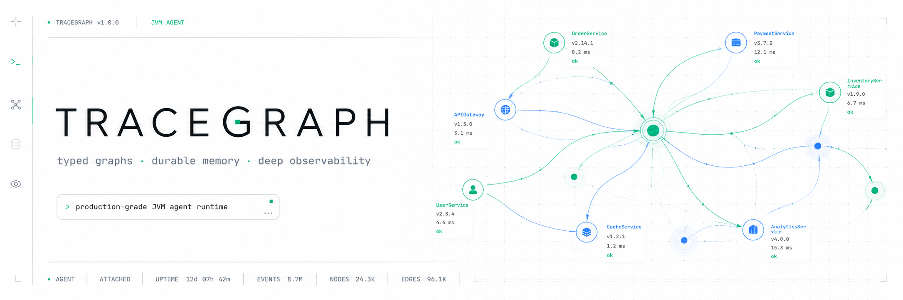

# TraceGraph（中文完整版，面向初学者）

> 本文为中文完整说明。内容面向对代理（Agent）、大语言模型（LLM）和执行图不熟悉的读者，详细解释核心概念与使用方法。

## 目录（快速导航）
- 为什么使用 TraceGraph
- 基本概念：代理、LLM、执行图、节点、边、状态、上下文
- 快速开始：安装、构建、运行示例
- 深入指南：重试、检查点、并行、内存、可观测性（OTel）
- 集成：Spring Boot、连接器（OpenAI / Anthropic）
- 例子与演练
- 常见问题与贡献指南

## 一、为什么使用 TraceGraph

如果你想在 JVM 环境中构建可编程、可测试、可恢复的长时工作流（例如任务流水线、对话代理、微服务编排），TraceGraph 提供了一套声明式的、类型安全的执行图抽象。相比把控制流写成大量异步/回调代码，TraceGraph 用「命名节点 + 有向边」把流程拆成独立可测的步骤：每个节点是一个纯函数（或异步函数），输入为当前状态，输出为下一状态。

主要优势：
- 强类型（Java records）保证状态结构明确，便于单元测试。
- 节点粒度清晰，便于插入重试、回退与审计逻辑。
- 内置检查点与恢复（resume），适合长期或可中断的流程。
- 可插拔的内存存储与观察器，便于调试、回放与监控。

## 二、基础概念（面向初学者）

### 1. 代理（Agent）与 LLM：
- Agent（代理）是一个能够接收输入、做出决策并采取动作（可能调用外部工具/模型）的程序。现代 Agent 常用大语言模型（LLM）来生成下一步动作或决策。TraceGraph 并不是 LLM 本身，而是一个将 LLM 与业务逻辑、安全、重试与可观测性结合的执行框架。

### 2. 执行图（Graph）
- Graph 是有向图：节点（Node）是步骤，边（Edge）定义步骤之间如何流转。Graph 有一个入口节点（entry）和一个或多个终止节点（terminal）。

### 3. 节点（Node）
- 节点接收当前状态 `S` 和执行上下文 `Context`，并返回新的状态或路由指令（例如 `goTo`、`sendAll`）。节点可以是同步函数（立即返回）或异步返回 `CompletableFuture`。

### 4. 状态（State）
- `S` 通常是不可变的 Java record。每个节点返回修改后的新状态，避免共享可变状态带来的并发问题。

### 5. 上下文（Context）
- `Context` 提供运行时工具：访问 `MemoryStore`、获取 `idempotencyKey()`、记录 LLM token 使用量、请求中断或报告进度等。

## 三、快速开始（在本机运行）

先决条件：
- 安装 JDK 21，Maven 3.9+

克隆并构建：

```bash
git clone https://github.com/kimhongzhang323/TraceGraph.git
cd TraceGraph
mvn -B -ntp verify
```

运行快速示例（examples/quickstart）：

```bash
mvn -f examples/quickstart/pom.xml exec:java
```

简单示例代码（概念）：

```java
record OrderState(String id, boolean valid, boolean charged, boolean shipped) {
        OrderState withValid(boolean v) { return new OrderState(id, v, charged, shipped); }
        OrderState withCharged(boolean c) { return new OrderState(id, valid, c, shipped); }
        OrderState withShipped(boolean s) { return new OrderState(id, valid, charged, s); }
}

Graph<OrderState> graph = Graph.<OrderState>builder()
        .node("validate", (state, ctx) -> state.withValid(true))
        .node("charge", (state, ctx) -> state.withCharged(true))
        .entry("validate")
        .edge("validate", "charge", OrderState::valid)
        .terminal("charge")
        .build();

ExecutionResult<OrderState> r = graph.run(new OrderState("o1", false, false, false));
```

## 四、深入指南（核心功能）

### 1. 重试（Retry）
- 每个节点可以配置 `RetryPolicy`（固定或指数回退）。当节点抛出异常时，执行器会根据策略重试。注意：`Error` 与 `InterruptedException` 会跳过重试，直接短路。

### 2. 检查点（Checkpoint）与恢复（Resume）
- 检查点记录执行进度（在节点成功退出后写入），以便进程崩溃或需要暂停时重新恢复。恢复时，执行器会从 `lastCompletedNode` 继续，并重新评估其出边：因此节点需要是具备幂等性的或使用 `Context.idempotencyKey()` 做去重。

### 3. 并行与发送（Parallel / SendAll）
- `parallel(...)` 启动多个分支并行执行，使用合并器（merger）将多个分支的状态合并回主状态。
- `sendAll(...)` 允许在运行时动态生成 N 个发送目标和负载，并并行执行。

### 4. MemoryStore（跨执行内存）
- `MemoryStore` 是一个按 `scope` 组织的键值存储，适用于跨执行的共享数据（会话、缓存、外部上下文）。实现包括 `InMemoryMemoryStore`、`FileMemoryStore`（JSON，原子写入）与 `JdbcMemoryStore`。

### 5. 可观测性（Observability）
- 通过 `NodeListener` SPI（例如 `OtelNodeListener`）发送节点进入/退出事件到 OpenTelemetry。重试以 span 事件记录，状态变更以 `state` 事件记录，方便在 APM 中查看。

### 6. Trace 记录与回放（Replay）
- `TraceRecorder` 与 `TraceStore`（内存或 JSON 文件）保存执行步（TraceStep），可用 `Replayer`/`ReplayRunner` 从任意步骤重新执行以调试或对比差异（`TraceDiff`）。

## 五、与 LLM/工具集成（Connectors）

TraceGraph 保持对 LLM 的低耦合。`LlmClient` 是最小的抽象（`complete()`/`stream()`），`tracegraph-connectors` 提供 OpenAI 与 Anthropic 的实现以及 `MockLlmClient` 用于测试。使用 `ChatNode` 将 LLM 调用封装为图节点。

注意：LLM 调用会消耗令牌（tokens）并产生费用，TraceGraph 提供 `NodeListener.onUsage` 钩子来采集并上报使用情况。

## 六、Spring Boot 与 Web 集成

`tracegraph-spring-boot-starter` 提供条件自动装配：默认注入 noop SPI bean（`NodeListener`、`CheckpointStore`、`TraceRecorder`、`MemoryStore`）。当你希望查看追踪并通过 HTTP 操作时，可以启用 `TraceStore` 并使用内置的 `TraceController`：

- `GET /tracegraph/traces` 列表
- `GET /tracegraph/traces/{id}` 获取单个执行追踪
- `GET /tracegraph/traces/{a}/diff/{b}` 比较两个追踪差异
- `POST /tracegraph/traces/{id}/replay?step=N` 从步骤 N 回放（需要在服务器上配置相应的 Graph Bean）

## 七、示例（学习路径）

1. `examples/quickstart`：最小示例，先运行并观察输出。
2. `examples/spring-boot-app`：Spring 集成示例，运行并访问 `/tracegraph/traces`。
3. `examples/rag-agent`、`examples/react-agent`：展示如何把检索与工具调用组合到代理中。

## 八、术语建议（统一翻译）

- Trace / ExecutionTrace：建议翻译为 “追踪”。（已统一为“追踪”）
- Node：节点
- Edge：边
- Context：上下文
- MemoryStore：内存存储

## 九、构建与本地预览文档

构建 Java 项目：

```bash
mvn -B -ntp verify
```

构建文档站点（本地预览）：

```bash
pip install mkdocs mkdocs-material
mkdocs serve -f docs/site/mkdocs.yml
# 浏览 http://127.0.0.1:8000
```

## 十、关于 CI 部署失败（你可能遇到的 `403` 错误）

如果在通过 `peaceiris/actions-gh-pages@v4` 部署时出现 `remote: Permission to <repo> denied to github-actions[bot].`，通常是因为仓库的 Actions 写入权限受限。解决方法：

1. 仓库设置 > Actions > General > Workflow permissions：选择 **Read and write permissions**。这允许 `GITHUB_TOKEN` 写入分支。
2. 如果你不想授予全权限，创建一个个人访问令牌（PAT）并把它作为仓库 Secret（例如 `GH_PAGES_PAT`），然后在 workflow 中使用 `github_token: ${{ secrets.GH_PAGES_PAT }}`。PAT 需要 `repo` 权限来推送分支。

我已在 workflow 中添加 `permissions: contents: write` 与说明注记；如果仓库仍然拒绝，请按上面步骤检查设置或使用 PAT。

## 十一、贡献指南

欢迎提交 PR 或 Issue。在提交代码前，请确保运行 `mvn verify` 并通过所有测试。
