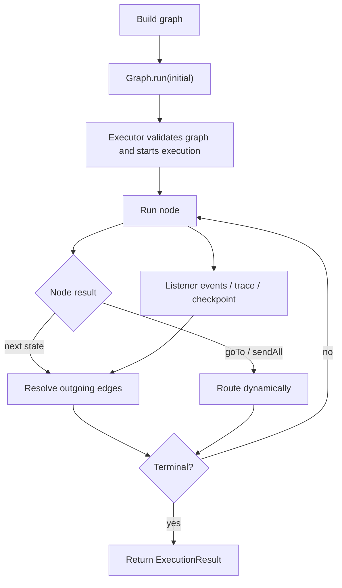
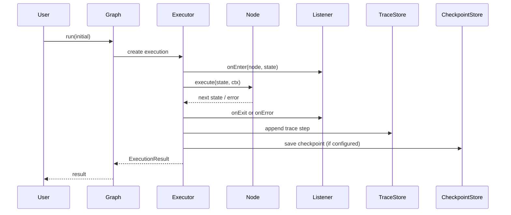

# TraceGraph

[](https://central.sonatype.com/artifact/site.tracegraph/tracegraph-core)
[](LICENSE)

TraceGraph 是一个原生于 JVM 的代理（Agent）运行时，用于构建具有持久化状态、重试、检查点、内存以及可观测性钩子的类型化执行图（typed execution graphs）。

---

文档语言: English (默认) 和 中文（中文由 AI 起草）。

- 英文文档: [README.md](README.md)
- 中文文档: [README.zh.md](README.zh.md)

如果您更喜欢中文文档，请打开 `docs` 站点并在导航栏选择 `中文` 以查看 AI 翻译的页面（机器翻译草稿可能需要人工审阅）。

该项目面向希望在 JVM 上实现图状编排，同时不放弃强类型、可测试性或生产级控制的团队。它并不打算逐行克隆 LangGraph。这里的重点是可靠性、可调试性，以及与 Java 和 Spring 生态系统的干净集成。

## 目录

- [为什么使用 TraceGraph](#为什么使用-tracegraph)
- [项目状态](#项目状态)
- [模块概览](#模块概览)
- [环境要求](#环境要求)
- [安装指南](#安装指南)
- [快速开始](#快速开始)
- [选择你的路径](#选择你的路径)
- [快速入门示例](#快速入门示例)
- [执行模型](#执行模型)
- [核心概念](#核心概念)
- [运行时特性](#运行时特性)
- [Spring Boot 集成](#spring-boot-集成)
- [LLM 连接器](#llm-连接器)
- [示例](#示例)
- [文档](#文档)
- [构建与测试](#构建与测试)
- [兼容性与保证](#兼容性与保证)
- [常见问题 (FAQ)](#常见问题-faq)
- [贡献指南](#贡献指南)

## 为什么使用 TraceGraph

- 使用普通 Java 函数定义类型化的图
- 确定性的执行路径与显式的状态转换
- 内置支持重试、异步节点和并行扇出（fan-out）
- 适用于长时间运行流程的检查点与恢复钩子
- 用于调试的追踪记录与回放支持
- 集成 OpenTelemetry 用于生产级可观测性
- 用于应用集成的 Spring Boot 自动配置
- 在 JVM 上为 LLM 适配器提供连接器模块

当您遇到以下情况时，TraceGraph 是一个很好的选择：

- 需要图状编排并对节点边界有显式控制
- 需要可预测且易于测试的状态转换
- 需要生产级钩子，如重试、检查点、追踪回放和 OpenTelemetry
- 需要一个优先考虑 JVM、且对普通 Java 和 Spring 习惯用法友好的库

当您想要以下功能时，TraceGraph 可能不是最合适的选择：

- 一个无代码（no-code）的编排 UI
- 主要由提示词（prompts）而非应用程序代码驱动的隐藏控制流
- 一个为您包办运行时、存储和追踪的“开箱即用”托管平台

## 项目状态

TraceGraph 正在积极开发中。

- `tracegraph-core` 是最成熟的模块，已经涵盖了核心的图构建和执行行为。
- `tracegraph-runtime`、`tracegraph-memory`、`tracegraph-observability` 和 `tracegraph-spring-boot-starter` 已实现并经过测试，但仍在不断演进。
- `tracegraph-connectors` 处于非常早期的阶段，应被视为实验性的集成代码。

在 API 稳定之前，预计在 1.0 版本之前的版本中会有破坏性变更。

## 模块概览

| 模块 | 用途 |
|---|---|
| `tracegraph-core` | 类型化的图、节点、边、执行结果、重试、异步节点以及并行执行原语 |
| `tracegraph-runtime` | 检查点存储实现及面向运行时的恢复行为 |
| `tracegraph-memory` | 基于内存和文件的存储实现 |
| `tracegraph-observability` | OpenTelemetry 监听器、追踪记录、回放、差异对比以及追踪存储实现 |
| `tracegraph-spring-boot-starter` | Spring Boot 自动配置和 Web 集成组件 |
| `tracegraph-connectors` | OpenAI 和 Anthropic 等 HTTP 客户端的连接器适配器 |

## 环境要求

- JDK 21
- Maven 3.9+

GitHub Actions 也配置为基于 JDK 21 运行，因此本地和 CI 环境应保持一致。

## 安装指南

选择最符合您用例的最小模块集：

```xml
<dependency>
    <groupId>site.tracegraph</groupId>
    <artifactId>tracegraph-core</artifactId>
    <version>0.3.0-SNAPSHOT</version>
</dependency>
```

根据需要添加支持模块：

- `tracegraph-runtime`: 用于检查点持久化和恢复流程
- `tracegraph-memory`: 用于内存存储实现
- `tracegraph-observability`: 用于追踪、回放和 OpenTelemetry 监听器
- `tracegraph-connectors`: 用于 LLM、提示词、结构化输出和 MCP 适配器
- `tracegraph-rag`: 用于检索和 RAG 辅助工具
- `tracegraph-spring-boot-starter`: 用于 Spring Boot 自动配置

如果您在稳定的公共版本发布之前使用此仓库，请从源码安装：

```bash
mvn -B -ntp install
```

## 快速开始

克隆仓库并运行完整的验证构建：

```bash
mvn -B -ntp verify
```

如果 Maven 在本地选择了错误的 JDK，请验证 `mvn -version` 并确保 `JAVA_HOME` 指向 Java 21 安装目录。

最快的了解方式是：

1. 使用 `mvn -B -ntp verify` 构建仓库。
2. 运行 `examples/quickstart` 查看一个小型的纯 Java 执行图。
3. 如果您需要 HTTP 端点和自动配置，请查看 `examples/spring-boot-app`。
4. 逐个模块添加可观测性、回放、内存或连接器，而不是一次性全部添加。

## 选择你的路径

从能解决您今天问题的最精简配置开始：

- 如果您想要在纯 Java 中进行类型化编排、重试、路由和并行执行，请选择 `tracegraph-core`。
- 如果执行必须跨越进程边界存活或从检查点恢复，请添加 `tracegraph-runtime`。
- 如果节点需要跨次运行的按作用域划分的内存，请添加 `tracegraph-memory`。
- 如果您需要追踪回放、调试产物或 OpenTelemetry span，请添加 `tracegraph-observability`。
- 如果图节点需要 LLM、提示词、结构化输出或 MCP 辅助工具，请添加 `tracegraph-connectors`。
- 如果您想要现成的检索和重排实用工具，而不是自己用 SPI 组装，请添加 `tracegraph-rag`。
- 当运行时需要以最少的连线工作插入到 Spring Boot 应用程序时，请使用 `tracegraph-spring-boot-starter`。

对于许多团队而言，最佳的采用顺序是先引入 `core`，然后是 `observability`，最后只引入您实际需要的存储和连接器模块。

## 快速入门示例

核心 API 使用普通的 Java record 和函数。图被显式地组装，并返回一个类型化的 `ExecutionResult`。

```java
import io.tracegraph.core.ExecutionResult;
import io.tracegraph.core.Graph;

record OrderState(String id, boolean valid, boolean charged, boolean shipped) {
    OrderState withValid(boolean value) {
        return new OrderState(id, value, charged, shipped);
    }

    OrderState withCharged(boolean value) {
        return new OrderState(id, valid, value, shipped);
    }

    OrderState withShipped(boolean value) {
        return new OrderState(id, valid, charged, value);
    }
}

Graph<OrderState> graph = Graph.<OrderState>builder()
        .node("validate", (state, ctx) -> state.withValid(true))
        .node("charge", (state, ctx) -> state.withCharged(true))
        .node("ship", (state, ctx) -> state.withShipped(true))
        .entry("validate")
        .edge("validate", "charge", OrderState::valid)
        .edge("charge", "ship")
        .terminal("ship")
        .build();

ExecutionResult<OrderState> result = graph.run(
        new OrderState("o-1", false, false, false)
);
```

对于运行时和集成模块，同一个图可以扩展以具备持久性和可观测性：

```java
Graph<OrderState> durableGraph = Graph.<OrderState>builder()
        .node("validate", (state, ctx) -> state.withValid(true))
        .node("charge", (state, ctx) -> state.withCharged(true), RetryPolicy.fixed(3, Duration.ofMillis(100)))
        .entry("validate")
        .edge("validate", "charge", OrderState::valid)
        .terminal("charge")
        .traceRecorder(new RecordingTraceRecorder(new InMemoryTraceStore()))
        .listener(OtelNodeListener.usingGlobal())
        .build();
```

## 执行模型

TraceGraph 保持执行语义的显式性：

1. 图从一个指定的入口节点 (entry) 开始。
2. 每个节点接收当前的类型化状态加上一个 `Context` (上下文)。
3. 节点返回一个新状态，或者在路由节点的情况下返回一个路由结果。
4. 执行器解析出边，如果配置了重试则进行重试，并记录监听器或追踪事件。
5. 当达到终止节点、请求中断或错误导致运行结束时，执行停止。

在 `Graph.run(...)` 背后没有隐藏的调度器或不透明的代理循环。图的定义即是控制流。

## 图表说明

这些 Mermaid 图展示了 TraceGraph 的两个主要视角：执行如何在执行器中流转，以及运行时各个部分如何围绕单次执行进行交互。





## 重试机制

可以为每个节点附加 `RetryPolicy`，或者将其设置为图的默认策略。执行器负责处理退避（backoff）并触发 `NodeListener.onRetry`。

```java
RetryPolicy policy = RetryPolicy.exponential(
        3,
        Duration.ofMillis(100),
        2.0,
        Duration.ofSeconds(2)
);

Graph<OrderState> graph = Graph.<OrderState>builder()
        .node("charge", chargeNode, policy)
        .entry("charge").terminal("charge")
        .build();
```

`Error` 和 `InterruptedException` 将始终短路跳过重试。在节点内部使用 `ctx.idempotencyKey()` 来实现您自己的去重逻辑。

## 追踪回放

接入 `TraceRecorder` 即可逐步回放任何过去的执行记录。

```java
TraceStore store = new InMemoryTraceStore();    // 或 JsonFileTraceStore / JdbcTraceStore
Graph<OrderState> graph = Graph.<OrderState>builder()
        /* ... */
        .traceRecorder(new RecordingTraceRecorder(store))
        .build();

ExecutionResult<OrderState> r = graph.run(seed);

ExecutionTrace<OrderState> trace =
        (ExecutionTrace<OrderState>) store.load(r.executionId()).orElseThrow();

Replayer<OrderState> replay = Replayer.of(trace);
for (int i = 0; i < replay.stepCount(); i++) {
    TraceStep<OrderState> step = replay.stepAt(i);
    System.out.printf("%d %s : %s -> %s%n",
            step.index(), step.nodeName(), step.before(), step.after());
}

// 针对一个(可能已修改的)图，从选定步骤重新执行
ReplayRunner<OrderState> runner = ReplayRunner.of(trace, graph);
ExecutionResult<OrderState> fork = runner.reRunFrom(1);
// fork.executionId() != r.executionId(); 新的追踪会记录 forkedFromExecutionId/forkedFromStepIndex
```

## 异步与并行

```java
Graph<OrderState> graph = Graph.<OrderState>builder()
        .asyncNode("score", (state, ctx) -> CompletableFuture.supplyAsync(() -> score(state)))
        .parallel("enrich",
                List.of(
                        (s, ctx) -> withCustomerProfile(s),
                        (s, ctx) -> withFraudCheck(s),
                        (s, ctx) -> withInventory(s)
                ),
                (input, branchResults) -> {
                    OrderState merged = input;
                    for (OrderState branch : branchResults) {
                        merged = merged.merge(branch);
                    }
                    return merged;
                })
        .entry("score").edge("score", "enrich").terminal("enrich")
        .build();
```

默认的执行器是 virtual-thread-per-task（每个任务一个虚拟线程），在每次 `run` 时延迟创建并在完成时关闭。在 `parallel(...)` 中，声明顺序中首个抛出的异常将作为总体失败。

## 可观测性 (OpenTelemetry)

```java
Graph<OrderState> graph = Graph.<OrderState>builder()
        /* ... */
        .listener(OtelNodeListener.usingGlobal())
        .build();
```

每个节点对应一个 Span，重试记录为同一 Span 上的 Span 事件，发生错误时设置 `StatusCode.ERROR`。状态差异作为 `state` Span 事件流动，并带有渲染后的执行前/后属性（渲染器可通过 `StateRenderer` 插件化配置）。使用 `Listeners.compose(...)` 可以组合多个监听器。

## 核心概念

### 图 (Graphs)

`Graph<S>` 是主要的运行时抽象。您需要定义：

- 命名的节点
- 有向的边
- 一个入口节点
- 一个或多个终止节点
- 可选的重试、检查点、追踪、监听器、内存以及执行器行为

### 节点 (Nodes)

TraceGraph 支持几种执行样式：

- 同步节点: 通过 `node(...)`
- 异步节点: 通过 `asyncNode(...)`
- 并行分支: 通过 `parallel(...)`
- 并行异步分支: 通过 `parallelAsync(...)`

### 执行结果 (Execution Results)

执行将返回一个包含以下信息的 `ExecutionResult<S>`：

- `executionId` (执行 ID)
- `finalState` (最终状态)
- `path` (执行路径)
- `status` (执行状态)
- `error` (错误信息)

这使得运行时易于测试和检查。

## 运行时特性

### 重试
重试策略可以应用于单个节点或作为图的默认设置。运行时支持固定（fixed）和指数退避（exponential backoff）策略。

### 检查点与恢复
可以将图连接到 `CheckpointStore` 并稍后通过执行 ID 恢复：

```java
Optional<ExecutionResult<OrderState>> resumed = graph.resume("execution-123");
```

`tracegraph-runtime` 模块包含一个 `InMemoryCheckpointStore`，其扩展点专为外部持久化存储（例如基于 JDBC 的实现）而设计。

### 内存存储
内存 SPI 支持针对代理式工作流的按作用域键值持久化。当前的实现包括：

- `InMemoryMemoryStore`
- `FileMemoryStore`

```java
MemoryStore memory = new InMemoryMemoryStore();
memory.put("session:demo", "customer", Map.of("tier", "gold"));
```

对于持久化存储，JDBC 实现可以从 `DataSource` 创建并一次性初始化：

```java
JdbcMemoryStore store = JdbcMemoryStore.of(dataSource);
store.initSchema();
```

### 可观测性与追踪回放
可观测性模块包括：

- OpenTelemetry 节点监听器
- 状态渲染钩子
- 追踪记录
- 内存和 JSON 文件追踪存储
- 回放和追踪差异工具

这对于运行后的检查、调试和确定性回放工作流非常有用。

```java
TraceStore store = new InMemoryTraceStore();
TraceRecorder recorder = new RecordingTraceRecorder(store);
Graph<OrderState> graph = Graph.<OrderState>builder()
        .traceRecorder(recorder)
        .build();
```

## Spring Boot 集成

Spring Boot starter 会自动为以下接口配置默认 Bean：

- `NodeListener`
- `CheckpointStore`
- `TraceRecorder`
- `MemoryStore`

这为应用程序提供了一种简洁的方法来覆盖基础设施问题，同时保持图代码的简单。

```yaml
tracegraph:
        web:
                enabled: true
        memory:
                jdbc:
                        enabled: true
                        init-schema: true
        llm:
                enabled: false
```

当存在可观测性模块时，starter 还会暴露追踪检查端点：

- `GET /tracegraph/traces`
- `GET /tracegraph/traces/{id}`
- `GET /tracegraph/traces/{a}/diff/{b}`
- `DELETE /tracegraph/traces/{id}`

## LLM 连接器

连接器模块提供了适用于 OpenAI 兼容和 Anthropic 兼容的聊天 API 的精简 HTTP 适配器。

```java
LlmClient client = OpenAiLlmClient.builder()
        .apiKey(System.getenv("OPENAI_API_KEY"))
        .build();

LlmResponse response = client.complete(LlmRequest.builder()
        .model("gpt-4.1-mini")
        .messages(List.of(ChatMessage.user("总结当前图状态")))
        .build());
```

连接器层被有意设计得比较底层。它的目的是赋予图节点干净的 Java 类型和测试接缝，而不是完全隐藏各大 LLM 提供商之间的差异。

## 示例

该仓库包含了适用于常见采用路径的小型可运行示例：

- `examples/quickstart` 用于最小的图配置
- `examples/spring-boot-app` 用于基于 starter 的 HTTP 集成
- `examples/rag-agent` 用于检索增强工作流
- `examples/react-agent` 用于 ReAct 风格的工具使用
- `examples/hitl-approval` 用于人工环路 (human-in-the-loop) 审批模式

从仓库根目录直接运行它们：

```bash
mvn -f examples/quickstart/pom.xml exec:java
mvn -f examples/spring-boot-app/pom.xml spring-boot:run
mvn -f examples/rag-agent/pom.xml exec:java
mvn -f examples/react-agent/pom.xml exec:java
mvn -f examples/hitl-approval/pom.xml exec:java
```

## 文档

除了本 README 之外，在 `docs/site/docs` 下还有更完整的文档站点源码：

- `docs/site/docs/index.md` 顶层引导页
- `docs/site/docs/getting-started` 安装和快速入门材料
- `docs/site/docs/concepts` 图、路由、内存、可观测性和 RAG 的概念说明
- `docs/site/docs/cookbook` 基于示例的模式指南

`examples/*/README.md` 下的示例 README 也非常值得作为可运行的参考材料使用。

## 构建与测试

有用的本地命令：

```bash
mvn test
mvn verify
```

该构建使用严格的编译器设置，包括通过 Maven 编译器插件将警告视为错误（warnings-as-errors）。

若要在 Windows 上进行本地验证，请确保 Maven 实际在 Java 21 上运行：

```bash
mvn -version
```

如果报告的是 Java 17 或更低版本，请在运行构建之前更新 `JAVA_HOME`。

## 兼容性与保证

目前对用户的预期：

- 构建和测试需要 JDK 21。
- 公共 API 仍处于 1.0 之前版本，并可能在不同版本之间发生变化。
- `tracegraph-core` 是最安全的首选构建依赖模块。
- connector 模块应被视为集成助手，而不是提供商抽象的绝对承诺。
- 生成的文档和示例旨在紧跟 main 分支，但发布工件才是真正的兼容性边界。

## CI/CD

GitHub Actions 已配置为执行以下任务：

- 在 Ubuntu 和 Windows 上的跨平台 CI
- 依赖项变更的拉取请求 (PR) 安全审查
- 定期以及 main 分支的 CodeQL 分析
- 针对 Maven 和 GitHub Actions 的每周 Dependabot 更新
- 自动起草发布草案
- 将发行版发布到 GitHub Packages
- 为标记版本 (tagged versions) 创建 GitHub Release

发布标签 (Release tags) 遵循 `v*` 约定，例如：

```text
v0.1.0
```

## 版本控制与发布

该项目目前处于 1.0 之前的开发阶段，并在源代码控制中使用快照版本 (snapshot versions)。

发布自动化在 GitHub Actions 中配置。如果您在公共包分发最终确定之前使用该项目，最安全的选择是从源代码构建并在本地安装：

```bash
mvn install
```

## 路线图

近期的优先事项包括：

- 加固图运行时 API
- 改进持久性和检查点集成
- 扩展可观测性和回放的人机交互工程
- 成熟 Spring Boot 集成
- 稳定连接器接口

## 常见问题 (FAQ)

### TraceGraph 是 LangGraph 的克隆吗？

不是。它借鉴了图运行时（graph-runtime）的理念空间，但它有意围绕 Java 类型、显式运行时控制和 JVM 集成点进行设计。

### 我可以不使用 LLM 来使用它吗？

可以。核心运行时对模型提供商没有依赖。您可以将它用于任何类型化的工作流或编排图。

### 我可以仅与 Spring Boot 一起使用吗？

可以，但 starter 只是一个附加组件。在底层，您仍然使用相同的 `Graph<S>` 运行时和 SPI 抽象。

### 目前它支持持久化恢复吗？

支持，通过检查点 SPI 和运行时模块提供支持，但持久性方案仍在不断演进，应被视为 1.0 之前的基础设施。

## 贡献指南

欢迎提交 Issues 和 Pull Requests (PR)。

当参与贡献时：

1. 使用 JDK 21 和 Maven 3.9+。
2. 在发起 Pull Request 之前运行 `mvn -B -ntp verify`。
3. 保持变更范围明确，并在行为改变时添加或更新测试。
4. 优先选择小型、易于审查的 Pull Request，而不是广泛的重构。

## 许可证

本项目基于 [Apache License 2.0](LICENSE) 许可协议开源。
