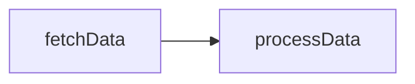
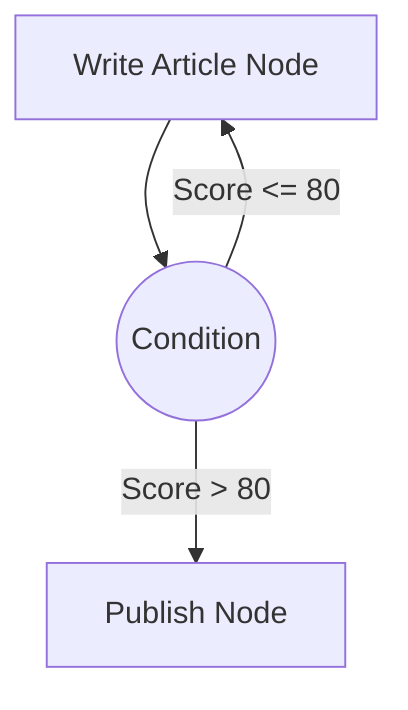
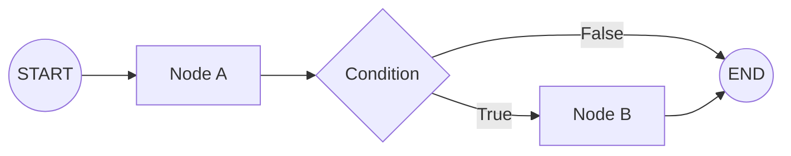

# Edges and Routing

Edges are the connective tissue of a TraceGraph. While nodes define *what* work gets done, edges define the execution flow—*when* and *where* the graph moves next.

## Standard Edges

A standard edge creates a linear, unconditional path from one node to another. Once the source node finishes successfully, the target node automatically begins.

```java
// After "fetchData" finishes, always run "processData"
graph.edge("fetchData", "processData");
```



## Conditional Edges (Routing)

Conditional edges introduce dynamic decision-making into your graphs. Instead of a fixed target, a conditional edge evaluates the current state and returns the name of the next node to execute.

This is the core mechanism for building intelligent agents that loop, retry, or choose different paths based on LLM outputs.

### Example: Quality Check Loop

Imagine a node that writes an article, followed by an evaluator. The conditional edge acts as a router.



```java
graph.conditionalEdge("evaluateArticle", state -> {
    if (state.getScore() > 80) {
        return "publish";
    } else {
        return "writeArticle"; // Loop back!
    }
});
```

## Graph Entry and Exit Points

Graphs must have clearly defined entry and exit boundaries.

- **START:** The default entry node. You define the first node to execute by creating an edge from the virtual `START` node.
- **END:** When a node connects to the virtual `END` node, the graph execution gracefully terminates and returns the final state to the caller.



## Validation

TraceGraph evaluates your edges before execution starts. It ensures:
1. All referenced target nodes actually exist.
2. There is a valid path from `START` to at least one `END`.
3. There are no unreachable "island" nodes.

By separating node logic from routing logic, TraceGraph allows you to visually map and easily refactor complex agentic loops.
