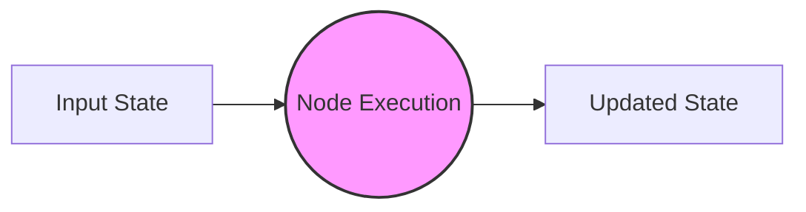
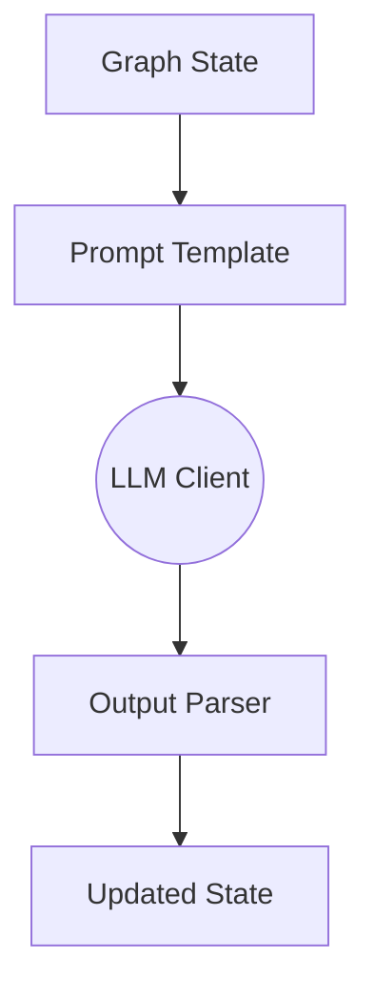
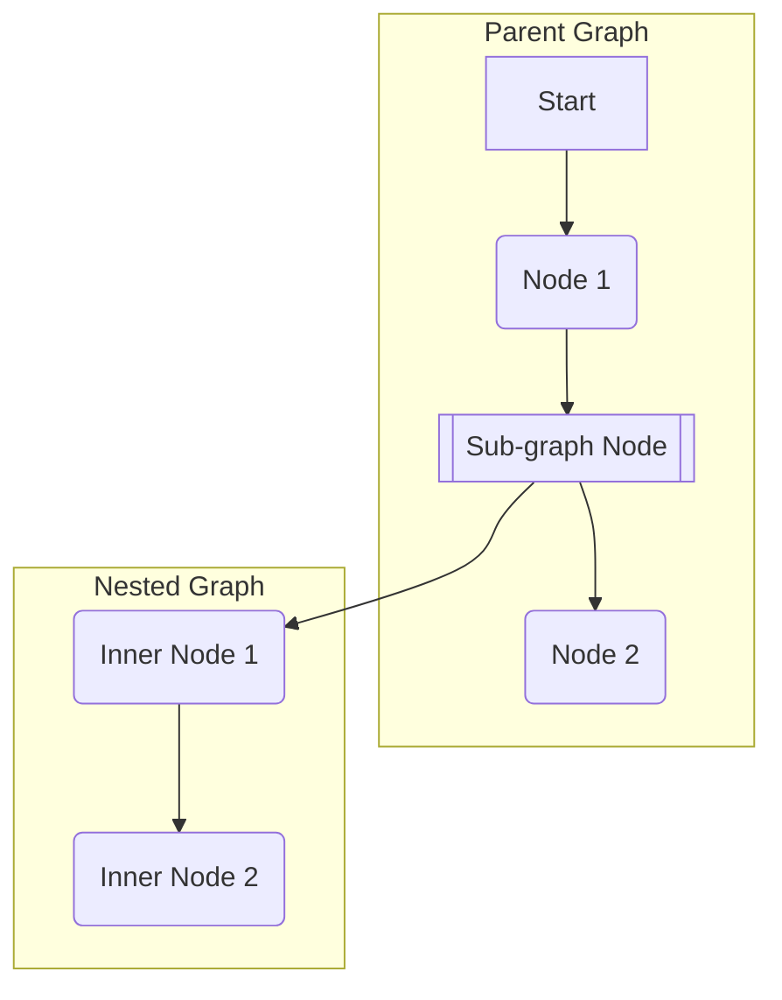

# Graph Nodes

Nodes are the fundamental building blocks of a TraceGraph. While the overall Graph acts as the orchestrator, each Node represents a distinct unit of computation, logic, or external interaction.

## Anatomy of a Node

A node's primary responsibility is to take the current `State` of the graph, perform some operation (which may take milliseconds or minutes), and return an updated `State`.



## Node Types

TraceGraph supports various node types, enabling you to mix simple code logic with advanced AI capabilities.

### 1. Function Nodes

The simplest type of node. It executes standard Java code, modifying the state directly. Use this for data parsing, calculations, or formatting.

```java
graph.node("formatData", state -> {
    String raw = state.getRawData();
    state.setFormattedData(raw.trim().toUpperCase());
    return state;
});
```

### 2. LLM Nodes

Nodes designed specifically to interact with language models. They handle the complexity of formatting prompts, parsing structured outputs, and managing token context.



### 3. Tool Execution Nodes

In agentic workflows, LLMs often request the execution of a tool. Tool Nodes are responsible for taking these requests, executing the corresponding local function or API call, and returning the observation back to the state.

### 4. Sub-graph Nodes

For complex applications, a single graph can become too large. TraceGraph allows you to encapsulate a full graph and embed it as a single node within a parent graph.



## Node Best Practices

- **Single Responsibility:** A node should do one thing well. Don't mix data fetching and LLM prompting in the same node.
- **Idempotency:** Nodes may be retried if failures occur. Design your nodes so that running them twice yields the same result, or use transaction IDs for external side-effects.
