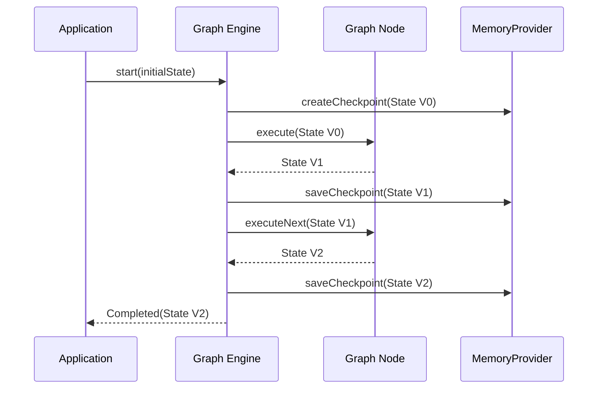

# Memory and Checkpointing

TraceGraph provides a robust and pluggable memory management system designed to support long-running workflows, Human-in-the-Loop (HITL) interactions, and fault tolerance. In complex AI agent workflows, keeping track of history and being able to resume from interruptions is essential.

## How Memory Works

Memory in TraceGraph is based on the concept of **Checkpoints**. A checkpoint represents a snapshot of the graph's state at a specific point in time—usually immediately after a node finishes its execution.

### Execution Flow with Memory



## Checkpoint Use Cases

By continuously saving checkpoints, TraceGraph enables several powerful features:

1. **Fault Tolerance (Resume Execution):** If a process crashes, the server restarts, or a network failure occurs during a long LLM generation, the application can read the last saved checkpoint and resume execution without re-running previous steps.
2. **Human-in-the-Loop (HITL):** You can design your graph to pause execution deliberately. For instance, before an email is sent, the graph pauses. A human user views the state, edits the email draft, and approves it. The graph then resumes from that checkpoint.
3. **Time Travel & Debugging:** Because history is saved, developers can query past checkpoints to understand how the state mutated over time. You can even "rewind" execution to a past checkpoint, change a node's logic, and replay it.

## Memory Providers

TraceGraph abstracts storage through the `MemoryProvider` interface. You can swap out the storage mechanism without changing your graph logic.

- **InMemoryProvider:** Stores checkpoints in RAM. Best for local development, unit testing, and short-lived execution flows.
- **Relational Databases (e.g., PostgreSQL, MySQL):** Ideal for production workloads. Ensures ACID compliance and persistent state across server restarts.
- **Key-Value Stores (e.g., Redis):** Excellent for high-throughput, low-latency checkpointing in distributed systems.

### Example: Configuring Memory

```java
// Create a persistent memory provider
MemoryProvider memory = new PostgresMemoryProvider("jdbc:postgresql://localhost:5432/db");

// Attach it to the graph
Graph<MyState> graph = new GraphBuilder<MyState>()
    .withMemory(memory)
    .addNode("step1", new Step1Node())
    .build();
```

> **Best Practice:** When designing your state class, ensure all fields are serializable so they can be seamlessly persisted by the `MemoryProvider`.
