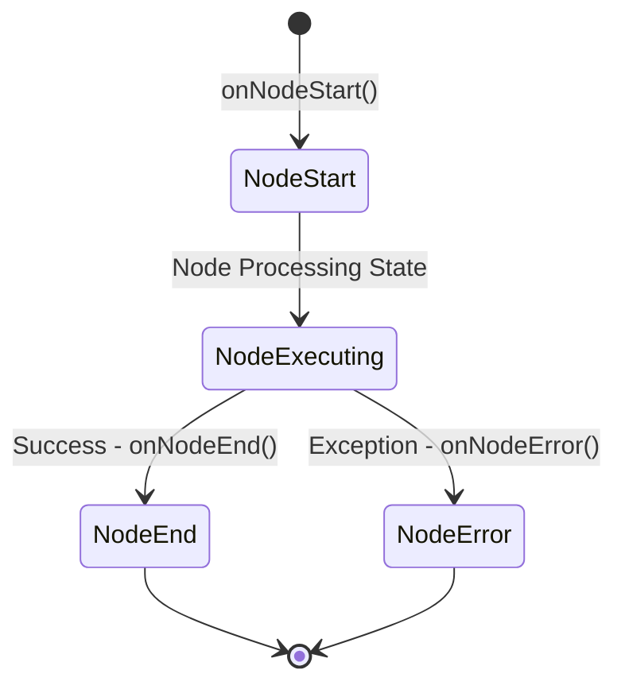

# Observability

TraceGraph provides extensive, real-time observability into your graph's execution. Understanding how state changes, how long nodes take to execute, and where errors occur is critical when orchestrating complex AI workflows.

## Node Listeners

The core of TraceGraph's observability lies in the `NodeListener` interface. You can implement your own listener to hook into the lifecycle events of nodes. This allows for custom logging, metrics collection, and alerting.

### Available Lifecycle Hooks

- `onNodeStart`: Fired just before a node begins execution. Useful for recording the initial state.
- `onNodeEnd`: Fired after a node completes execution successfully. Useful for calculating execution duration and observing state mutations.
- `onNodeError`: Fired if a node throws an exception. Essential for error tracking and alerting.



## OpenTelemetry Integration

TraceGraph provides built-in support for OpenTelemetry (OTel) via the `OtelNodeListener`. When registered with your graph, it automatically maps node executions to OpenTelemetry spans.

### Distributed Tracing

With OpenTelemetry, every graph execution becomes a **Trace**, and every node execution becomes a **Span**.

```mermaid
gantt
    title TraceGraph Execution Trace
    dateFormat  s
    axisFormat  %S
    
    section Graph Execution
    Graph Run            :a1, 0, 10s
    
    section Nodes
    Fetch Data Node      :a2, 0, 2s
    Process Data Node    :a3, 2, 4s
    LLM API Call Node    :a4, 4, 9s
    Format Output Node   :a5, 9, 10s
```



### Capturing State Changes

TraceGraph's OTel integration does more than just measure time. It captures:
- **Input State:** The state of the graph when the node started.
- **Output State / Diffs:** The specific changes made by the node are recorded as span events, providing granular visibility into how your state evolves.
- **Attributes:** Node names, execution IDs, and retry attempts are attached as searchable span attributes.

### Example Configuration

```java
Graph<MyState> graph = new Graph<>();
// Register the OpenTelemetry listener
graph.addListener(new OtelNodeListener(openTelemetryInstance));
```

By pointing your OpenTelemetry exporter to systems like Jaeger, Zipkin, or Datadog, you get a premium visual dashboard of your AI agent's performance and decision-making pathways out-of-the-box.
