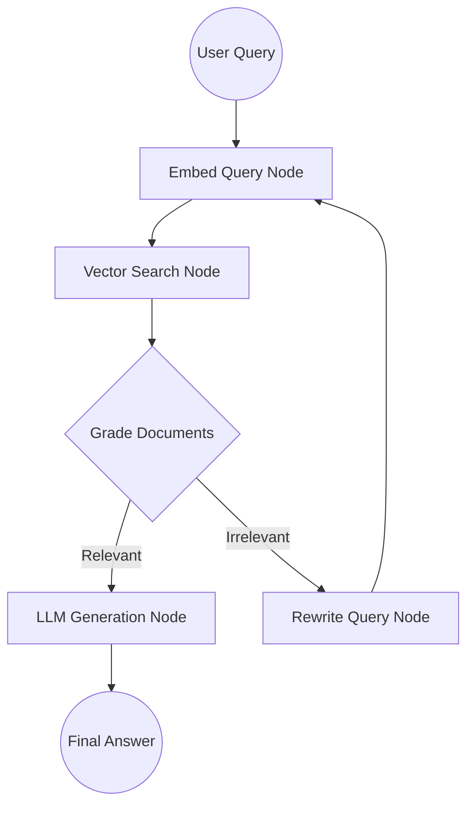

# RAG Agent Cookbook

This cookbook demonstrates how to build a highly effective Retrieval-Augmented Generation (RAG) pipeline using TraceGraph.

## Architecture Overview

A traditional RAG simply fetches documents and passes them to an LLM. However, an **Agentic RAG** can evaluate the retrieved documents, rewrite the query if the documents are irrelevant, or decide to fetch from a different source.



## Step-by-Step Implementation

### 1. The State
First, we define a state that can hold our query, retrieved documents, and the final answer.

```java
public class RagState {
    private String query;
    private List<Document> context = new ArrayList<>();
    private String finalAnswer;
    private int retryCount = 0;
    // getters and setters...
}
```

### 2. The Nodes

We define nodes for each step in our mermaid diagram:
- **`retrieveNode`**: Uses an embedding client to search a Vector Database.
- **`gradeNode`**: A lightweight LLM call or heuristic to check if the retrieved `context` actually answers the `query`.
- **`generateNode`**: Calls a powerful LLM to synthesize the final answer.
- **`rewriteNode`**: Asks an LLM to rephrase the user query to yield better search results.

### 3. The Graph Routing

Here is where TraceGraph shines. We wire the nodes together with conditional logic.

```java
Graph<RagState> ragGraph = new GraphBuilder<RagState>()
    .addNode("retrieve", retrieveNode)
    .addNode("generate", generateNode)
    .addNode("rewrite", rewriteNode)
    // The routing logic
    .conditionalEdge("retrieve", state -> {
        boolean isRelevant = gradeContext(state.getQuery(), state.getContext());
        if (isRelevant) {
            return "generate"; // Proceed to answer
        } else if (state.getRetryCount() < 3) {
            return "rewrite"; // Try again with a new query
        } else {
            return "generate"; // Give up and answer as best as possible
        }
    })
    .edge("rewrite", "retrieve") // Always go back to search after rewriting
    .edge("generate", "END")
    .build();
```

## Running the Example

TraceGraph provides a complete, runnable example of this architecture.
You can explore the code and run it directly from the repository.

👉 **[See the runnable example at `examples/rag-agent/`](https://github.com/kimho/TraceGraph/tree/main/examples/rag-agent)**
