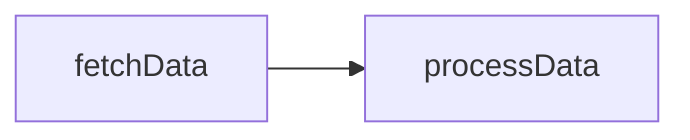
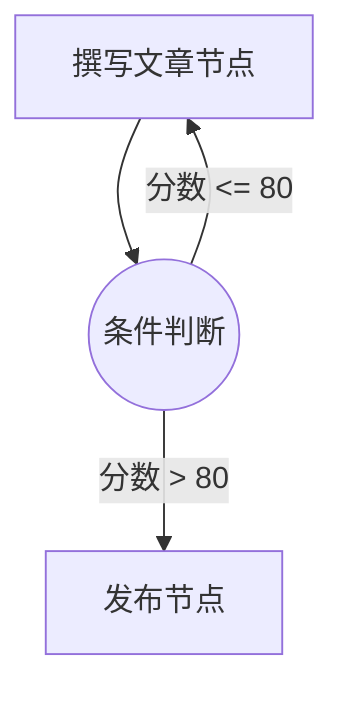
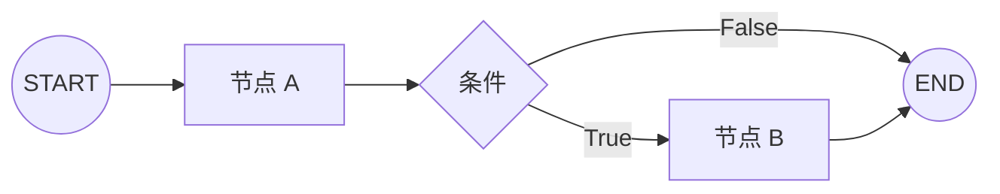

# 边与路由 (Edges and Routing)

边是 TraceGraph 的结缔组织。如果说节点定义了要完成的*工作内容*，那么边就定义了执行流程——图接下来的走向：*何时*以及*去哪*。

## 标准边 (Standard Edges)

标准边创建从一个节点到另一个节点的线性、无条件路径。一旦源节点成功完成，目标节点就会自动开始。

```java
// "fetchData" 完成后，始终运行 "processData"
graph.edge("fetchData", "processData");
```



## 条件边 (Conditional Edges - Routing)

条件边在您的图中引入了动态决策。与固定目标不同，条件边会评估当前状态并返回要执行的下一个节点的名称。

这是构建根据 LLM 输出进行循环、重试或选择不同路径的智能代理的核心机制。

### 示例：质量检查循环

想象一个编写文章的节点，后跟一个评估器。条件边充当路由器。



```java
graph.conditionalEdge("evaluateArticle", state -> {
    if (state.getScore() > 80) {
        return "publish";
    } else {
        return "writeArticle"; // 循环回去！
    }
});
```

## 图的入口和出口点

图必须具有明确定义的进入和退出边界。

- **START:** 默认的入口节点。您通过创建从虚拟 `START` 节点的边来定义要执行的第一个节点。
- **END:** 当节点连接到虚拟 `END` 节点时，图执行将优雅地终止，并将最终状态返回给调用者。



## 验证 (Validation)

TraceGraph 在执行开始之前会评估您的边。它确保：
1. 引用的所有目标节点确实存在。
2. 存在一条从 `START` 至少到一个 `END` 的有效路径。
3. 没有不可达的“孤岛”节点。

通过将节点逻辑与路由逻辑分离，TraceGraph 允许您以可视化方式映射并轻松重构复杂的代理循环。
