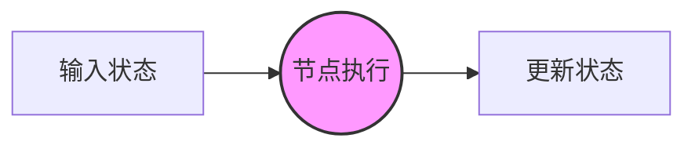
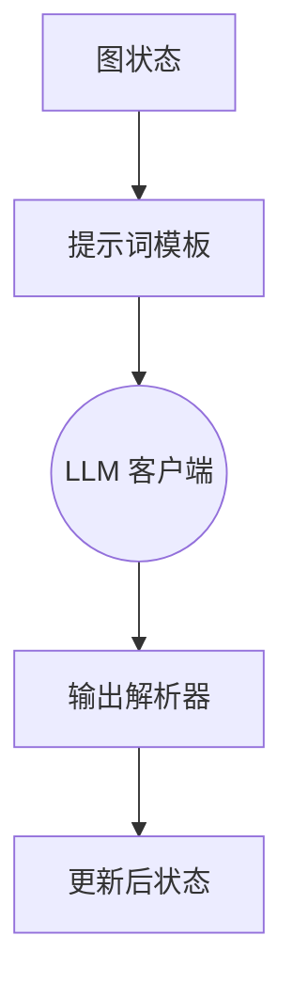
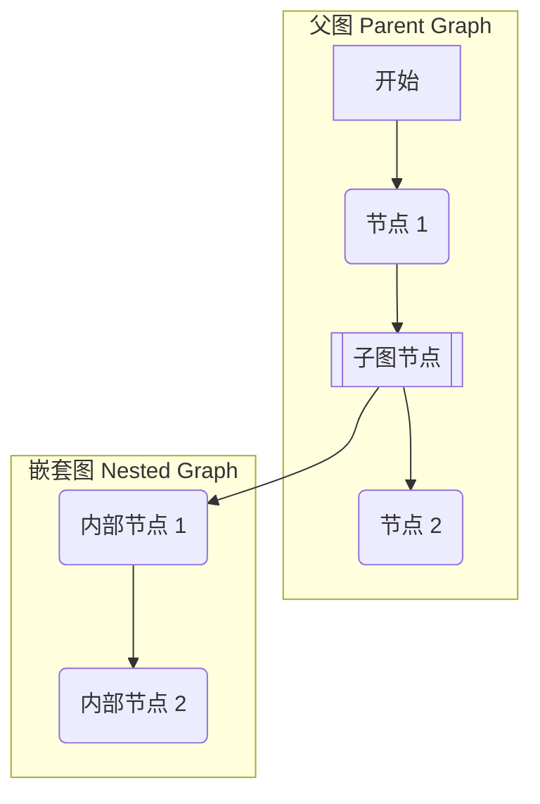

# 节点 (Graph Nodes)

节点是 TraceGraph 的基本构建块。整体图 (Graph) 充当编排器，而每个节点则代表一个独立的计算、逻辑或外部交互单元。

## 节点剖析

节点的主要职责是获取图的当前状态 (`State`)，执行某些操作（可能需要几毫秒或几分钟），然后返回更新后的状态 (`State`)。



## 节点类型

TraceGraph 支持多种节点类型，使您能够将简单的代码逻辑与高级 AI 功能混合在一起。

### 1. 函数节点 (Function Nodes)

最简单的节点类型。它执行标准 Java 代码，直接修改状态。将其用于数据解析、计算或格式化。

```java
graph.node("formatData", state -> {
    String raw = state.getRawData();
    state.setFormattedData(raw.trim().toUpperCase());
    return state;
});
```

### 2. LLM 节点

专为与大语言模型交互而设计的节点。它们处理格式化提示词、解析结构化输出以及管理上下文 token 的复杂性。



### 3. 工具执行节点 (Tool Execution Nodes)

在代理式工作流中，LLM 通常请求执行某个工具。工具节点负责接受这些请求，执行相应的本地函数或 API 调用，并将观察结果返回到状态中。

### 4. 子图节点 (Sub-graph Nodes)

对于复杂的应用程序，单个图可能会变得过于庞大。TraceGraph 允许您封装一个完整的图并将其作为单个节点嵌入到父图中。



## 节点最佳实践

- **单一职责:** 一个节点应该做好一件事。不要在同一个节点中混合数据获取和 LLM 提示词。
- **幂等性:** 如果发生故障，节点可能会重试。设计您的节点，使得运行它们两次会产生相同的结果，或者为外部副作用使用事务 ID。
