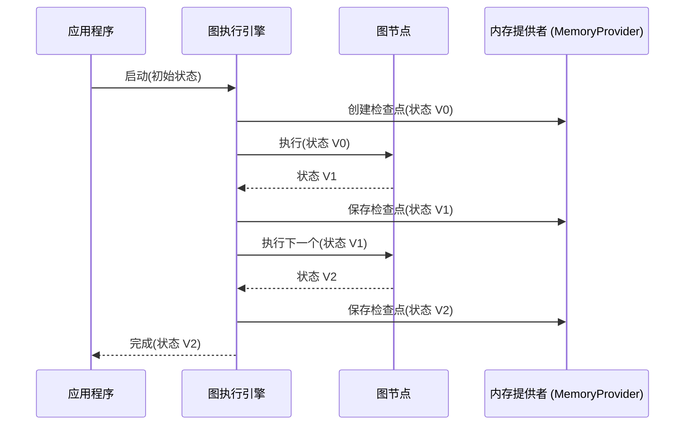

# 内存与检查点

TraceGraph 提供了一个强大且可插拔的内存管理系统，旨在支持长时间运行的工作流、人在环路 (HITL) 交互和系统容错。在复杂的 AI 代理工作流中，跟踪历史记录并能够在中断后恢复是至关重要的。

## 内存的工作原理

TraceGraph 中的内存基于**检查点 (Checkpoints)** 的概念。检查点代表图状态在特定时间点的快照——通常是在节点完成其执行之后立即保存。

### 带有内存的执行流程图



## 检查点的使用场景

通过持续保存检查点，TraceGraph 实现了几个强大的功能：

1. **容错性（恢复执行）:** 如果进程崩溃、服务器重启，或者在漫长的 LLM 生成过程中发生网络故障，应用程序可以读取最后保存的检查点并恢复执行，而无需重新运行之前的步骤。
2. **人在环路 (HITL):** 您可以设计您的图故意暂停执行。例如，在发送电子邮件之前，图会暂停。人类用户查看状态、编辑电子邮件草稿并批准它。然后图从该检查点恢复。
3. **时间旅行与调试:** 因为历史记录被保存了，开发人员可以查询过去的检查点，以了解状态是如何随着时间推移而改变的。您甚至可以“倒带”执行到过去的检查点，更改节点的逻辑，然后重新播放。

## 内存提供者 (Memory Providers)

TraceGraph 通过 `MemoryProvider` 接口抽象了存储。您可以在不更改图逻辑的情况下更换存储机制。

- **InMemoryProvider:** 将检查点存储在 RAM 中。最适合本地开发、单元测试和生命周期短的执行流程。
- **关系型数据库（例如 PostgreSQL, MySQL）:** 生产工作负载的理想选择。确保 ACID 合规性并在服务器重启时持久保存状态。
- **键值存储（例如 Redis）:** 非常适合分布式系统中高吞吐量、低延迟的检查点保存。

### 示例：配置内存

```java
// 创建持久化内存提供者
MemoryProvider memory = new PostgresMemoryProvider("jdbc:postgresql://localhost:5432/db");

// 将其附加到图
Graph<MyState> graph = new GraphBuilder<MyState>()
    .withMemory(memory)
    .addNode("step1", new Step1Node())
    .build();
```

> **最佳实践：** 在设计您的状态类时，请确保所有字段都是可序列化的，以便 `MemoryProvider` 可以无缝地持久化它们。
