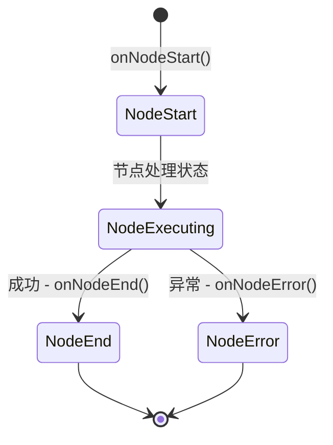

# 可观测性

TraceGraph 为您图的执行提供了广泛的、实时的可观测性。在编排复杂的 AI 工作流时，了解状态如何变化、节点执行需要多长时间以及发生错误的位置至关重要。

## 节点监听器 (Node Listeners)

TraceGraph 可观测性的核心是 `NodeListener` 接口。您可以实现自己的监听器来挂载到节点生命周期事件上。这允许进行自定义日志记录、指标收集和警报。

### 可用的生命周期钩子

- `onNodeStart`: 在节点开始执行之前触发。对记录初始状态很有用。
- `onNodeEnd`: 在节点成功执行完成后触发。可用于计算执行时长并观察状态的修改。
- `onNodeError`: 如果节点抛出异常则触发。对于错误跟踪和报警必不可少。



## OpenTelemetry 集成

TraceGraph 通过 `OtelNodeListener` 提供对 OpenTelemetry (OTel) 的内置支持。注册到您的图后，它会自动将节点执行映射到 OpenTelemetry 的 span 中。

### 分布式追踪

借助 OpenTelemetry，每次图的执行都会成为一个 **Trace (追踪)**，而每次节点的执行都会成为一个 **Span (跨度)**。

```mermaid
gantt
    title TraceGraph 执行追踪
    dateFormat  s
    axisFormat  %S
    
    section 图执行
    图运行任务             :a1, 0, 10s
    
    section 节点
    获取数据节点          :a2, 0, 2s
    处理数据节点          :a3, 2, 4s
    LLM API调用节点       :a4, 4, 9s
    格式化输出节点        :a5, 9, 10s
```



### 捕获状态变化

TraceGraph 的 OTel 集成不仅仅是测量时间。它还捕获：
- **输入状态:** 节点开始时图的状态。
- **输出状态 / 差异:** 节点所做的具体修改被记录为 span 事件，从而提供关于状态如何演变的细粒度可见性。
- **属性:** 节点名称、执行 ID 和重试次数均作为可搜索的 span 属性附加。

### 配置示例

```java
Graph<MyState> graph = new Graph<>();
// 注册 OpenTelemetry 监听器
graph.addListener(new OtelNodeListener(openTelemetryInstance));
```

通过将您的 OpenTelemetry 导出器指向 Jaeger、Zipkin 或 Datadog 等系统，您可以开箱即用地获得有关 AI 代理性能和决策路径的高级可视化仪表板。
