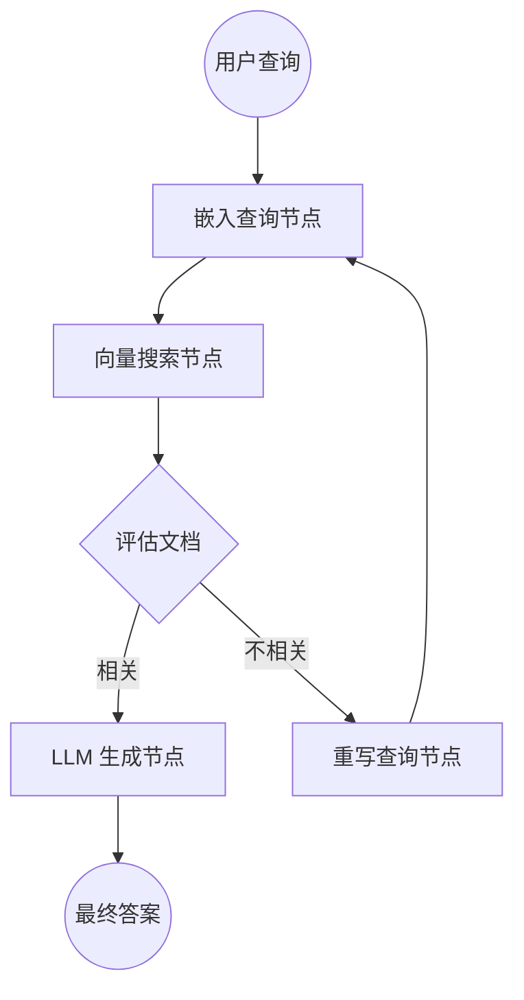

# 检索增强生成 (RAG) 代理实战

本指南演示了如何使用 TraceGraph 构建高效的检索增强生成 (RAG) 管道。

## 架构概述

传统的 RAG 只是获取文档并将其传递给 LLM。但是，**代理式 RAG (Agentic RAG)** 可以评估检索到的文档，如果文档不相关则重写查询，或者决定从不同来源获取。



## 逐步实施

### 1. 状态 (The State)
首先，我们定义一个状态，它可以保存我们的查询、检索到的文档和最终答案。

```java
public class RagState {
    private String query;
    private List<Document> context = new ArrayList<>();
    private String finalAnswer;
    private int retryCount = 0;
    // getters and setters...
}
```

### 2. 节点 (The Nodes)

我们为 mermaid 图中的每个步骤定义节点：
- **`retrieveNode`**: 使用嵌入客户端搜索向量数据库。
- **`gradeNode`**: 轻量级的 LLM 调用或启发式方法，用于检查检索到的 `context` 是否真正回答了 `query`。
- **`generateNode`**: 调用强大的 LLM 来综合最终答案。
- **`rewriteNode`**: 要求 LLM 重新表述用户查询以获得更好的搜索结果。

### 3. 图路由 (The Graph Routing)

这就是 TraceGraph 发挥作用的地方。我们将节点与条件逻辑连接在一起。

```java
Graph<RagState> ragGraph = new GraphBuilder<RagState>()
    .addNode("retrieve", retrieveNode)
    .addNode("generate", generateNode)
    .addNode("rewrite", rewriteNode)
    // 路由逻辑
    .conditionalEdge("retrieve", state -> {
        boolean isRelevant = gradeContext(state.getQuery(), state.getContext());
        if (isRelevant) {
            return "generate"; // 继续生成答案
        } else if (state.getRetryCount() < 3) {
            return "rewrite"; // 使用新查询重试
        } else {
            return "generate"; // 放弃并尽可能地回答
        }
    })
    .edge("rewrite", "retrieve") // 重写后总是返回搜索
    .edge("generate", "END")
    .build();
```

## 运行示例

TraceGraph 提供了该架构的一个完整可运行示例。
您可以直接从存储库中浏览代码并运行它。

👉 **[请参阅 `examples/rag-agent/` 处的可运行示例](https://github.com/kimho/TraceGraph/tree/main/examples/rag-agent)**
