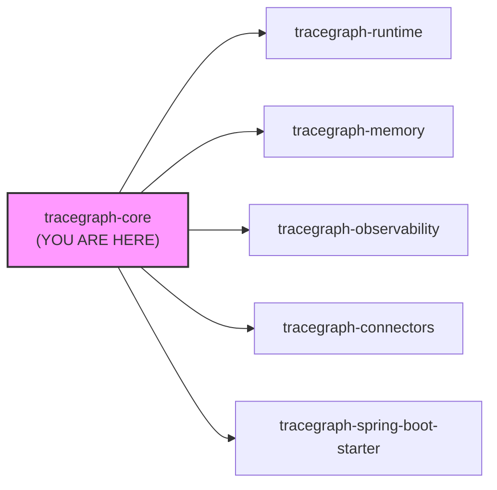
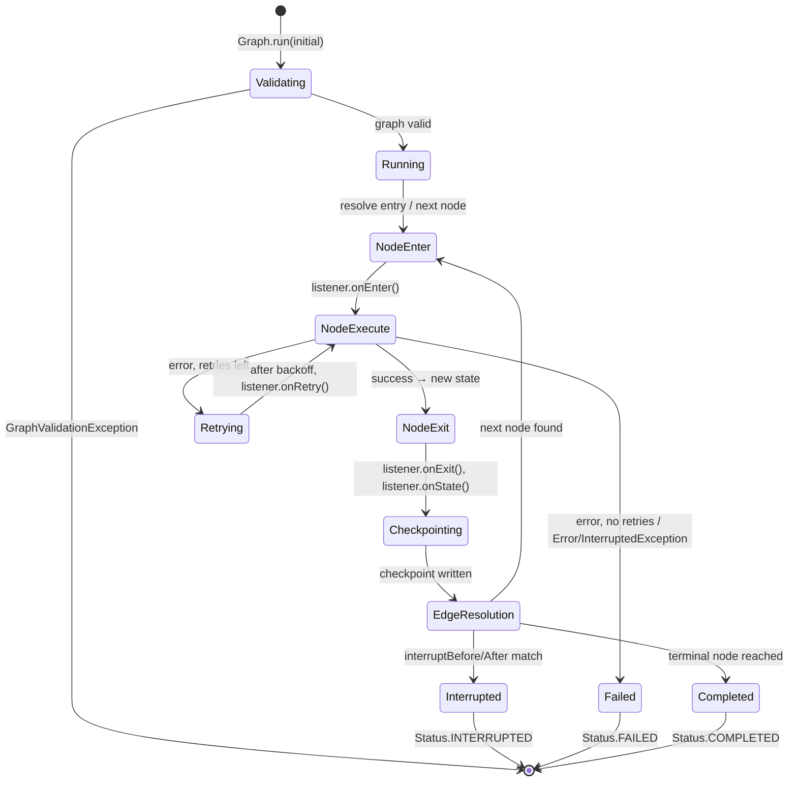
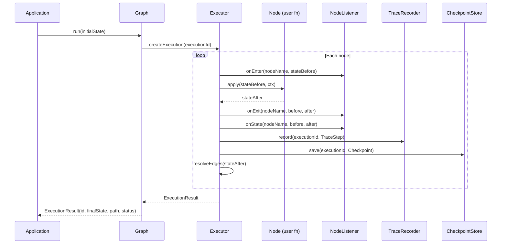
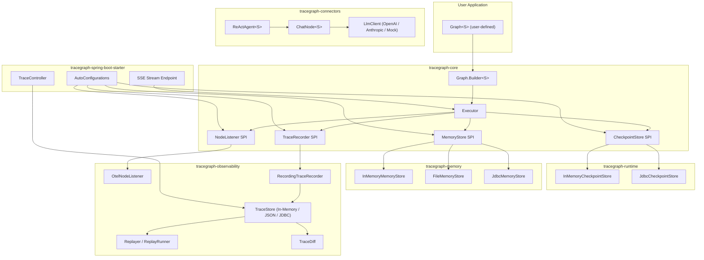
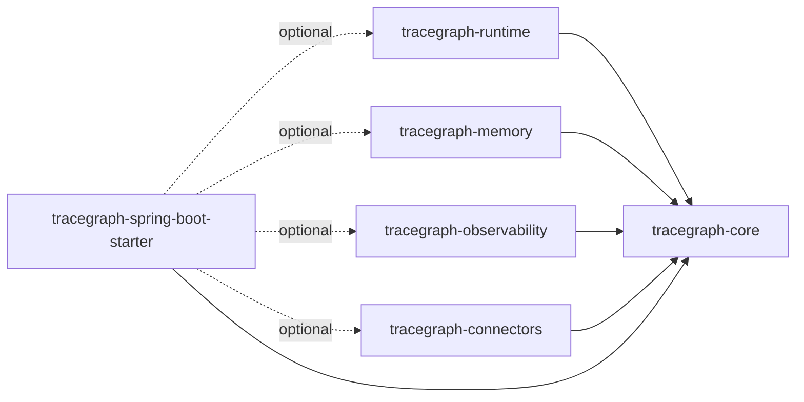

# Documentation Improvement Implementation Plan

> **For agentic workers:** REQUIRED SUB-SKILL: Use superpowers:subagent-driven-development (recommended) or superpowers:executing-plans to implement this plan task-by-task. Steps use checkbox (`- [ ]`) syntax for tracking.

**Goal:** Rewrite all 14 module READMEs (EN + ZH), the root README pair, and enrich the docs/site tutorial pages with full detail, multiple Mermaid diagram types, and natural Chinese translations.

**Architecture:** Three parallel domain-cluster writes (core+runtime, memory+observability, connectors+starter), then root README last to pull everything together. Each module README follows the standard 13-section template defined in the spec. All work happens on branch `docs/documentation-improvement`.

**Tech Stack:** Markdown, Mermaid (flowchart TD, sequenceDiagram, classDiagram, stateDiagram-v2, erDiagram), Java 21 code examples, Chinese (Simplified Mandarin).

**Branch:** `docs/documentation-improvement`

**Spec:** `docs/superpowers/specs/2026-05-12-documentation-improvement-design.md`

---

## Standard Section Template (reference for all tasks)

Every module README must contain in order:
1. Header (badges + 1-line description)
2. What it does (3–5 sentences, problem + solution)
3. System context diagram (Mermaid `graph LR` — all 6 modules, this one highlighted)
4. Internal architecture diagram (Mermaid `classDiagram` or `graph TD`)
5. State / lifecycle diagram (Mermaid `stateDiagram-v2`) — where applicable
6. Sequence diagram (Mermaid `sequenceDiagram`)
7. Data model / ER diagram (Mermaid `erDiagram`) — for persistence modules
8. Core concepts (key public types with annotated code)
9. Complete usage walkthrough (numbered steps, full Java code)
10. Configuration reference (markdown table)
11. Integration with other modules (prose + code)
12. Testing guidance (how to test in isolation)
13. FAQ (3–5 Q&A pairs)

Chinese (ZH) versions are full translations — not stubs. Minimum 400 lines each.

---

## Task 1: tracegraph-core README (English)

**Files:**
- Modify: `tracegraph-core/README.md`

- [ ] **Step 1: Write the full English README**

Write `tracegraph-core/README.md` with the following exact content:

```markdown
# tracegraph-core

[](https://central.sonatype.com/artifact/site.tracegraph/tracegraph-core)
[](../LICENSE)
[](https://openjdk.org/projects/jdk/21/)

The foundational module of TraceGraph. Provides typed graph definitions, the synchronous execution loop, and all Service Provider Interfaces (SPIs) that other modules implement.

---

## What it does

`tracegraph-core` is the engine room. It lets you define a directed, typed execution graph using plain Java functions, then run it with a single call. Every node receives the current state and a `Context`, returns a new state, and the executor resolves outgoing edges to decide what runs next.

The module has zero heavy dependencies — no Spring, no OTel, no Jackson. It ships the SPI interfaces (`NodeListener`, `CheckpointStore`, `TraceRecorder`, `MemoryStore`) so every other TraceGraph module can plug in cleanly. You can use `tracegraph-core` alone for pure workflow orchestration with no LLM or cloud dependency.

---

## System Context



All other modules depend on `tracegraph-core`. It must stay dependency-free (SLF4J API only).

---

## Internal Architecture

```mermaid
classDiagram
    class Graph~S~ {
        +run(S initial) ExecutionResult~S~
        +resume(String executionId) Optional~ExecutionResult~S~~
        +stream(S initial) Publisher~NodeEvent~S~~
        +toMermaid() String
        +toPlantUml() String
        +builder() Builder~S~
    }

    class Builder~S~ {
        +node(String name, Node~S~ fn) Builder~S~
        +node(String name, Node~S~ fn, RetryPolicy policy) Builder~S~
        +asyncNode(String name, AsyncNode~S~ fn) Builder~S~
        +parallel(String name, List branches, Merger~S~ merger) Builder~S~
        +routingNode(String name, RoutingNode~S~ fn) Builder~S~
        +subgraph(String name, Graph~S~ inner) Builder~S~
        +entry(String name) Builder~S~
        +edge(String from, String to) Builder~S~
        +edge(String from, String to, Predicate~S~ cond) Builder~S~
        +terminal(String name) Builder~S~
        +listener(NodeListener~S~ l) Builder~S~
        +traceRecorder(TraceRecorder~S~ r) Builder~S~
        +checkpointStore(CheckpointStore~S~ s) Builder~S~
        +memoryStore(MemoryStore ms) Builder~S~
        +defaultRetryPolicy(RetryPolicy p) Builder~S~
        +executor(ExecutorService ex) Builder~S~
        +interruptBefore(String... names) Builder~S~
        +interruptAfter(String... names) Builder~S~
        +build() Graph~S~
    }

    class Node~S~ {
        <<FunctionalInterface>>
        +apply(S state, Context ctx) S
    }

    class AsyncNode~S~ {
        <<FunctionalInterface>>
        +apply(S state, Context ctx) CompletableFuture~S~
    }

    class RoutingNode~S~ {
        <<FunctionalInterface>>
        +apply(S state, Context ctx) NodeResult~S~
    }

    class Edge~S~ {
        <<Record>>
        +from() String
        +to() String
        +condition() Optional~Predicate~S~~
    }

    class ExecutionResult~S~ {
        <<Record>>
        +executionId() String
        +finalState() S
        +path() List~String~
        +status() Status
        +error() Optional~Throwable~
    }

    class Status {
        <<Enum>>
        COMPLETED
        FAILED
        INTERRUPTED
    }

    class Context {
        <<Interface>>
        +executionId() String
        +idempotencyKey() String
        +memory() MemoryStore
        +reportUsage(int prompt, int completion)
    }

    class NodeListener~S~ {
        <<SPI Interface>>
        +onEnter(String name, S state)
        +onExit(String name, S before, S after)
        +onError(String name, S state, Throwable t)
        +onRetry(String name, S state, int attempt, Throwable cause)
        +onState(String name, S before, S after)
        +onUsage(String name, int prompt, int completion)
    }

    class CheckpointStore~S~ {
        <<SPI Interface>>
        +save(String executionId, Checkpoint~S~ cp)
        +load(String executionId) Optional~Checkpoint~S~~
    }

    class TraceRecorder~S~ {
        <<SPI Interface>>
        +record(String executionId, TraceStep~S~ step)
        +complete(String executionId, Status status, S finalState)
    }

    class MemoryStore {
        <<SPI Interface>>
        +get(String scope, String key) Optional~Object~
        +put(String scope, String key, Object value)
        +delete(String scope, String key)
        +keys(String scope) Set~String~
        +noop() MemoryStore
    }

    class RetryPolicy {
        +fixed(int maxAttempts, Duration delay) RetryPolicy
        +exponential(int max, Duration base, double mult, Duration cap) RetryPolicy
    }

    Graph~S~ *-- Builder~S~
    Graph~S~ --> Node~S~
    Graph~S~ --> AsyncNode~S~
    Graph~S~ --> RoutingNode~S~
    Graph~S~ --> Edge~S~
    Graph~S~ --> NodeListener~S~
    Graph~S~ --> CheckpointStore~S~
    Graph~S~ --> TraceRecorder~S~
    Graph~S~ --> MemoryStore
    Graph~S~ ..> ExecutionResult~S~
    ExecutionResult~S~ --> Status
```



---

## Execution Lifecycle



---

## Execution Sequence



---

## Core Concepts

### `Graph<S>`

The primary runtime type. Immutable after `build()`. Safe to share across threads. Generic over `<S>` — your state type.

```java
record PipelineState(String input, String output, boolean done) {}

Graph<PipelineState> graph = Graph.<PipelineState>builder()
    .node("preprocess", (s, ctx) -> s.withOutput(preprocess(s.input())))
    .node("classify",   (s, ctx) -> s.withOutput(classify(s.output())))
    .entry("preprocess")
    .edge("preprocess", "classify")
    .terminal("classify")
    .build();
```

### `Node<S>`

A `@FunctionalInterface`. Receives `(S state, Context ctx)`, returns new state. Must be stateless and thread-safe.

```java
Node<PipelineState> preprocessNode = (state, ctx) -> {
    String cleaned = state.input().trim().toLowerCase();
    return new PipelineState(state.input(), cleaned, false);
};
```

### `AsyncNode<S>`

Same contract as `Node<S>` but returns `CompletableFuture<S>`. Designed for I/O-bound work on virtual threads.

```java
AsyncNode<PipelineState> fetchNode = (state, ctx) ->
    httpClient.sendAsync(buildRequest(state), BodyHandlers.ofString())
              .thenApply(r -> state.withOutput(r.body()));
```

### `Edge<S>`

First-class data record. Connects two named nodes, optionally gated by a predicate on state.

```java
// Unconditional edge
.edge("validate", "charge")

// Conditional edge — only taken when state.valid() is true
.edge("validate", "charge", PipelineState::done)
```

### `RetryPolicy`

Attached per-node or as graph default. Executor handles backoff; `Error` and `InterruptedException` always short-circuit.

```java
RetryPolicy policy = RetryPolicy.exponential(
    3,                        // max attempts
    Duration.ofMillis(200),   // base delay
    2.0,                      // multiplier
    Duration.ofSeconds(5)     // cap
);

Graph.<PipelineState>builder()
    .node("call_api", apiNode, policy)
    // ...
```

### SPIs

Four SPI interfaces live in `tracegraph-core` and are implemented by other modules:

| SPI | Implemented by |
|---|---|
| `NodeListener` | `tracegraph-observability` (`OtelNodeListener`) |
| `CheckpointStore` | `tracegraph-runtime` (`InMemoryCheckpointStore`, `JdbcCheckpointStore`) |
| `TraceRecorder` | `tracegraph-observability` (`RecordingTraceRecorder`) |
| `MemoryStore` | `tracegraph-memory` (`InMemoryMemoryStore`, `FileMemoryStore`, `JdbcMemoryStore`) |

Compose multiple `NodeListener` implementations with `Listeners.compose(l1, l2)`.

---

## Complete Usage Walkthrough

### Step 1 — Add the dependency

```xml
<dependency>
    <groupId>site.tracegraph</groupId>
    <artifactId>tracegraph-core</artifactId>
    <version>0.3.0-SNAPSHOT</version>
</dependency>
```

### Step 2 — Define your state as a record

```java
record OrderState(
    String orderId,
    boolean validated,
    boolean charged,
    boolean shipped,
    String errorMessage
) {
    OrderState withValidated(boolean v) {
        return new OrderState(orderId, v, charged, shipped, errorMessage);
    }
    OrderState withCharged(boolean c) {
        return new OrderState(orderId, validated, c, shipped, errorMessage);
    }
    OrderState withShipped(boolean s) {
        return new OrderState(orderId, validated, charged, s, errorMessage);
    }
    OrderState withError(String msg) {
        return new OrderState(orderId, validated, charged, shipped, msg);
    }
}
```

### Step 3 — Build the graph

```java
Graph<OrderState> graph = Graph.<OrderState>builder()
    .node("validate", (state, ctx) -> {
        boolean ok = state.orderId() != null && !state.orderId().isBlank();
        return state.withValidated(ok);
    })
    .node("charge", (state, ctx) -> {
        // ctx.idempotencyKey() is stable across retries — use it for dedup
        chargeService.charge(state.orderId(), ctx.idempotencyKey());
        return state.withCharged(true);
    }, RetryPolicy.fixed(3, Duration.ofSeconds(1)))
    .node("ship", (state, ctx) -> {
        shippingService.ship(state.orderId());
        return state.withShipped(true);
    })
    .node("reject", (state, ctx) ->
        state.withError("Order validation failed"))
    .entry("validate")
    .edge("validate", "charge",  OrderState::validated)
    .edge("validate", "reject",  s -> !s.validated())
    .edge("charge",   "ship")
    .terminal("ship")
    .terminal("reject")
    .build();
```

### Step 4 — Run and inspect the result

```java
OrderState initial = new OrderState("ORD-001", false, false, false, null);
ExecutionResult<OrderState> result = graph.run(initial);

System.out.println("Status:     " + result.status());
System.out.println("Path:       " + result.path());
System.out.println("Final state:" + result.finalState());
// Status:      COMPLETED
// Path:        [validate, charge, ship]
// Final state: OrderState[orderId=ORD-001, validated=true, charged=true, shipped=true, errorMessage=null]
```

### Step 5 — Attach a listener

```java
NodeListener<OrderState> logger = new NodeListener<>() {
    public void onEnter(String name, OrderState s) {
        System.out.printf("[ENTER] %s%n", name);
    }
    public void onExit(String name, OrderState before, OrderState after) {
        System.out.printf("[EXIT]  %s%n", name);
    }
    public void onError(String name, OrderState s, Throwable t) {
        System.out.printf("[ERROR] %s: %s%n", name, t.getMessage());
    }
};

Graph<OrderState> graph = Graph.<OrderState>builder()
    // ... same nodes and edges ...
    .listener(logger)
    .build();
```

### Step 6 — Generate diagrams from the graph

```java
System.out.println(graph.toMermaid());
// flowchart TD
//   validate --> charge
//   validate --> reject
//   charge --> ship

System.out.println(graph.toPlantUml());
```

---

## Configuration Reference

`tracegraph-core` has no external configuration file. All settings are provided via the builder:

| Builder method | Type | Default | Description |
|---|---|---|---|
| `.entry(name)` | `String` | required | Name of the first node to execute |
| `.terminal(name)` | `String` | required (≥1) | Node(s) where execution stops |
| `.defaultRetryPolicy(p)` | `RetryPolicy` | no-op | Retry policy applied when no per-node policy is set |
| `.executor(ex)` | `ExecutorService` | virtual-thread-per-task (lazily created) | Executor for async/parallel nodes; NOT shut down by the graph if user-supplied |
| `.listener(l)` | `NodeListener<S>` | no-op | Compose multiple with `Listeners.compose(l1, l2)` |
| `.traceRecorder(r)` | `TraceRecorder<S>` | no-op | Wire a `RecordingTraceRecorder` from `tracegraph-observability` |
| `.checkpointStore(s)` | `CheckpointStore<S>` | no-op | Wire a `JdbcCheckpointStore` from `tracegraph-runtime` |
| `.memoryStore(ms)` | `MemoryStore` | `MemoryStore.noop()` | Wire a `JdbcMemoryStore` from `tracegraph-memory` |
| `.interruptBefore(names)` | `String...` | none | Pause before these nodes (HITL) |
| `.interruptAfter(names)` | `String...` | none | Pause after these nodes (HITL) |

---

## Integration with Other Modules

`tracegraph-core` is the base. Everything else is layered on top:

```java
// Core only — no extra deps needed
Graph<MyState> coreGraph = Graph.<MyState>builder()
    .node("step", fn)
    .entry("step").terminal("step")
    .build();

// Core + observability + runtime + memory
Graph<MyState> fullGraph = Graph.<MyState>builder()
    .node("step", fn, RetryPolicy.fixed(3, Duration.ofMillis(100)))
    .entry("step").terminal("step")
    // From tracegraph-observability:
    .listener(OtelNodeListener.usingGlobal())
    .traceRecorder(new RecordingTraceRecorder(new InMemoryTraceStore()))
    // From tracegraph-runtime:
    .checkpointStore(new JdbcCheckpointStore(dataSource, MyState.class))
    // From tracegraph-memory:
    .memoryStore(new JdbcMemoryStore(dataSource))
    .build();
```

---

## Testing Guidance

`tracegraph-core` has no infrastructure deps, so tests are pure Java JUnit 5.

```java
class GraphExecutionTest {

    record CountState(int count) {
        CountState inc() { return new CountState(count + 1); }
    }

    @Test
    void completesAfterSingleNode() {
        Graph<CountState> g = Graph.<CountState>builder()
            .node("inc", (s, ctx) -> s.inc())
            .entry("inc").terminal("inc")
            .build();

        ExecutionResult<CountState> r = g.run(new CountState(0));

        assertThat(r.status()).isEqualTo(Status.COMPLETED);
        assertThat(r.finalState().count()).isEqualTo(1);
        assertThat(r.path()).containsExactly("inc");
    }

    @Test
    void followsConditionalEdge() {
        Graph<CountState> g = Graph.<CountState>builder()
            .node("start", (s, ctx) -> s.inc())
            .node("positive", (s, ctx) -> s)
            .node("zero",     (s, ctx) -> s)
            .entry("start")
            .edge("start", "positive", s -> s.count() > 0)
            .edge("start", "zero",     s -> s.count() == 0)
            .terminal("positive").terminal("zero")
            .build();

        ExecutionResult<CountState> r = g.run(new CountState(0));

        assertThat(r.path()).containsExactly("start", "positive");
    }

    @Test
    void listenerReceivesEnterAndExit() {
        List<String> events = new ArrayList<>();
        NodeListener<CountState> listener = new NodeListener<>() {
            public void onEnter(String n, CountState s) { events.add("enter:" + n); }
            public void onExit(String n, CountState b, CountState a) { events.add("exit:" + n); }
        };

        Graph<CountState> g = Graph.<CountState>builder()
            .node("inc", (s, ctx) -> s.inc())
            .entry("inc").terminal("inc")
            .listener(listener)
            .build();

        g.run(new CountState(0));

        assertThat(events).containsExactly("enter:inc", "exit:inc");
    }
}
```

---

## FAQ

**Q: Can I reuse the same `Graph<S>` instance across multiple threads?**
Yes. `Graph<S>` is immutable after `build()` and fully thread-safe. Each call to `run()` creates an isolated execution with its own state.

**Q: What happens if no edge predicate matches?**
The executor throws `NodeExecutionException` with a message describing the dead-end node and the current state.

**Q: Can I have more than one entry node?**
No. Each graph has exactly one entry node. For fan-in from multiple entry points, use a `parallel()` or `routingNode()` at the start.

**Q: Does `tracegraph-core` support cycles?**
Yes. You can add edges that loop back to earlier nodes. The executor will follow them indefinitely — add a terminal predicate or max-steps guard in your node logic to prevent infinite loops.

**Q: What is `ctx.idempotencyKey()`?**
A stable, deterministic string derived from `executionId + nodeName + attemptNumber`. Use it inside a node to deduplicate side effects across retries.
```

- [ ] **Step 2: Verify the file was written**

```bash
wc -l tracegraph-core/README.md
```
Expected: ≥ 400 lines

- [ ] **Step 3: Commit**

```bash
git add tracegraph-core/README.md
git commit -m "docs(core): full English README with class diagram, state machine, sequence, usage walkthrough"
```

---

## Task 2: tracegraph-core README (Chinese)

**Files:**
- Modify: `tracegraph-core/README.zh.md`

- [ ] **Step 1: Write the full Chinese README**

Write `tracegraph-core/README.zh.md` as a complete Mandarin translation of `tracegraph-core/README.md`. Requirements:
- All section headings translated (## 系统概述, ## 内部架构, ## 执行生命周期, ## 核心概念, ## 完整使用指南, ## 配置参考, ## 与其他模块集成, ## 测试指南, ## 常见问题)
- All Mermaid diagrams kept identical (diagram syntax is language-neutral; only node labels that are plain English prose may be translated if they fit cleanly)
- All prose sections translated to natural Mandarin — not word-for-word literal machine translation
- All code examples kept identical (Java code is not translated)
- All table rows translated
- FAQ questions and answers translated

Key translations to use consistently throughout the project:
- "typed execution graph" → 类型化执行图
- "state" → 状态
- "node" → 节点
- "edge" → 边
- "executor" → 执行器
- "checkpoint" → 检查点
- "trace" → 追踪记录
- "listener" → 监听器
- "retry" → 重试
- "entry node" → 入口节点
- "terminal node" → 终止节点
- "fan-out" → 扇出
- "SPI" → 服务提供接口 (SPI)

- [ ] **Step 2: Commit**

```bash
git add tracegraph-core/README.zh.md
git commit -m "docs(core): full Chinese README translation"
```

---

## Task 3: tracegraph-runtime README (English)

**Files:**
- Modify: `tracegraph-runtime/README.md`

- [ ] **Step 1: Write the full English README**

Write `tracegraph-runtime/README.md`. Required sections and diagrams:

**System context:** Same 6-module graph as Task 1 but with `tracegraph-runtime` highlighted.

**Internal architecture classDiagram:**
```
CheckpointStore<S> <<SPI>>
InMemoryCheckpointStore<S>
JdbcCheckpointStore<S>
Checkpoint<S> <<Record>>
  - executionId: String
  - lastCompletedNode: String
  - state: S
  - interruptPending: boolean
  - status: Status
```

**State machine (stateDiagram-v2):**
```
[*] --> RUNNING
RUNNING --> COMPLETED
RUNNING --> FAILED
RUNNING --> INTERRUPTED : interruptBefore/After match
INTERRUPTED --> RUNNING : graph.resume(executionId)
COMPLETED --> [*]
FAILED --> [*]
INTERRUPTED --> [*] : abandoned
```

**Sequence diagram:** show checkpoint write (after node exit, before edge resolution) and full resume flow (load checkpoint → re-evaluate edges of lastCompletedNode → continue).

**ER diagram:**
```
TRACEGRAPH_CHECKPOINT {
    VARCHAR execution_id PK
    VARCHAR last_completed_node
    VARCHAR status
    TIMESTAMP created_at
    TIMESTAMP updated_at
    TEXT state_json
    BOOLEAN interrupt_pending
}
```

**Core concepts:** `CheckpointStore` SPI, `InMemoryCheckpointStore`, `JdbcCheckpointStore` (schema init, portable upsert, at-least-once semantics on resume), `interruptBefore`/`interruptAfter`, `RetryPolicy` (fixed vs exponential, backoff, `Error`/`InterruptedException` short-circuit), parallel branches with virtual threads, `AsyncNode<S>`.

**Usage walkthrough:**
1. Add `tracegraph-runtime` dependency
2. Wire `JdbcCheckpointStore` (with `initSchema()`)
3. Configure `interruptBefore("human_approval")`
4. Run graph → receive `Status.INTERRUPTED`
5. Call `graph.resume(executionId)` → receive `Status.COMPLETED`
6. Parallel branches example with `parallel()` + merger
7. Async node example with `asyncNode()`

**Configuration table:** checkpoint store options, interrupt configuration, executor configuration, retry defaults.

**Testing guidance:** use `InMemoryCheckpointStore` in tests; verify INTERRUPTED status; verify resume continues from saved node; verify retry count via `onRetry` listener.

**FAQ:** at-least-once semantics, what happens if crash mid-node, can I resume after FAILED, is parallel merge order deterministic.

- [ ] **Step 2: Verify**

```bash
wc -l tracegraph-runtime/README.md
```
Expected: ≥ 400 lines

- [ ] **Step 3: Commit**

```bash
git add tracegraph-runtime/README.md
git commit -m "docs(runtime): full English README with state machine, ER diagram, checkpoint + resume walkthrough"
```

---

## Task 4: tracegraph-runtime README (Chinese)

**Files:**
- Modify: `tracegraph-runtime/README.zh.md`

- [ ] **Step 1: Write the full Chinese README**

Full Mandarin translation of `tracegraph-runtime/README.md`. Use the same terminology table from Task 2. Additional key terms:
- "checkpoint" → 检查点
- "resume" → 恢复执行
- "interrupt" → 中断
- "at-least-once" → 至少一次执行语义
- "parallel branch" → 并行分支
- "merger" → 合并函数
- "virtual thread" → 虚拟线程
- "backoff" → 退避

- [ ] **Step 2: Commit**

```bash
git add tracegraph-runtime/README.zh.md
git commit -m "docs(runtime): full Chinese README translation"
```

---

## Task 5: tracegraph-memory README (English)

**Files:**
- Modify: `tracegraph-memory/README.md`

- [ ] **Step 1: Write the full English README**

Write `tracegraph-memory/README.md`. Required sections and diagrams:

**System context:** 6-module diagram with `tracegraph-memory` highlighted.

**Internal architecture classDiagram:**
```
MemoryStore <<SPI Interface>>
  +get(scope, key): Optional<Object>
  +put(scope, key, value): void
  +delete(scope, key): void
  +keys(scope): Set<String>
  +noop(): MemoryStore

InMemoryMemoryStore
  -data: ConcurrentHashMap<String, ConcurrentHashMap<String, Object>>

FileMemoryStore
  -root: Path
  +of(Path root): FileMemoryStore

JdbcMemoryStore
  -dataSource: DataSource
  -table: String
  +of(DataSource ds): JdbcMemoryStore
  +initSchema(): void
```

**Sequence diagram:** `ctx.memory(scope).put(key, value)` → `MemoryStore.put(scope, key, value)` → `JdbcMemoryStore` → SQL upsert.

**ER diagram:**
```
TRACEGRAPH_MEMORY {
    VARCHAR scope PK
    VARCHAR key_name PK
    TEXT value_json
    TIMESTAMP created_at
    TIMESTAMP updated_at
}
```

**Core concepts:** scoped key-value model, Jackson polymorphic typing for heterogeneous values, `FileMemoryStore` atomic write pattern (`*.tmp` + `ATOMIC_MOVE`), path-traversal guard.

**Usage walkthrough:**
1. Dependency
2. `InMemoryMemoryStore` for dev/test
3. `FileMemoryStore` for single-node apps
4. `JdbcMemoryStore` production setup with `initSchema()`
5. Accessing memory in nodes via `ctx.memory(scope).put/get`
6. Wiring into `Graph.Builder.memoryStore(...)`

**Configuration table:** `JdbcMemoryStore` — table name override, schema init flag.

**Testing guidance:** use `InMemoryMemoryStore`; verify scope isolation; verify value round-trip for complex POJOs.

**FAQ:** TTL/expiry (not yet supported), thread safety, scope naming conventions, heterogeneous values.

- [ ] **Step 2: Verify + Commit**

```bash
wc -l tracegraph-memory/README.md
git add tracegraph-memory/README.md
git commit -m "docs(memory): full English README with ER diagram, Jackson typing explanation, usage walkthrough"
```

---

## Task 6: tracegraph-memory README (Chinese)

**Files:**
- Modify: `tracegraph-memory/README.zh.md`

- [ ] **Step 1: Write + Commit**

Full Mandarin translation of `tracegraph-memory/README.md`. Key additional terms:
- "scope" → 作用域
- "key-value" → 键值对
- "polymorphic typing" → 多态类型序列化
- "atomic write" → 原子写入
- "path traversal guard" → 路径穿越防护

```bash
git add tracegraph-memory/README.zh.md
git commit -m "docs(memory): full Chinese README translation"
```

---

## Task 7: tracegraph-observability README (English)

**Files:**
- Modify: `tracegraph-observability/README.md`

- [ ] **Step 1: Write the full English README**

Write `tracegraph-observability/README.md`. Required sections and diagrams:

**System context:** 6-module diagram with `tracegraph-observability` highlighted.

**Internal architecture classDiagram:**
```
NodeListener<S> <<SPI — from core>>
OtelNodeListener<S>
  +usingGlobal(): OtelNodeListener
  +of(OpenTelemetry ot): OtelNodeListener

TraceRecorder<S> <<SPI — from core>>
RecordingTraceRecorder<S>
  -store: TraceStore<S>

TraceStore<S> <<Interface>>
  +save(ExecutionTrace<S>)
  +load(String id): Optional<ExecutionTrace<S>>
  +listIds(): List<String>

InMemoryTraceStore<S>
JsonFileTraceStore<S>
  +of(Path dir, Class<S> type): JsonFileTraceStore<S>
JdbcTraceStore<S>
  +of(DataSource ds, Class<S> type): JdbcTraceStore<S>

ExecutionTrace<S> <<Record>>
  -executionId: String
  -steps: List<TraceStep<S>>
  -status: Status
  -finalState: S
  -forkedFromExecutionId: String
  -forkedFromStepIndex: int

TraceStep<S> <<Record>>
  -index: int
  -nodeName: String
  -before: S
  -after: S
  -attempts: int
  -usage: Usage

Replayer<S>
  +of(ExecutionTrace<S>): Replayer<S>
  +stepAt(int i): TraceStep<S>
  +stepCount(): int

ReplayRunner<S>
  +of(ExecutionTrace<S>, Graph<S>): ReplayRunner<S>
  +reRunFrom(int stepIndex): ExecutionResult<S>
  +reRunFrom(int stepIndex, S seedOverride): ExecutionResult<S>

TraceDiff<S> <<Record>>
  +between(ExecutionTrace<S> left, ExecutionTrace<S> right): TraceDiff<S>
  -matchedPrefix: List<TraceStep<S>>
  -divergenceIndex: int
  -leftRemainder: List<TraceStep<S>>
  -rightRemainder: List<TraceStep<S>>
  -sameStatus: boolean
  -sameFinalState: boolean
  +identical(): boolean

LlmCostListener<S>
  -totalPromptTokens: long
  -totalCompletionTokens: long
  +totalCost(): Map<String, Long>
```

**Trace lifecycle state machine (stateDiagram-v2):**
```
[*] --> Recording : RecordingTraceRecorder.record(step)
Recording --> Recording : append TraceStep
Recording --> Persisted : complete(status, finalState)
Persisted --> Loaded : TraceStore.load(executionId)
Loaded --> Replaying : Replayer.stepAt(i) / ReplayRunner.reRunFrom(i)
Replaying --> Forked : new ExecutionTrace with forkedFrom lineage
Forked --> Persisted : store.save(forkedTrace)
Persisted --> Diffed : TraceDiff.between(left, right)
```

**Replay sequence diagram:** full flow from production run → trace stored → developer calls ReplayRunner → new trace forked → TraceDiff computed.

**ER diagram for JdbcTraceStore:**
```
TRACEGRAPH_TRACE {
    VARCHAR execution_id PK
    VARCHAR status
    TIMESTAMP started_at
    TIMESTAMP completed_at
    VARCHAR forked_from_execution_id FK
    INT forked_from_step_index
    TEXT data_json
}
```

**Core concepts:** OtelNodeListener (span-per-node, retries as events, state diffs as span events, `StateRenderer`, `LlmCostListener`), `RecordingTraceRecorder`, `TraceStore` impls, `Replayer` (read-only step walk), `ReplayRunner` (re-execution with fork lineage), `TraceDiff` (divergence analysis).

**Usage walkthrough:**
1. OTel setup (global tracer)
2. `RecordingTraceRecorder` + `InMemoryTraceStore`
3. `JsonFileTraceStore` production setup
4. `JdbcTraceStore` production setup
5. Reading a trace step-by-step with `Replayer`
6. Re-executing from step N with `ReplayRunner`
7. Diffing two traces with `TraceDiff`
8. Reading cost totals from `LlmCostListener`

**FAQ:** Throwable round-trip (lossy — only className + message), OTel span naming, branch steps in parallel, resume appends to existing trace.

- [ ] **Step 2: Verify + Commit**

```bash
wc -l tracegraph-observability/README.md
git add tracegraph-observability/README.md
git commit -m "docs(observability): full English README with trace lifecycle, replay sequence, ER diagram, diff walkthrough"
```

---

## Task 8: tracegraph-observability README (Chinese)

**Files:**
- Modify: `tracegraph-observability/README.zh.md`

- [ ] **Step 1: Write + Commit**

Full Mandarin translation of `tracegraph-observability/README.md`. Key additional terms:
- "trace" → 追踪记录
- "replay" → 回放
- "diff" → 差异分析
- "span" → 追踪跨度（Span）
- "fork" → 派生执行
- "divergence" → 分歧点
- "state diff" → 状态差异

```bash
git add tracegraph-observability/README.zh.md
git commit -m "docs(observability): full Chinese README translation"
```

---

## Task 9: tracegraph-connectors README (English)

**Files:**
- Modify: `tracegraph-connectors/README.md`

- [ ] **Step 1: Write the full English README**

Write `tracegraph-connectors/README.md`. Required sections and diagrams:

**System context:** 6-module diagram with `tracegraph-connectors` highlighted.

**Internal architecture classDiagram:**
```
LlmClient <<Interface>>
  +complete(LlmRequest): LlmResponse
  +stream(LlmRequest): Publisher<LlmStreamChunk>

LlmRequest <<Record>>
  -model: String
  -messages: List<ChatMessage>
  -temperature: Double
  -maxTokens: Integer

LlmResponse <<Record>>
  -content: String
  -finishReason: String
  -usage: Usage

ChatMessage <<Record>>
  -role: Role
  -content: String

OpenAiLlmClient
  +builder(): Builder

AnthropicLlmClient
  +builder(): Builder

MockLlmClient

LlmStreamChunk <<Record>>
  -delta: String
  -finishReason: String
  +isLast(): boolean

ChatNode<S>
  -client: LlmClient
  -requestBuilder: Function<S, LlmRequest>
  -responseFolder: BiFunction<S, LlmResponse, S>

Tool <<FunctionalInterface>>
  +execute(String args): String

ToolDefinition <<Record>>
  -name: String
  -description: String
  -parametersSchema: String

ToolCall <<Record>>
ToolResult <<Record>>

ReActAgent<S>
  +builder(): Builder<S>
  +buildGraph(): Graph<S>
```

**ReAct state machine (stateDiagram-v2):**
```
[*] --> LLM_Reason : user intent provided
LLM_Reason --> Tool_Execute : model returns ToolCall(s)
Tool_Execute --> LLM_Reason : ToolResult appended to messages
LLM_Reason --> [*] : model returns text (no ToolCall)
```

**Sequence diagram:** `ChatNode` → `LlmClient.complete()` → parse `ToolCall` → `Tool.execute()` → append `ToolResult` → next LLM call.

**Core concepts:** `LlmClient` SPI (vendor-neutral), `OpenAiLlmClient` (OpenAI-compatible endpoint, JDK `HttpClient`, `LlmHttpException`), `AnthropicLlmClient` (Anthropic Messages API, system message lifting), `MockLlmClient` (test double), `ChatNode<S>` (bridges LLM to graph state), `ReActAgent<S>` (full ReAct loop graph factory), streaming (`stream()` default wraps `complete()`).

**Usage walkthrough:**
1. Dependency
2. `OpenAiLlmClient` setup
3. `AnthropicLlmClient` setup
4. `MockLlmClient` for tests
5. `ChatNode<S>` wired into a graph
6. Tool definition and registration
7. Full `ReActAgent` graph with tools
8. Streaming with `LlmClient.stream()`

**FAQ:** error handling (`LlmHttpException`), streaming vs non-streaming, how to swap providers, tool call parsing.

- [ ] **Step 2: Verify + Commit**

```bash
wc -l tracegraph-connectors/README.md
git add tracegraph-connectors/README.md
git commit -m "docs(connectors): full English README with ReAct state machine, ChatNode sequence, LlmClient class diagram"
```

---

## Task 10: tracegraph-connectors README (Chinese)

**Files:**
- Modify: `tracegraph-connectors/README.zh.md`

- [ ] **Step 1: Write + Commit**

Full Mandarin translation of `tracegraph-connectors/README.md`. Key additional terms:
- "LLM" → 大语言模型（LLM）
- "tool call" → 工具调用
- "tool result" → 工具返回结果
- "streaming" → 流式输出
- "ReAct" → ReAct（推理与行动）循环
- "vendor-neutral" → 厂商无关
- "test double" → 测试替身

```bash
git add tracegraph-connectors/README.zh.md
git commit -m "docs(connectors): full Chinese README translation"
```

---

## Task 11: tracegraph-spring-boot-starter README (English)

**Files:**
- Modify: `tracegraph-spring-boot-starter/README.md`

- [ ] **Step 1: Write the full English README**

Write `tracegraph-spring-boot-starter/README.md`. Required sections and diagrams:

**System context:** 6-module diagram with `tracegraph-spring-boot-starter` highlighted, arrows from all other modules into starter.

**Internal architecture classDiagram:**
```
TraceGraphAutoConfiguration
  @ConditionalOnMissingBean(NodeListener, CheckpointStore, TraceRecorder, MemoryStore)
  registers: no-op defaults for all 4 SPIs

TraceWebAutoConfiguration
  @ConditionalOnClass(DispatcherServlet, TraceStore)
  @ConditionalOnWebApplication
  @ConditionalOnBean(TraceStore)
  @ConditionalOnProperty("tracegraph.web.enabled", true)
  registers: TraceController, TraceReplayController, TraceStreamController

MemoryAutoConfiguration
  @ConditionalOnClass(DataSource, JdbcMemoryStore)
  @ConditionalOnBean(DataSource)
  @ConditionalOnMissingBean(MemoryStore)
  @ConditionalOnProperty("tracegraph.memory.jdbc.enabled", true)
  registers: JdbcMemoryStore (auto init schema)

LlmAutoConfiguration
  @ConditionalOnClass(LlmClient)
  @ConditionalOnMissingBean(LlmClient)
  @ConditionalOnProperty("tracegraph.llm.provider", set)
  registers: OpenAiLlmClient or AnthropicLlmClient

TraceGraphProperties
  prefix: "tracegraph"
  web.enabled: boolean (default true)
  memory.jdbc.enabled: boolean (default true)
  memory.jdbc.init-schema: boolean (default true)
  memory.jdbc.table: String
  llm.enabled: boolean
  llm.provider: String
  llm.api-key: String
  llm.endpoint: String
  llm.model: String
```

**Spring startup sequence diagram:**
```
SpringApplication.run() →
  AutoConfiguration imports loaded →
    MemoryAutoConfiguration (runs before TraceGraphAutoConfiguration) →
      JdbcMemoryStore bean registered (if DataSource present) →
    TraceGraphAutoConfiguration →
      no-op NodeListener (if no user bean) →
      no-op CheckpointStore (if no user bean) →
      no-op TraceRecorder (if no user bean) →
      JdbcMemoryStore already present, skips no-op MemoryStore →
    LlmAutoConfiguration →
      OpenAiLlmClient or AnthropicLlmClient bean registered →
    TraceWebAutoConfiguration →
      TraceController, TraceReplayController, TraceStreamController registered →
  User @Bean Graph<S> injected with all SPI beans
```

**Conditional bean resolution flowchart.**

**REST API reference table:**

| Method | Path | Description | Response codes |
|---|---|---|---|
| GET | `/tracegraph/traces` | List execution IDs (paginated with `?limit=N&offset=M`; `X-Total-Count` header) | 200, 400 |
| GET | `/tracegraph/traces/{id}` | Full trace JSON | 200, 404 |
| GET | `/tracegraph/traces/{a}/diff/{b}` | `TraceDiff` JSON between two traces | 200, 404 |
| DELETE | `/tracegraph/traces/{id}` | Delete trace | 204, 404 |
| POST | `/tracegraph/traces/{id}/replay?step=N` | Re-execute from step N (default -1) | 200, 400, 404 |
| POST | `/tracegraph/traces/{id}/resume` | Resume interrupted execution | 200, 404, 409 |
| POST | `/tracegraph/traces/stream` | SSE stream of `NodeEvent<S>` | 200 |

**Configuration table:** all `tracegraph.*` properties with types, defaults, and descriptions.

**Usage walkthrough:**
1. Add starter dependency
2. Minimal `application.yml`
3. Define `@Bean Graph<MyState>` injecting auto-configured SPIs
4. Enable JDBC memory with `DataSource`
5. Wire LLM auto-config
6. Override a no-op default with a user `@Bean`
7. Use the REST API endpoints

**Testing guidance:** use `@SpringBootTest` with `TestcontainersDataSource`; `MockLlmClient` as `@TestBean` override.

- [ ] **Step 2: Verify + Commit**

```bash
wc -l tracegraph-spring-boot-starter/README.md
git add tracegraph-spring-boot-starter/README.md
git commit -m "docs(starter): full English README with auto-config class diagram, startup sequence, REST API table"
```

---

## Task 12: tracegraph-spring-boot-starter README (Chinese)

**Files:**
- Modify: `tracegraph-spring-boot-starter/README.zh.md`

- [ ] **Step 1: Write + Commit**

Full Mandarin translation. Key additional terms:
- "auto-configuration" → 自动配置
- "conditional bean" → 条件化 Bean
- "dependency injection" → 依赖注入
- "REST endpoint" → REST 端点
- "Spring Application Context" → Spring 应用上下文
- "SSE" → 服务器发送事件（SSE）

```bash
git add tracegraph-spring-boot-starter/README.zh.md
git commit -m "docs(starter): full Chinese README translation"
```

---

## Task 13: Root README.md (English) — enhancements

**Files:**
- Modify: `README.md`

- [ ] **Step 1: Add full system architecture diagram after the "Modules" section**

Insert this after the modules table:



- [ ] **Step 2: Add module dependency graph**



- [ ] **Step 3: Add comparison table**

Add a "How does TraceGraph compare?" section:

| Feature | TraceGraph | LangGraph4j | Temporal | Spring Batch |
|---|---|---|---|---|
| Typed state | ✅ Java generics | ✅ | ❌ | 🔶 |
| Graph-defined control flow | ✅ | ✅ | ❌ workflow DSL | ❌ job/step |
| Retries | ✅ per-node policy | 🔶 | ✅ | ✅ |
| Checkpoints + resume | ✅ | ✅ | ✅ | ✅ |
| Trace replay + diff | ✅ | ❌ | ❌ | ❌ |
| OpenTelemetry | ✅ | 🔶 | ✅ | ❌ |
| LLM adapters | ✅ | ✅ | ❌ | ❌ |
| Spring Boot starter | ✅ | ❌ | ✅ | ✅ |
| Virtual threads (JDK 21) | ✅ | ❌ | ❌ | ❌ |
| License | Apache 2.0 | Apache 2.0 | MIT | Apache 2.0 |

- [ ] **Step 4: Add feature matrix**

| Feature | core | runtime | memory | observability | connectors | starter |
|---|---|---|---|---|---|---|
| Typed graph + nodes | ✅ | | | | | |
| Sync execution | ✅ | | | | | |
| Async nodes | ✅ | | | | | |
| Parallel branches | ✅ | | | | | |
| Retry policies | ✅ | | | | | |
| Checkpointing | SPI | ✅ | | | | |
| Resume | ✅ | ✅ | | | | |
| HITL interrupts | ✅ | ✅ | | | | |
| Scoped memory | SPI | | ✅ | | | |
| OTel tracing | SPI | | | ✅ | | |
| Trace recording | SPI | | | ✅ | | |
| Trace replay + diff | | | | ✅ | | |
| LLM client | | | | | ✅ | |
| ChatNode / ReAct | | | | | ✅ | |
| Spring auto-config | | | | | | ✅ |
| REST trace API | | | | | | ✅ |

- [ ] **Step 5: Commit**

```bash
git add README.md
git commit -m "docs(root): add system architecture diagram, module dependency graph, comparison table, feature matrix"
```

---

## Task 14: Root README.zh.md (Chinese) — sync with English

**Files:**
- Modify: `README.zh.md`

- [ ] **Step 1: Translate and add all new sections from Task 13**

Translate the new sections (system architecture diagram, module dependency graph, comparison table, feature matrix) into Mandarin. Mermaid diagrams are kept identical; table headers and cell content translated.

- [ ] **Step 2: Commit**

```bash
git add README.zh.md
git commit -m "docs(root): sync Chinese README with new architecture diagrams and comparison tables"
```

---

## Task 15: Enrich docs/site tutorial pages

**Files:**
- Modify: `docs/site/docs/getting-started/installation.md`
- Modify: `docs/site/docs/getting-started/quickstart.md`
- Modify: `docs/site/docs/getting-started/first-graph.md`
- Modify: `docs/site/docs/tutorial/01-nodes-and-edges.md` through `11-hitl-interrupts.md`

- [ ] **Step 1: Add inline Mermaid diagrams to each tutorial**

For each tutorial file, add a relevant diagram at the top that visualizes the concept being taught:
- `01-nodes-and-edges.md` → flowchart showing a simple 3-node graph
- `02-state-and-context.md` → sequence diagram: node receives state + ctx, returns new state
- `03-retries-and-failures.md` → state machine: RUNNING → RETRYING → COMPLETED/FAILED
- `04-checkpoints-and-resume.md` → sequence: run → interrupt → resume
- `05-parallel-and-send.md` → parallel fan-out flowchart
- `06-memory.md` → memory layer diagram (ctx → MemoryStore → scope → value)
- `07-llm-and-tools.md` → ChatNode sequence
- `08-react-agent.md` → ReAct state machine
- `09-rag-pipeline.md` → flowchart: embed → retrieve → rerank → generate
- `10-replay-and-diff.md` → replay sequence
- `11-hitl-interrupts.md` → state machine: RUNNING → INTERRUPTED → resume prompt → RUNNING

- [ ] **Step 2: Add cross-links between related tutorials**

At the bottom of each tutorial add a "See also" section linking to related tutorials and module READMEs.

- [ ] **Step 3: Commit**

```bash
git add docs/site/docs/
git commit -m "docs(site): add Mermaid diagrams and cross-links to all tutorial pages"
```

---

## Self-Review Checklist

- [ ] All 14 module README files written (EN + ZH for each of 6 modules)
- [ ] Root README.md and README.zh.md updated
- [ ] Each EN README ≥ 400 lines
- [ ] Each ZH README ≥ 400 lines (full translation, not stub)
- [ ] Every module has: system context diagram, class diagram, sequence diagram
- [ ] Persistence modules (memory, observability, runtime) have ER diagrams
- [ ] State machine modules (runtime, observability, connectors ReAct) have stateDiagram-v2
- [ ] Root README has: full system architecture, module dependency graph, comparison table, feature matrix
- [ ] All code examples use `io.tracegraph.*` package names (not `site.tracegraph.*`)
- [ ] No placeholder text ("TBD", "TODO", "...")
- [ ] Chinese text is natural Mandarin
- [ ] All commits on branch `docs/documentation-improvement`
