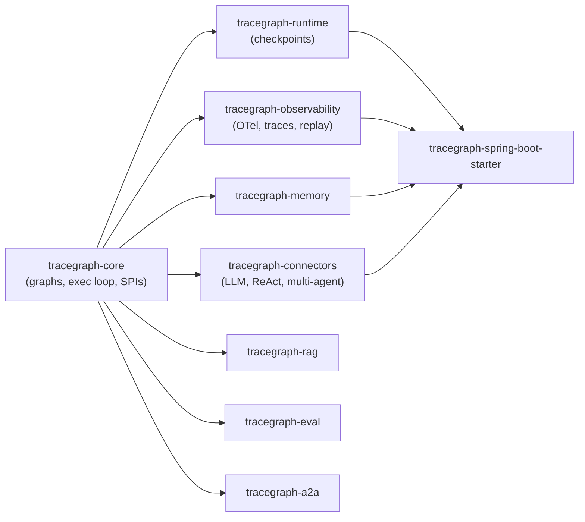
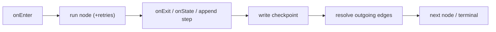

# Architecture

The design rationale behind TraceGraph: why it's shaped the way it is, where the seams are, and which constraints are deliberate. If **[[Core Concepts]]** is the *what*, this page is the *why*.

> 🌐 中文版： **[[zh-Architecture|架构设计]]**

## Product thesis

> **A production-grade agent runtime for the JVM.** Typed graphs, durable memory, deep observability.

TraceGraph is **not** "LangGraph but Java." Every design choice reinforces three properties: **reliability, debuggability, and enterprise readiness**. The killer differentiator the whole architecture protects:

> **Replay any agent execution with a full state diff and reasoning trace.**

That single capability explains most of the seams below — recording is separate from listening, edges are data not lambdas, state is immutable, and checkpoints write at a precise point in the loop.

## Module boundaries

TraceGraph is a Maven multi-module build. The hard rule: **`tracegraph-core` stays minimal** — SLF4J API only at runtime, no Spring, Jackson, or OpenTelemetry. Anything heavier lives behind an SPI in another module.

**The decision rule:** if a feature would force `tracegraph-core` to depend on Spring / Jackson / OTel / a memory store — it goes in another module. Concretely:

- Memory implementations (JDBC, Redis, vector) → `tracegraph-memory`, never core.
- Spring anything → `tracegraph-spring-boot-starter` only (it depends only on `spring-boot-autoconfigure`).
- OpenTelemetry → wired through `NodeListener` in `tracegraph-observability`, never imported by core.

See **[[Modules]]** for the per-module contents.

## The SPI seams

Core defines five service-provider interfaces and ships no-op or minimal defaults. Other modules supply real implementations; the Spring starter auto-wires them.

| SPI | Shape | Why it's an SPI |
|---|---|---|
| `NodeListener` | span-shaped lifecycle hooks; **executionId-blind** | metrics/tracing without coupling core to OTel |
| `TraceRecorder` | step recorder; **executionId-aware** | replay needs per-execution history; kept separate from listeners |
| `CheckpointStore` | save/load by executionId | durability without coupling core to JDBC |
| `MemoryStore` | scoped key-value | cross-run state without coupling core to a database |
| `Guardrail<T>` | ALLOW/BLOCK/TRANSFORM | content gating composable outside core |

### Why two observability SPIs?

`NodeListener` and `TraceRecorder` look similar but are deliberately distinct:

- **`NodeListener` is span-shaped and executionId-blind** — it maps cleanly onto OpenTelemetry spans, where the current span is ambient. One span per node; retries are span events; branches inside `parallel(...)` are invisible.
- **`TraceRecorder` is executionId-aware** — replay must reconstruct *which run* produced *which steps*, append on resume, and track fork/parent lineage. That needs the executionId in hand.

Collapsing them into one interface would force OTel to carry executionId (it shouldn't) or force replay to lose lineage (it can't). Keeping them separate is what makes both clean.

## The execution loop, and why the ordering matters

Two ordering rules are load-bearing:

1. **Checkpoints write after node exit, before edge resolution.** On resume, the executor re-evaluates the outgoing edges of `lastCompletedNode` and continues. This is only correct if **edge predicates are pure functions of state** — hence that's a hard contract, not a suggestion.
2. **State diffs fire once per successful node exit** — not per retry, not on failure. Retries are span events / an `attempts` counter, never extra steps. This keeps traces and spans a faithful 1:1 map of the logical run.

**At-least-once on resume:** a mid-node crash re-runs that node from attempt 1. Side-effecting nodes use `ctx.idempotencyKey()` to stay safe. TraceGraph chooses at-least-once (simple, durable) over exactly-once (distributed-consensus territory) on purpose.

## Concurrency model

Built for **Project Loom / virtual threads** (JDK 21):

- The default executor is **virtual-thread-per-task**, created lazily per `run` and shut down on completion. A user-supplied `.executor(...)` is **never** shut down by the graph — you own its lifecycle.
- Every blocking call inside a node (HTTP, JDBC, file I/O) should be virtual-thread friendly. **No `synchronized` across blocking I/O** (it pins carrier threads — use `ReentrantLock`). **No `ThreadLocal`** in node paths (VTs disrupt TL semantics) — use the `Context` parameter.
- `Graph<S>` is **immutable after `build()`** and safe to share across threads; `Graph.Builder<S>` is single-thread-only.
- Parallel branches must not share mutable state, must have a deterministic merge defined by the graph (not the runtime), and surface any branch failure to the parent (first-by-declaration-order wins).

See the in-repo [concurrency rules](https://github.com/kimhongzhang323/TraceGraph/blob/main/.claude/rules/concurrency.md).

## API design philosophy

The project positions itself as "production-grade JVM," so consumers will pin versions and depend on binary compatibility. Key stances (full rules: [api-design.md](https://github.com/kimhongzhang323/TraceGraph/blob/main/.claude/rules/api-design.md)):

- **Single type parameter `<S>`** on `Node`/`Graph`. Two type parameters double the inference burden on the fluent builder; use **state composition** for sub-results.
- **Edges are first-class data** (a top-level record), so replay/visualization can enumerate them.
- **Immutable state preferred** — nodes return the next state, never mutate. Final fields publish safely.
- **The fluent builder is the contract** — setters return `Builder<S>` (never `Builder<? extends S>`, which kills chain inference); `build()` validates eagerly and throws `*ValidationException`.
- **Pre-1.0 semver:** `0.x` minors may break, but every break is documented in `CHANGELOG.md`. `tracegraph-core` is the safest module to build against.

## How a new feature finds its home

A worked example of the decision rule — "add persistent traces":

1. Does it need Jackson/JDBC? **Yes** → not core.
2. Is it observability? **Yes** → `tracegraph-observability`.
3. Expose it behind the existing `TraceStore` SPI (`JsonFileTraceStore`, `JdbcTraceStore`) so core and the executor stay unchanged.
4. Make the heavy dep (`Jackson`) `<optional>` so users who don't opt in don't pay for it.
5. Auto-wire in the starter **only** when the classpath + beans are present (`@ConditionalOnClass`, `@ConditionalOnBean`).

That five-step shape repeats across the codebase — it's why the core stays small while the surface area grows.

---

**Related:** **[[Core Concepts]]** · **[[Execution Model]]** · **[[Modules]]** · **[[Observability and Replay]]**
