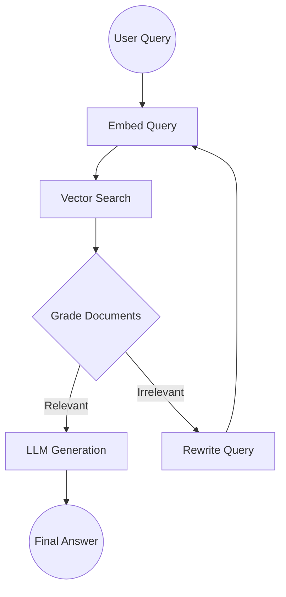

# Cookbook

Task-oriented recipes — "I want to build X" → here's the shape. Each recipe links to a runnable example in the repo. For the build-up walkthrough, see **[[Tutorial]]**.

> 🌐 中文版： **[[实用手册|zh-Cookbook]]**

**Recipes**

- [ReAct agent](#react-agent)
- [Agentic RAG](#agentic-rag)
- [Human-in-the-loop approval](#human-in-the-loop-approval)

---

## ReAct agent

**Goal:** an LLM that interleaves reasoning and tool use until it can answer.

A ReAct agent: (1) receives a task, (2) decides whether it needs a tool, (3) if so, executes the tool, observes the result, and loops back to (2), (4) otherwise produces the final answer. This is natively supported by TraceGraph's routing and tool nodes — `ReActAgent<S>` wires the `llm` → `tools` → `llm` … → `done` loop for you.

```java
Graph<AgentState> agent = ReActAgent.<AgentState>builder()
    .client(client)
    .tool(calcDef, calculator)
    .tool(searchDef, searchTool)
    .requestFactory(state -> LlmRequest.builder().messages(state.history()).model("gpt-4o-mini").build())
    .responseFolder((state, resp) -> state.withHistory(append(state.history(), ChatMessage.assistant(resp.content()))))
    .toolResultFolder((state, results) -> state.withHistory(append(state.history(), toMessages(results))))
    .build()
    .buildGraph();
```

See the full walkthrough in **[[Tutorial]] → Part 8**, the API in **[[LLM Connectors]]**, and the runnable example:

👉 [`examples/react-agent/`](https://github.com/kimhongzhang323/TraceGraph/tree/main/examples/react-agent)

---

## Agentic RAG

**Goal:** RAG that grades retrieved documents and rewrites the query when they're irrelevant — instead of blindly stuffing whatever came back into the prompt.



The key is conditional routing: a `gradeNode` (lightweight LLM call or heuristic) decides whether the retrieved context answers the query; if not, a `rewriteNode` rephrases and loops back to retrieval, with a retry cap so it always terminates.

```java
// state carries query, retrieved context, retryCount, finalAnswer
// route after retrieval based on a relevance grade:
//   relevant            -> "generate"
//   not relevant, < 3   -> "rewrite"  (then edge "rewrite" -> "retrieve")
//   not relevant, >= 3  -> "generate" (answer as best as possible)
```

Wire it with a `RoutingNode` (see **[[Runtime Features]] → Dynamic routing**) and give the `retrieve`/`generate` nodes their own retry policies. Because each step is a node, the whole loop is observable end-to-end in the trace. See **[[RAG]]** for the module, and the runnable example:

👉 [`examples/rag-agent/`](https://github.com/kimhongzhang323/TraceGraph/tree/main/examples/rag-agent)

---

## Human-in-the-loop approval

**Goal:** pause before a sensitive action (send email, delete record, transfer money) and require explicit human approval.

TraceGraph handles this with checkpoints + interrupts: (1) the graph executes up to a breakpoint, (2) execution suspends and state is persisted, (3) a human reviews the state via UI or API, (4) execution resumes — optionally with modified state or an approval flag.

```java
Graph<ApprovalState> graph = Graph.<ApprovalState>builder()
    .node("draft", draftNode).node("review", reviewNode).node("publish", publishNode)
    .edge("draft", "review").edge("review", "publish")
    .entry("draft").terminal("publish")
    .checkpointStore(checkpointStore)
    .interruptBefore("publish")
    .build();

ExecutionResult<ApprovalState> r = graph.run(ApprovalState.of("Draft content..."));  // INTERRUPTED
// ... operator approves ...
graph.resume(r.executionId());                                                        // COMPLETED
```

Full walkthrough in **[[Tutorial]] → Part 11**; REST flow in **[[REST API Reference]]** (`POST /tracegraph/traces/{id}/resume`). Runnable example:

👉 [`examples/hitl-approval/`](https://github.com/kimhongzhang323/TraceGraph/tree/main/examples/hitl-approval)

---

**See also:** **[[Tutorial]]** · **[[Multi-Agent Patterns]]** · **[[Spring Boot Integration]]**
