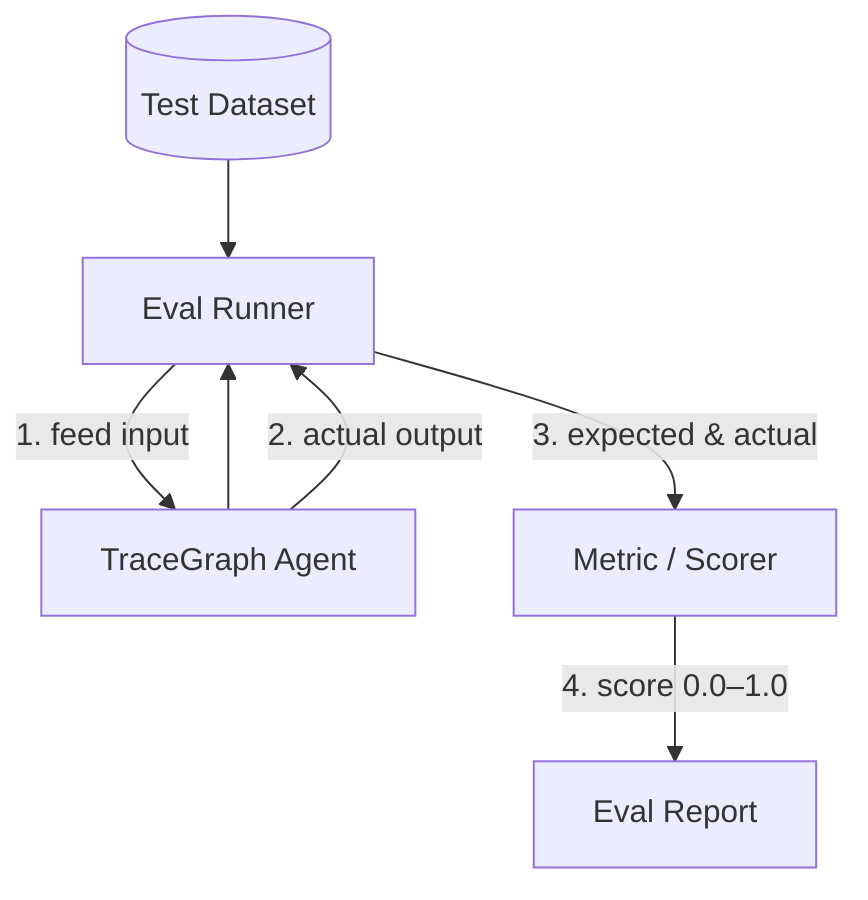

# Evaluation

`tracegraph-eval` scores and evaluates agents against a dataset of expected answers — so you can tell whether a prompt or graph change actually made the agent better.

LLM output is non-deterministic and often natural language, so "did it improve?" needs **metrics over a dataset**, not a single assertion.

## Core concepts

| Concept | Meaning |
|---|---|
| **Dataset** | a list of `(input, expected output)` pairs — the ground truth |
| **Metric / Scorer** | compares actual vs. expected, returns a score (0.0–1.0) |
| **Eval run** | runs the agent across the whole dataset, producing an aggregate report |



## Built-in metrics

| Metric | Measures |
|---|---|
| `ExactMatch` | exact equality |
| `Contains` | substring presence |
| `Latency` | wall-clock time |
| `BleuMetric` | n-gram overlap (whitespace-tokenized) |
| `RougeMetric` | recall-oriented overlap |
| `TokenF1Metric` | token precision/recall F1 |
| Embedding / LLM-judge | semantic similarity / model-graded correctness |

`BleuMetric` / `RougeMetric` / `TokenF1Metric` each take a `passThreshold` and implement the `Metric<S>` SAM:

```java
EvalSuite<MyState> suite = EvalSuite.<MyState>builder()
        .metric(new BleuMetric<>(MyState::output, MyState::expected, 0.4))
        .metric(new RougeMetric<>(MyState::output, MyState::expected, 0.5))
        .metric(new TokenF1Metric<>(MyState::output, MyState::expected, 0.6))
        .addCases(cases)
        .build();
```

## CI gating

Fail the build on regressions without custom assertion code:

```java
EvalSuite<S> suite = EvalSuite.<S>builder()
        .failFast(true)
        .minPassRate(0.95)
        .metric(metric)
        .addCases(cases)
        .build();

List<EvalResult<S>> results = suite.run(graph);
EvalSuite.assertPassed(results);   // throws EvalAssertionException on regression
```

## Baseline snapshots (run-over-run regression)

```java
EvalBaselineStore store = new EvalBaselineStore(Path.of("baselines/main.json"));
EvalBaseline baseline = store.load();

EvalReport.toComparisonMarkdown(currentResults, baseline);   // regression/improvement arrows
store.save(EvalBaseline.from(currentResults));               // promote on green
```

## Dataset loaders

Version-controllable datasets instead of hand-written Java cases:

```java
List<EvalCase<MyState>> jsonl = EvalCaseLoader.fromJsonl(
        Path.of("dataset.jsonl"),
        json -> new MyState(json.get("input").asText(), json.get("expected").asText()));

List<EvalCase<MyState>> csv = EvalCaseLoader.fromCsv(
        Path.of("dataset.csv"),
        row -> new MyState(row.get("input"), row.get("expected")));
```

## Parallel execution

Runs on virtual threads:

```java
List<EvalResult<S>> results = suite.runParallel(graph,
        Executors.newVirtualThreadPerTaskExecutor());
```

## Summary stats

```java
EvalSummary summary = EvalSummary.from(results);
// summary.passRate, summary.metricMeans, summary.latencyP50 / P95 / P99
String md = EvalReport.toSummaryMarkdown(results);
```

## Conditional metric skipping

Override `Metric.canScore(EvalCase<S>)` (defaults to `true`) so metrics gracefully no-op on cases they can't grade (e.g. an LLM-judge metric on a case with no `expected`). Skipped scores render as `—` in reports.

## Per-step golden-trace assertions

Beyond final-state equality, grade **intermediate behaviour** (tool args, retrieved docs, retry counts) on a captured `ExecutionTrace<S>` (see **[[Observability and Replay]]**):

```java
EvalRunner<S> runner = EvalRunner.<S>builder()
        .graph(graph)
        .traceStore(traceStore)
        .assertion("retrieve", step ->
                step.after().docs().size() < 3
                        ? Optional.of("expected ≥3 docs, got " + step.after().docs().size())
                        : Optional.empty())
        .build();
```

## Reporters

`EvalReport` produces **Markdown** (`toSummaryMarkdown`, `toComparisonMarkdown`) and **JUnit XML** for CI dashboards.

---

**Related:** **[[Observability and Replay]]** · **[[LLM Connectors]]** · **[[Multi-Agent Patterns]]**
