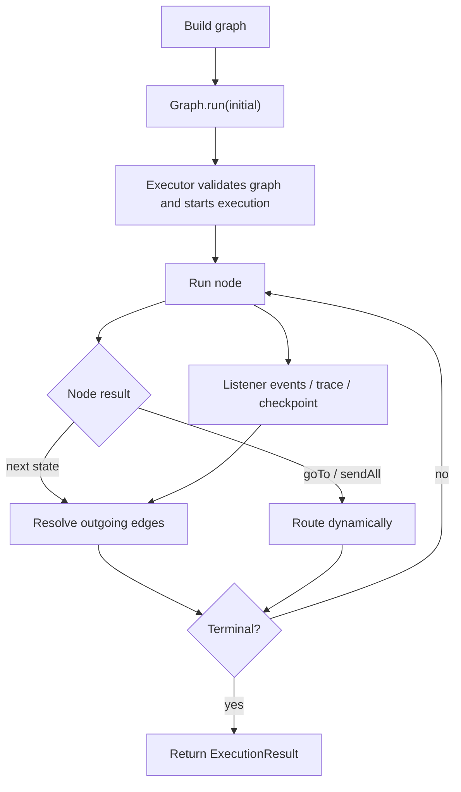
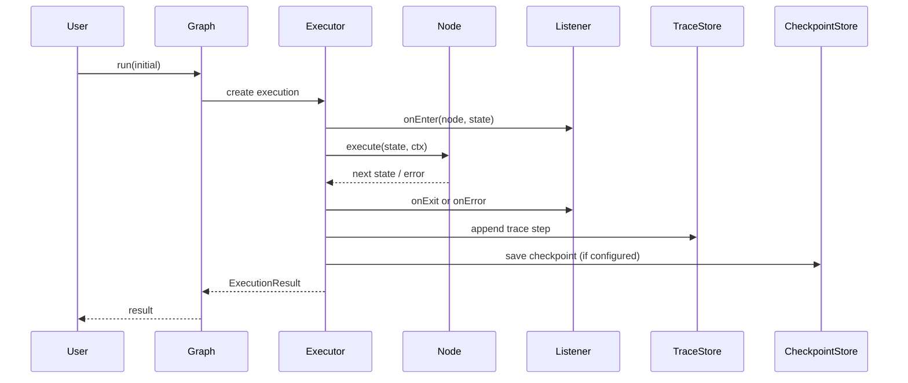

# Execution Model

TraceGraph keeps execution semantics explicit. There is no hidden scheduler or opaque agent loop behind `Graph.run(...)` — **the graph definition is the control flow.**

## The run loop

1. A graph starts at its single named **entry node**.
2. Each node receives the current typed **state** plus a **`Context`**.
3. The node returns a **new state**, or a **routing result** (for a routing node).
4. The executor **resolves outgoing edges**, retries if configured, and records listener / trace events.
5. Execution stops when a **terminal node** is reached, an **interrupt** is requested, or an **error** ends the run.

## Who talks to whom

## Three executor entry points

TraceGraph has exactly three ways into the executor:

| Entry point | Use | CheckpointStore? |
|---|---|---|
| `graph.run(seed)` | normal execution from the entry node | writes if configured |
| `graph.resume(executionId)` | continue a checkpointed / interrupted run | reads + writes |
| `graph.runFrom(startNode, seed, executionId)` | replay re-execution from a chosen point | **no** interaction |

`runFrom(...)` is the mechanic behind replay forks — see **[[Observability and Replay]]**.

## Ordering guarantees

These ordering rules are part of the contract and are what make replay and observability reliable:

- **Checkpoints write after node exit, before edge resolution.** Resume re-evaluates the outgoing edges of the saved `lastCompletedNode` and continues from there.
- **State diffs** (`NodeListener.onState`) fire **once per successful node exit** — not on failure, not per retry.
- **Retries** don't create extra trace steps; `TraceStep.attempts` records the count. Retries are span events on the same span (no span-per-attempt).
- **Listener `onEnter`/`onExit`** bracket each node; `onError` replaces `onExit` on failure.

## At-least-once semantics

Nodes are **at-least-once on resume**. If a crash happens mid-node, that node re-runs from attempt 1 on resume. This is why:

- **Edge predicates must be pure functions of state.**
- Nodes that perform side effects should use `ctx.idempotencyKey()` for their own deduplication.

## Failure handling

- A node throwing surfaces as `status = FAILED` with `error` populated, unless a `RetryPolicy` recovers it.
- `Error` and `InterruptedException` **always short-circuit retries**.
- Inside `parallel(...)`, **first-by-declaration-order failure wins**.

## Executor and threads

- The default executor is **virtual-thread-per-task**, lazily created per `run` and shut down on completion.
- A **user-supplied executor** via `.executor(...)` is **not** shut down by the graph — you own its lifecycle.
- Target Loom: every blocking call inside a node (HTTP, JDBC, file I/O) should be virtual-thread friendly. Avoid `synchronized` across blocking I/O (use `ReentrantLock`); don't `ThreadLocal`-cache in node paths. See the [concurrency rules](https://github.com/kimhongzhang323/TraceGraph/blob/main/.claude/rules/concurrency.md).

## Run-level outcomes (`Status`)

| Status | Meaning |
|---|---|
| `COMPLETED` | reached a terminal node |
| `INTERRUPTED` | paused at an interrupt point; resume to continue |
| `TERMINATED` | a `TerminationListener` predicate ended the run cleanly |
| `FAILED` | a node failed and retries were exhausted (or not configured) |

---

**Next:** **[[Runtime Features]]** — retries, async, parallel, checkpoints, interrupts, subgraphs, routing, streaming.
