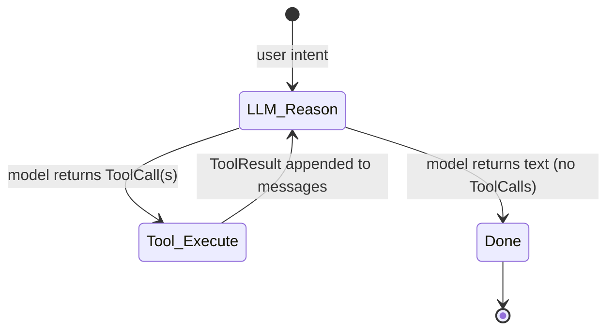

# LLM Connectors

`tracegraph-connectors` bridges the graph runtime to Large Language Models. It defines a **vendor-neutral `LlmClient` SPI** so you can swap providers without touching graph logic, ships concrete HTTP adapters, and provides `ChatNode<S>` and the `ReActAgent<S>` factory.

The module has **no mandatory dependencies beyond `tracegraph-core`** — Jackson is pulled in only when you use an HTTP adapter.

## LlmClient — the SPI

```java
public interface LlmClient {
    LlmResponse complete(LlmRequest request);

    default Flow.Publisher<LlmStreamChunk> stream(LlmRequest request) {
        // default wraps complete() into a single-chunk publisher;
        // providers with native streaming override this
    }
}
```

Swapping from OpenAI to Anthropic means replacing **one line** — the `LlmClient` construction. `ChatNode`, `ReActAgent`, tool definitions, and your state type stay unchanged.

### Records

| Record | Components |
|---|---|
| `LlmRequest` | `model`, `List<ChatMessage> messages`, `temperature`, `maxTokens` |
| `LlmResponse` | `content`, `finishReason`, `Usage usage` |
| `LlmResponse.Usage` | `promptTokens`, `completionTokens` |
| `ChatMessage` | `Role role`, `content` |
| `Role` (enum) | `USER`, `ASSISTANT`, `SYSTEM` |
| `LlmStreamChunk` | `delta`, `finishReason`; `isLast()` |

```java
LlmRequest request = new LlmRequest(
    "gpt-4o",
    List.of(
        new ChatMessage(Role.SYSTEM, "You are a helpful assistant."),
        new ChatMessage(Role.USER, "What is the capital of France?")),
    0.7,    // temperature
    1024);  // maxTokens
```

## Providers

| Client | Endpoint | Notes |
|---|---|---|
| `OpenAiLlmClient` | OpenAI-compatible `/chat/completions` | works with Azure, Ollama, LM Studio via custom endpoint |
| `AnthropicLlmClient` | Anthropic Messages API `POST /v1/messages` | lifts `SYSTEM` messages into top-level `system`; `x-api-key` + `anthropic-version` headers |
| `MockLlmClient` | none | in-tree test double: `echo()` / `constant(...)` / `of(lambda)` |

The connectors module also lists **Gemini, DeepSeek, and Ollama** adapters. Non-2xx responses from any HTTP adapter surface as **`LlmHttpException`** carrying `statusCode()` and `body()`.

### OpenAiLlmClient

```java
OpenAiLlmClient client = OpenAiLlmClient.builder()
    .apiKey(System.getenv("OPENAI_API_KEY"))
    .model("gpt-4o")
    .temperature(0.7)
    .maxTokens(2048)
    // .endpoint("https://api.openai.com/v1")  // override for Azure / Ollama / LM Studio
    // .httpClient(customHttpClient)
    // .requestTimeout(Duration.ofSeconds(60)) // default 30s
    .build();
```

| Builder option | Default | |
|---|---|---|
| `apiKey` | required | |
| `endpoint` | `https://api.openai.com/v1` | base URL |
| `model` | required | e.g. `gpt-4o` |
| `temperature` | `1.0` | 0.0–2.0 |
| `maxTokens` | `1024` | |
| `httpClient` | JDK default | custom `java.net.http.HttpClient` |
| `requestTimeout` | `30s` | |

Local model (Ollama / LM Studio) example:

```java
OpenAiLlmClient local = OpenAiLlmClient.builder()
    .apiKey("local")
    .endpoint("http://localhost:11434/v1")
    .model("llama3.1:8b")
    .build();
```

### AnthropicLlmClient

```java
AnthropicLlmClient client = AnthropicLlmClient.builder()
    .apiKey(System.getenv("ANTHROPIC_API_KEY"))
    .model("claude-3-5-sonnet-20241022")
    .maxTokens(4096)
    .build();
```

Builder options match OpenAI's, with `endpoint` defaulting to `https://api.anthropic.com`.

### MockLlmClient (tests)

```java
LlmClient echo     = MockLlmClient.echo();                       // echoes last user message
LlmClient constant = MockLlmClient.constant("Paris.");           // always the same
LlmClient lambda   = MockLlmClient.of(req -> new LlmResponse(     // full control
        "Mock reply to: " + req.messages().getLast().content(),
        "stop",
        new LlmResponse.Usage(10, 5)));
```

> For deterministic record/replay of real exchanges in CI, the connectors **test jar** ships `CassetteLlmClient` (a VCR-style client). `LlmClientContractTest` validates behaviors across providers via cassette replay — no live API keys needed.

## ChatNode — the LLM-to-graph bridge

`ChatNode<S>` adapts any `LlmClient` to a `Node<S>`. You supply two functions:

- `requestBuilder`: `Function<S, LlmRequest>` — build the request from state
- `responseFolder`: `BiFunction<S, LlmResponse, S>` — fold the response back into state

After the call, `ChatNode` automatically fires **`ctx.reportUsage(promptTokens, completionTokens)`** so listeners receive accurate token counts.

```java
ChatNode<ConversationState> chatNode = new ChatNode<>(
    client,
    state -> new LlmRequest("gpt-4o", state.messages(), 0.7, 1024),
    (state, response) -> state
        .withMessage(new ChatMessage(Role.ASSISTANT, response.content()))
        .withAnswer(response.content()));

Graph<ConversationState> graph = Graph.<ConversationState>builder()
        .node("chat", chatNode)
        .entry("chat").terminal("chat")
        .build();
```

`ChatNode` uses `complete()`, not `stream()`. Because it is a plain `Node<S>`, it works with `RetryPolicy` (handle 429s with exponential backoff) and `ctx.idempotencyKey()` identically to any node.

## Tools

`Tool` is a functional SAM — `execute(String args) → String` — where `args` is a JSON object string described by `ToolDefinition.parametersSchema()`.

```java
ToolDefinition weatherDef = new ToolDefinition(
    "get_weather",
    "Returns current weather conditions for a city.",
    """
    { "type":"object",
      "properties": { "city": { "type":"string" } },
      "required": ["city"] }
    """);

Tool weatherTool = args -> weatherService.getCurrent(parseCity(args)).toJson();
```

Records: `ToolDefinition(name, description, parametersSchema)`, `ToolCall`, `ToolResult`. Annotation-based binding (`@ToolMethod` + `ToolMethodAdapter`) converts Java methods to `Tool`/`ToolDefinition` via reflection.

## ReActAgent — Reason + Act loop

`ReActAgent<S>` is a factory that produces a complete `Graph<S>` implementing the ReAct loop. The built graph has three nodes: **`llm`** (routing node that calls the LLM), **`tools`** (executes tool calls), and **`done`** (terminal).



```java
Graph<AgentState> agentGraph = ReActAgent.<AgentState>builder()
    .client(client)
    .tool(weatherDef, weatherTool)
    .tool(searchDef, searchTool)
    .requestFactory(state -> new LlmRequest("gpt-4o", state.messages(), 0.5, 4096))
    .responseFolder((state, response) ->
        state.withMessage(new ChatMessage(Role.ASSISTANT, response.content())))
    .toolResultFolder((state, results) -> {
        var msgs = new ArrayList<>(state.messages());
        for (ToolResult r : results) {
            msgs.add(new ChatMessage(Role.USER, "Tool result: " + r.content()));
        }
        return new AgentState(List.copyOf(msgs), state.finalAnswer());
    })
    .build()
    .buildGraph();
```

To compose **multiple** ReAct agents (handoff, group chat, voting, role/tool isolation), see **[[Multi-Agent Patterns]]**.

## Streaming tokens

```java
client.stream(request).subscribe(new Flow.Subscriber<>() {
    public void onSubscribe(Flow.Subscription s) { s.request(Long.MAX_VALUE); }
    public void onNext(LlmStreamChunk chunk) {
        System.out.print(chunk.delta());
        if (chunk.isLast()) System.out.println();
    }
    public void onError(Throwable t) { t.printStackTrace(); }
    public void onComplete() { }
});
```

> Token streaming (`LlmClient.stream`) is distinct from graph-level event streaming (`Graph.stream`) — see **[[Runtime Features]]**.

## Other connector pieces (0.3.0)

| Feature | Type |
|---|---|
| Prompt templates | `PromptTemplate` (Mustache-style `{{var}}` + SHA-256 checksum), `PromptLibrary` |
| Structured output | `StructuredOutput<T>` — Jackson-backed extraction from `LlmResponse` |
| Guardrails | `LengthGuardrail`, `RegexPiiGuardrail`, `JsonSchemaGuardrail`, `LlmRequestGuardrail` (built on the core `Guardrail<T>` SPI) |
| MCP | Model Context Protocol adapters |

## Spring Boot

`LlmAutoConfiguration` wires an `OpenAiLlmClient` or `AnthropicLlmClient` from `tracegraph.llm.*` properties — see **[[Spring Boot Integration]]**.

## Cost tracking

`ChatNode` fires `ctx.reportUsage(...)`; `LlmCostListener` (in `tracegraph-observability`) accumulates per-execution / per-node totals — see **[[Observability and Replay]]**.

---

**Related:** **[[Multi-Agent Patterns]]** · **[[RAG]]** · **[[Observability and Replay]]**
