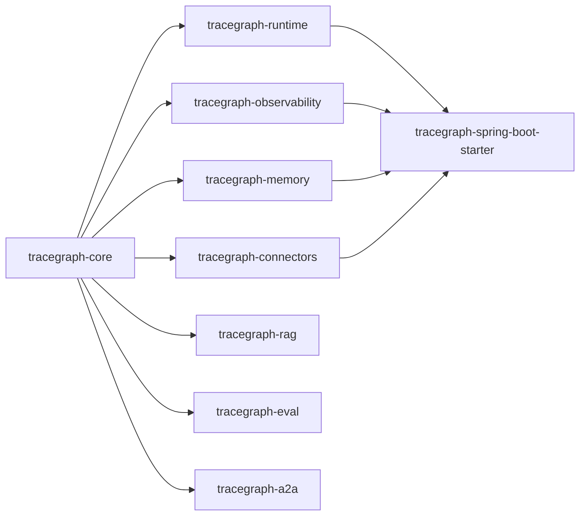

# Modules

TraceGraph is a Maven multi-module project — a parent POM at the root plus the modules below. The guiding rule: **`tracegraph-core` stays minimal** (SLF4J API only at runtime, no Spring / Jackson / OTel). Anything heavier goes in another module behind an SPI.

| Module | Purpose |
|---|---|
| `tracegraph-core` | Typed graphs, nodes, edges, execution results, retries, async nodes, parallel execution, routing, subgraphs, streaming, visualization. The `NodeListener` / `TraceRecorder` / `CheckpointStore` / `MemoryStore` / `Guardrail` SPIs live here. |
| `tracegraph-runtime` | Checkpoint store implementations (`InMemoryCheckpointStore`, `JdbcCheckpointStore`) and runtime-oriented resume behaviour. |
| `tracegraph-memory` | Scoped key-value memory: `InMemoryMemoryStore`, `FileMemoryStore`, `JdbcMemoryStore`. |
| `tracegraph-observability` | OpenTelemetry listeners, trace recording, replay, diffing, trace stores, cost/budget/termination listeners, exporters. |
| `tracegraph-spring-boot-starter` | Auto-configuration, REST endpoints, DI. The only module allowed to import Spring. |
| `tracegraph-connectors` | LLM HTTP clients (OpenAI, Anthropic, Gemini, DeepSeek, Ollama), prompt templates, structured output, guardrails, MCP, tools, ReAct + multi-agent patterns (Handoff, GroupChat, Voting, Supervisor). |
| `tracegraph-eval` | Golden-trace replay, metrics (Exact / Contains / Latency / BLEU / ROUGE / F1 / Embedding / LLM-judge), baseline comparison, dataset loaders, parallel execution. |
| `tracegraph-rag` | Embedding clients, vector stores (in-memory, Qdrant, Weaviate, Pinecone, PgVector), retrievers, RAG pipelines. |
| `tracegraph-a2a` | Agent-to-agent message bus and HTTP transport. |
| `tracegraph-bench` | JMH micro-benchmarks for graph dispatch and ReAct loops. Not published to Maven Central. |

## Dependency direction

`tracegraph-core` is the root that every other module depends on. The non-core modules depend on core (and optionally each other) and are consumed by the starter.



## Where does a feature belong?

If a feature would force `tracegraph-core` to depend on Spring / Jackson / OTel / a memory store — **it goes in another module.** Concretely:

- Memory implementations (JDBC, Redis, vector) → `tracegraph-memory` (or a connector module), never core.
- Spring anything → `tracegraph-spring-boot-starter` only.
- OpenTelemetry → wired through `NodeListener` in `tracegraph-observability`, never imported by core.

## Coordinates

Maven `groupId` is **`site.tracegraph`** (reverse-DNS of the verified `tracegraph.site` namespace). Java package names are **`io.tracegraph.*`** and are independent of the groupId.

```xml
<dependency>
    <groupId>site.tracegraph</groupId>
    <artifactId>tracegraph-core</artifactId>
    <version>0.3.0</version>
</dependency>
```

See **[[Getting Started]]** for the recommended adoption sequence.

---

**Related:** **[[Getting Started]]** · **[[Core Concepts]]**
