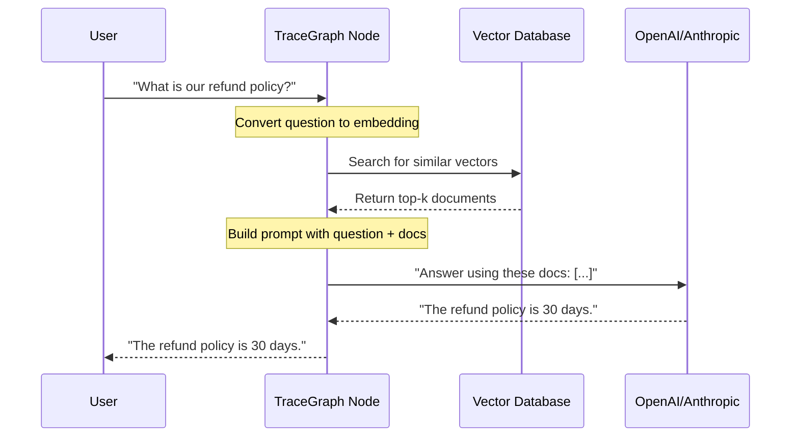

# RAG (Retrieval-Augmented Generation)

`tracegraph-rag` provides the tools to build retrieval-augmented workflows inside a TraceGraph graph: embedding clients, vector stores, retrievers, and RAG pipelines.

## Why RAG

LLMs only know what they were trained on — not your private wiki, today's news, or your database. RAG fixes this:

1. **Retrieve** relevant documents from a vector database.
2. **Augment** the user's prompt by pasting those documents in.
3. **Generate** an answer grounded in the pasted documents.



## What ships

| Piece | Examples |
|---|---|
| Embedding clients | `OpenAiEmbeddingClient`, `OllamaEmbeddingClient`, `GeminiEmbeddingClient`, `CohereEmbeddingClient` |
| Vector stores | in-memory, Qdrant, Weaviate, Pinecone, PgVector |
| Retrievers | `VectorStoreRetriever` |
| Pipelines | RAG pipeline helpers |

## Setting up a retriever

```java
import site.tracegraph.rag.retriever.VectorStoreRetriever;

VectorStoreRetriever retriever = VectorStoreRetriever.builder()
    .collectionName("company_policies")
    .topK(3)                  // return top 3 matches
    .build();
```

## A retrieval node

Create a node that retrieves before the LLM node runs, stashing documents into state:

```java
public class RetrieveDocsNode implements Node<RagState> {
    private final VectorStoreRetriever retriever;

    public RetrieveDocsNode(VectorStoreRetriever retriever) {
        this.retriever = retriever;
    }

    @Override
    public RagState apply(RagState state, Context ctx) {
        List<String> docs = retriever.retrieve(state.question());
        return state.withContextDocuments(docs);   // LLM node reads these next
    }
}
```

Then wire `RetrieveDocsNode` → a `ChatNode` (see **[[LLM Connectors]]**) whose `requestBuilder` pastes the retrieved documents into the prompt.

## Spring Boot

`EmbeddingAutoConfiguration` in the starter selects an embedding provider via the `tracegraph.rag.embedding.provider` property. See **[[Spring Boot Integration]]**.

## Runnable example

`examples/rag-agent` shows an end-to-end retrieval-augmented flow:

```bash
mvn -f examples/rag-agent/pom.xml exec:java
```

> **Note on memory vs. RAG:** the `MemoryStore` (see **[[Memory]]**) is a scoped key-value store for cross-run state; vector/semantic search is provided here in `tracegraph-rag`, not by the memory SPI.

---

**Related:** **[[LLM Connectors]]** · **[[Memory]]** · **[[Multi-Agent Patterns]]**
