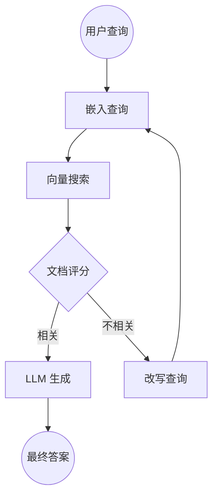

# 实用手册

任务导向食谱——"我想构建 X"→ 这是它的形态。每个食谱都链接到仓库中的可运行示例。循序渐进的教程见 **[[教程|zh-Tutorial]]**。

> 🌐 English: **[[Cookbook]]**

**食谱**

- [ReAct 智能体](#react-智能体)
- [智能体式 RAG](#智能体式-rag)
- [人在回路审批](#人在回路审批)

---

## ReAct 智能体

**目标：** 一个交替进行推理与工具使用、直到能作答的 LLM。

ReAct 智能体：(1) 接收任务，(2) 判断是否需要工具，(3) 若需要则执行工具、观察结果、回到 (2)，(4) 否则产出最终答案。TraceGraph 的路由与工具节点原生支持——`ReActAgent<S>` 为你接好 `llm` → `tools` → `llm` … → `done` 循环。

```java
Graph<AgentState> agent = ReActAgent.<AgentState>builder()
    .client(client)
    .tool(calcDef, calculator)
    .tool(searchDef, searchTool)
    .requestFactory(state -> LlmRequest.builder().messages(state.history()).model("gpt-4o-mini").build())
    .responseFolder((state, resp) -> state.withHistory(append(state.history(), ChatMessage.assistant(resp.content()))))
    .toolResultFolder((state, results) -> state.withHistory(append(state.history(), toMessages(results))))
    .build()
    .buildGraph();
```

完整讲解见 **[[教程|zh-Tutorial]] → 第 8 部分**，API 见 **[[LLM 连接器|zh-LLM-Connectors]]**，可运行示例：

👉 [`examples/react-agent/`](https://github.com/kimhongzhang323/TraceGraph/tree/main/examples/react-agent)

---

## 智能体式 RAG

**目标：** 对检索文档评分、在不相关时改写查询的 RAG——而非把返回内容盲目塞进提示词。



关键是条件路由：一个 `gradeNode`（轻量 LLM 调用或启发式）判断检索上下文是否回答了查询；若否，`rewriteNode` 改写并回到检索，并设重试上限确保终止。

```java
// 状态携带 query、检索上下文、retryCount、finalAnswer
// 检索后按相关性评分路由：
//   相关             -> "generate"
//   不相关，< 3      -> "rewrite"（再 edge "rewrite" -> "retrieve"）
//   不相关，>= 3     -> "generate"（尽力作答）
```

用 `RoutingNode` 接线（见 **[[运行时特性|zh-Runtime-Features]] → 动态路由**），并给 `retrieve`/`generate` 节点各自的重试策略。因每步都是节点，整个循环在追踪中端到端可观测。模块见 **[[RAG 检索增强|zh-RAG]]**，可运行示例：

👉 [`examples/rag-agent/`](https://github.com/kimhongzhang323/TraceGraph/tree/main/examples/rag-agent)

---

## 人在回路审批

**目标：** 在敏感动作（发邮件、删记录、转账）前暂停并要求明确的人工批准。

TraceGraph 用检查点 + 中断处理：(1) 图执行到断点，(2) 执行挂起、状态持久化，(3) 人经 UI 或 API 审核状态，(4) 执行恢复——可带修改后状态或批准标志。

```java
Graph<ApprovalState> graph = Graph.<ApprovalState>builder()
    .node("draft", draftNode).node("review", reviewNode).node("publish", publishNode)
    .edge("draft", "review").edge("review", "publish")
    .entry("draft").terminal("publish")
    .checkpointStore(checkpointStore)
    .interruptBefore("publish")
    .build();

ExecutionResult<ApprovalState> r = graph.run(ApprovalState.of("Draft content..."));  // INTERRUPTED
// ... 操作者批准 ...
graph.resume(r.executionId());                                                        // COMPLETED
```

完整讲解见 **[[教程|zh-Tutorial]] → 第 11 部分**；REST 流程见 **[[REST API 参考|zh-REST-API-Reference]]**（`POST /tracegraph/traces/{id}/resume`）。可运行示例：

👉 [`examples/hitl-approval/`](https://github.com/kimhongzhang323/TraceGraph/tree/main/examples/hitl-approval)

---

**另见：** **[[教程|zh-Tutorial]]** · **[[多智能体模式|zh-Multi-Agent-Patterns]]** · **[[Spring Boot 集成|zh-Spring-Boot-Integration]]**
