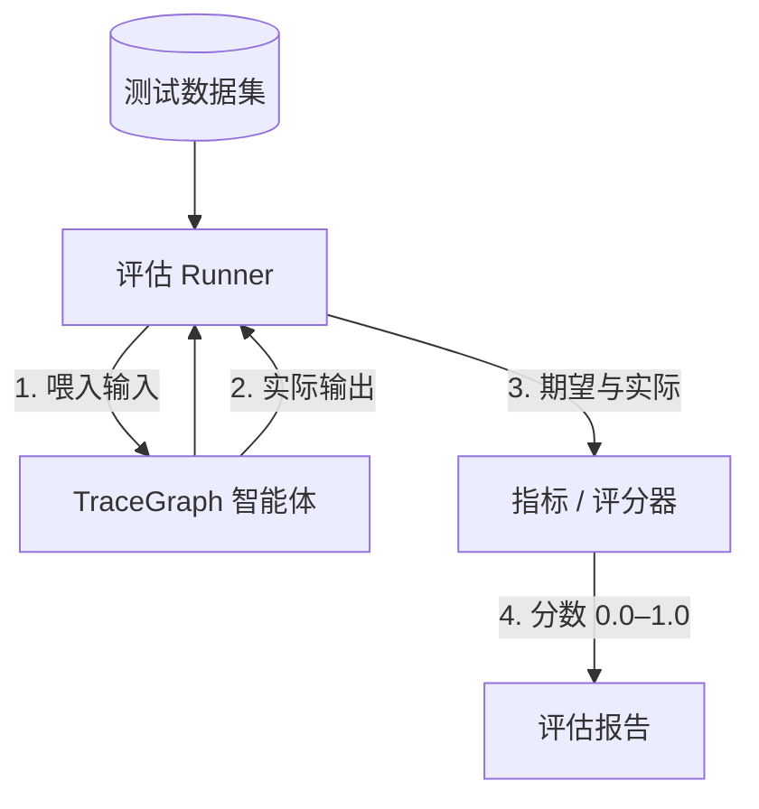

# 评估

`tracegraph-eval` 针对一组期望答案的数据集对智能体打分与评估——让你判断改提示词或改图逻辑是否真的让智能体变好了。

LLM 输出非确定且常为自然语言，因此"是否变好"需要**数据集上的指标**，而非单个断言。

> 🌐 本页为 AI 机翻草稿，需人工校对。English: **[[Evaluation]]**

## 核心概念

| 概念 | 含义 |
|---|---|
| **数据集** | `(输入, 期望输出)` 对的列表——真值 |
| **指标 / 评分器** | 比较实际与期望，返回分数（0.0–1.0） |
| **评估运行** | 在整个数据集上运行智能体，产出聚合报告 |



## 内置指标

| 指标 | 衡量 |
|---|---|
| `ExactMatch` | 完全相等 |
| `Contains` | 子串存在 |
| `Latency` | 墙钟时间 |
| `BleuMetric` | n-gram 重叠（空白分词） |
| `RougeMetric` | 召回导向重叠 |
| `TokenF1Metric` | token 精确率/召回率 F1 |
| Embedding / LLM-judge | 语义相似 / 模型评分正确性 |

`BleuMetric` / `RougeMetric` / `TokenF1Metric` 各取一个 `passThreshold` 并实现 `Metric<S>` SAM：

```java
EvalSuite<MyState> suite = EvalSuite.<MyState>builder()
        .metric(new BleuMetric<>(MyState::output, MyState::expected, 0.4))
        .metric(new RougeMetric<>(MyState::output, MyState::expected, 0.5))
        .metric(new TokenF1Metric<>(MyState::output, MyState::expected, 0.6))
        .addCases(cases)
        .build();
```

## CI 门禁

无需自定义断言代码即可在回归时让构建失败：

```java
EvalSuite<S> suite = EvalSuite.<S>builder()
        .failFast(true).minPassRate(0.95)
        .metric(metric).addCases(cases)
        .build();

List<EvalResult<S>> results = suite.run(graph);
EvalSuite.assertPassed(results);   // 回归时抛 EvalAssertionException
```

## 基线快照（逐次回归检测）

```java
EvalBaselineStore store = new EvalBaselineStore(Path.of("baselines/main.json"));
EvalBaseline baseline = store.load();
EvalReport.toComparisonMarkdown(currentResults, baseline);   // 回归/改进箭头
store.save(EvalBaseline.from(currentResults));               // 绿灯时提升
```

## 数据集加载器

可版本化的数据集，替代手写 Java case：

```java
List<EvalCase<MyState>> jsonl = EvalCaseLoader.fromJsonl(
        Path.of("dataset.jsonl"),
        json -> new MyState(json.get("input").asText(), json.get("expected").asText()));

List<EvalCase<MyState>> csv = EvalCaseLoader.fromCsv(
        Path.of("dataset.csv"),
        row -> new MyState(row.get("input"), row.get("expected")));
```

## 并行执行

在虚拟线程上运行：

```java
List<EvalResult<S>> results = suite.runParallel(graph,
        Executors.newVirtualThreadPerTaskExecutor());
```

## 摘要统计

```java
EvalSummary summary = EvalSummary.from(results);
// summary.passRate, summary.metricMeans, summary.latencyP50 / P95 / P99
String md = EvalReport.toSummaryMarkdown(results);
```

## 条件跳过指标

覆盖 `Metric.canScore(EvalCase<S>)`（默认 `true`），使指标在无法评分的 case 上优雅地不操作（如对无 `expected` 的 case 跳过 LLM-judge 指标）。跳过的分数在报告中渲染为 `—`。

## 逐步黄金追踪断言

除终态相等外，对捕获的 `ExecutionTrace<S>`（见 **[[zh-Observability-and-Replay|可观测性与重放]]**）评估**中间行为**（工具参数、检索文档、重试次数）：

```java
EvalRunner<S> runner = EvalRunner.<S>builder()
        .graph(graph).traceStore(traceStore)
        .assertion("retrieve", step ->
                step.after().docs().size() < 3
                        ? Optional.of("expected ≥3 docs, got " + step.after().docs().size())
                        : Optional.empty())
        .build();
```

## 报告器

`EvalReport` 产出 **Markdown**（`toSummaryMarkdown`、`toComparisonMarkdown`）与 **JUnit XML**，供 CI 仪表板使用。

---

**相关：** **[[zh-Observability-and-Replay|可观测性与重放]]** · **[[zh-LLM-Connectors|LLM 连接器]]** · **[[zh-Multi-Agent-Patterns|多智能体模式]]**
