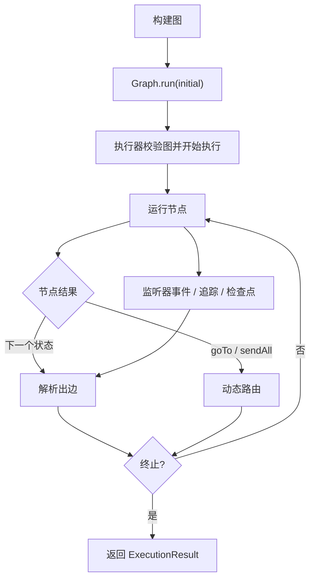

# 执行模型

TraceGraph 让执行语义保持显式。`Graph.run(...)` 背后没有隐藏的调度器或不透明的智能体循环——**图的定义就是控制流。**

> 🌐 本页为 AI 机翻草稿，需人工校对。English: **[[Execution Model]]**

## 运行循环

1. 图从其唯一的具名**入口节点**开始。
2. 每个节点接收当前类型化**状态**与一个 **`Context`**。
3. 节点返回一个**新状态**，或（对路由节点而言）一个**路由结果**。
4. 执行器**解析出边**，按配置重试，并记录监听器/追踪事件。
5. 当到达**终止节点**、请求**中断**或**错误**结束运行时，执行停止。

## 三个执行器入口

TraceGraph 恰好有三种进入执行器的方式：

| 入口 | 用途 | 涉及 CheckpointStore? |
|---|---|---|
| `graph.run(seed)` | 从入口节点正常执行 | 已配置则写入 |
| `graph.resume(executionId)` | 继续一个检查点/中断的运行 | 读 + 写 |
| `graph.runFrom(startNode, seed, executionId)` | 从某点重放重执行 | **不**交互 |

`runFrom(...)` 是重放分叉背后的机制——见 **[[zh-Observability-and-Replay|可观测性与重放]]**。

## 顺序保证

这些顺序规则是契约的一部分，也正是重放与可观测性可靠的原因：

- **检查点在节点退出之后、解析边之前写入。** 恢复时重新求值已保存 `lastCompletedNode` 的出边并继续。
- **状态差异**（`NodeListener.onState`）在**每次成功节点退出时触发一次**——失败时不触发，每次重试不触发。
- **重试**不产生额外追踪步骤；`TraceStep.attempts` 记录次数。重试是同一 span 上的事件（不是每次尝试一个 span）。
- **监听器 `onEnter`/`onExit`** 包住每个节点；失败时 `onError` 取代 `onExit`。

## 至少一次语义

节点在恢复时是**至少一次**。若节点执行中途崩溃，恢复时该节点从第 1 次尝试重跑。因此：

- **边谓词必须是状态的纯函数。**
- 有副作用的节点应使用 `ctx.idempotencyKey()` 做自己的去重。

## 失败处理

- 节点抛出异常表现为 `status = FAILED` 且 `error` 被填充，除非 `RetryPolicy` 恢复了它。
- `Error` 与 `InterruptedException` **总是短路**重试。
- 在 `parallel(...)` 内，**按声明顺序的第一个失败胜出**。

## 执行器与线程

- 默认执行器是**每任务虚拟线程**，按 `run` 惰性创建，完成时关闭。
- 通过 `.executor(...)` 提供的**用户执行器**不会被图关闭——其生命周期由你负责。
- 面向 Loom：节点内每个阻塞调用（HTTP、JDBC、文件 I/O）都应对虚拟线程友好。避免在阻塞 I/O 上使用 `synchronized`（改用 `ReentrantLock`）；不要在节点路径上用 `ThreadLocal`。见仓库内[并发规则](https://github.com/kimhongzhang323/TraceGraph/blob/main/.claude/rules/concurrency.md)。

## 运行级结果（`Status`）

| 状态 | 含义 |
|---|---|
| `COMPLETED` | 到达终止节点 |
| `INTERRUPTED` | 在中断点暂停；恢复以继续 |
| `TERMINATED` | `TerminationListener` 谓词干净地结束了运行 |
| `FAILED` | 节点失败且重试耗尽（或未配置） |

---

**下一步：** **[[zh-Runtime-Features|运行时特性]]**——重试、异步、并行、检查点、中断、子图、路由、流式。
