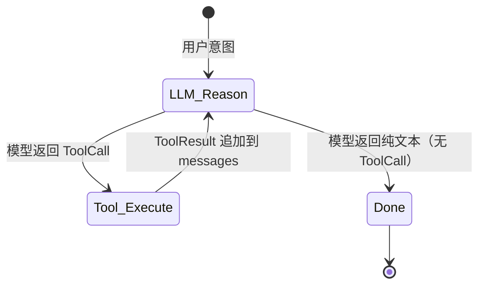

# LLM 连接器

`tracegraph-connectors` 把图运行时桥接到大语言模型。它定义**与厂商无关的 `LlmClient` SPI**，让你无需改图逻辑即可切换提供方，并提供具体 HTTP 适配器、`ChatNode<S>` 与 `ReActAgent<S>` 工厂。

该模块**除 `tracegraph-core` 外无强制依赖**——仅当使用 HTTP 适配器时才引入 Jackson。

> 🌐 本页为 AI 机翻草稿，需人工校对。English: **[[LLM Connectors]]**

## LlmClient —— SPI

```java
public interface LlmClient {
    LlmResponse complete(LlmRequest request);
    default Flow.Publisher<LlmStreamChunk> stream(LlmRequest request) {
        // 默认将 complete() 包装为单块发布者；有原生流式的提供方覆盖此方法
    }
}
```

从 OpenAI 切到 Anthropic 只需替换**一行**——`LlmClient` 构造。`ChatNode`、`ReActAgent`、工具定义与状态类型都不变。

### 记录

| 记录 | 组件 |
|---|---|
| `LlmRequest` | `model`、`List<ChatMessage> messages`、`temperature`、`maxTokens` |
| `LlmResponse` | `content`、`finishReason`、`Usage usage` |
| `LlmResponse.Usage` | `promptTokens`、`completionTokens` |
| `ChatMessage` | `Role role`、`content` |
| `Role`（枚举） | `USER`、`ASSISTANT`、`SYSTEM` |
| `LlmStreamChunk` | `delta`、`finishReason`；`isLast()` |

## 提供方

| 客户端 | 端点 | 备注 |
|---|---|---|
| `OpenAiLlmClient` | OpenAI 兼容 `/chat/completions` | 经自定义 endpoint 适配 Azure、Ollama、LM Studio |
| `AnthropicLlmClient` | Anthropic Messages API `POST /v1/messages` | 把 `SYSTEM` 消息提升到顶层 `system`；`x-api-key` + `anthropic-version` 头 |
| `MockLlmClient` | 无 | 测试替身：`echo()` / `constant(...)` / `of(lambda)` |

连接器模块还列有 **Gemini、DeepSeek、Ollama** 适配器。任意 HTTP 适配器的非 2xx 响应表现为 **`LlmHttpException`**（含 `statusCode()` 与 `body()`）。

### OpenAiLlmClient

```java
OpenAiLlmClient client = OpenAiLlmClient.builder()
    .apiKey(System.getenv("OPENAI_API_KEY"))
    .model("gpt-4o")
    .temperature(0.7)
    .maxTokens(2048)
    // .endpoint("https://api.openai.com/v1")  // 覆盖以适配 Azure / Ollama / LM Studio
    // .requestTimeout(Duration.ofSeconds(60)) // 默认 30s
    .build();
```

| 构建器选项 | 默认 |
|---|---|
| `apiKey` | 必填 |
| `endpoint` | `https://api.openai.com/v1` |
| `model` | 必填 |
| `temperature` | `1.0` |
| `maxTokens` | `1024` |
| `httpClient` | JDK 默认 |
| `requestTimeout` | `30s` |

本地模型（Ollama / LM Studio）：

```java
OpenAiLlmClient local = OpenAiLlmClient.builder()
    .apiKey("local").endpoint("http://localhost:11434/v1").model("llama3.1:8b").build();
```

### AnthropicLlmClient

```java
AnthropicLlmClient client = AnthropicLlmClient.builder()
    .apiKey(System.getenv("ANTHROPIC_API_KEY"))
    .model("claude-3-5-sonnet-20241022")
    .maxTokens(4096)
    .build();
```

构建器选项与 OpenAI 一致，`endpoint` 默认 `https://api.anthropic.com`。

### MockLlmClient（测试）

```java
LlmClient echo     = MockLlmClient.echo();                       // 回显最后一条用户消息
LlmClient constant = MockLlmClient.constant("Paris.");           // 总是相同
LlmClient lambda   = MockLlmClient.of(req -> new LlmResponse(     // 完全控制
        "Mock reply to: " + req.messages().getLast().content(),
        "stop", new LlmResponse.Usage(10, 5)));
```

> 在 CI 中确定性录制/回放真实交互，连接器**测试 jar** 提供 `CassetteLlmClient`（VCR 风格）。

## ChatNode —— LLM 到图的桥接

`ChatNode<S>` 把任意 `LlmClient` 适配为 `Node<S>`。你提供两个函数：

- `requestBuilder`: `Function<S, LlmRequest>`——从状态构建请求
- `responseFolder`: `BiFunction<S, LlmResponse, S>`——把响应折回状态

调用后，`ChatNode` 自动触发 **`ctx.reportUsage(promptTokens, completionTokens)`**，使监听器收到精确 token 数。

```java
ChatNode<ConversationState> chatNode = new ChatNode<>(
    client,
    state -> new LlmRequest("gpt-4o", state.messages(), 0.7, 1024),
    (state, response) -> state
        .withMessage(new ChatMessage(Role.ASSISTANT, response.content()))
        .withAnswer(response.content()));
```

`ChatNode` 使用 `complete()` 而非 `stream()`。因为它是普通 `Node<S>`，与 `RetryPolicy`（用指数退避处理 429）和 `ctx.idempotencyKey()` 的集成与任意节点一致。

## 工具

`Tool` 是函数式 SAM——`execute(String args) → String`——其中 `args` 是由 `ToolDefinition.parametersSchema()` 描述的 JSON 对象串。

```java
ToolDefinition weatherDef = new ToolDefinition(
    "get_weather", "Returns current weather conditions for a city.",
    """
    { "type":"object",
      "properties": { "city": { "type":"string" } },
      "required": ["city"] }
    """);

Tool weatherTool = args -> weatherService.getCurrent(parseCity(args)).toJson();
```

记录：`ToolDefinition(name, description, parametersSchema)`、`ToolCall`、`ToolResult`。基于注解的绑定（`@ToolMethod` + `ToolMethodAdapter`）通过反射把 Java 方法转为 `Tool`/`ToolDefinition`。

## ReActAgent —— 推理 + 行动循环

`ReActAgent<S>` 是生成完整 `Graph<S>` 的工厂，实现 ReAct 循环。生成的图含三个节点：**`llm`**（调用 LLM 的路由节点）、**`tools`**（执行工具调用）、**`done`**（终止）。



```java
Graph<AgentState> agentGraph = ReActAgent.<AgentState>builder()
    .client(client)
    .tool(weatherDef, weatherTool)
    .requestFactory(state -> new LlmRequest("gpt-4o", state.messages(), 0.5, 4096))
    .responseFolder((state, response) ->
        state.withMessage(new ChatMessage(Role.ASSISTANT, response.content())))
    .toolResultFolder((state, results) -> { /* 把工具结果折回状态 */ return state; })
    .build()
    .buildGraph();
```

要组合**多个** ReAct 智能体（交接、群聊、投票、角色/工具隔离），见 **[[zh-Multi-Agent-Patterns|多智能体模式]]**。

## token 流式

```java
client.stream(request).subscribe(new Flow.Subscriber<>() {
    public void onSubscribe(Flow.Subscription s) { s.request(Long.MAX_VALUE); }
    public void onNext(LlmStreamChunk chunk) {
        System.out.print(chunk.delta());
        if (chunk.isLast()) System.out.println();
    }
    public void onError(Throwable t) { t.printStackTrace(); }
    public void onComplete() { }
});
```

> token 流式（`LlmClient.stream`）区别于图级事件流式（`Graph.stream`）——见 **[[zh-Runtime-Features|运行时特性]]**。

## 其他连接器组件（0.3.0）

| 功能 | 类型 |
|---|---|
| 提示词模板 | `PromptTemplate`（Mustache 风格 `{{var}}` + SHA-256 校验和）、`PromptLibrary` |
| 结构化输出 | `StructuredOutput<T>`——基于 Jackson 从 `LlmResponse` 抽取 |
| 护栏 | `LengthGuardrail`、`RegexPiiGuardrail`、`JsonSchemaGuardrail`、`LlmRequestGuardrail`（基于核心 `Guardrail<T>` SPI） |
| MCP | Model Context Protocol 适配器 |

## Spring Boot

`LlmAutoConfiguration` 从 `tracegraph.llm.*` 属性接线 `OpenAiLlmClient` 或 `AnthropicLlmClient`——见 **[[zh-Spring-Boot-Integration|Spring Boot 集成]]**。

## 成本追踪

`ChatNode` 触发 `ctx.reportUsage(...)`；`LlmCostListener`（在 `tracegraph-observability`）累计每执行/每节点总量——见 **[[zh-Observability-and-Replay|可观测性与重放]]**。

---

**相关：** **[[zh-Multi-Agent-Patterns|多智能体模式]]** · **[[zh-RAG|RAG 检索增强]]** · **[[zh-Observability-and-Replay|可观测性与重放]]**
