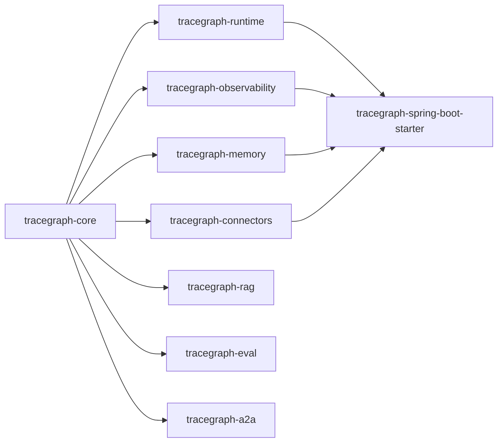

# 模块

TraceGraph 是一个 Maven 多模块项目——根部一个父 POM，加上下列模块。指导原则：**`tracegraph-core` 保持精简**（运行时仅 SLF4J API，无 Spring / Jackson / OTel）。更重的东西都通过 SPI 放在其他模块。

> 🌐 English: **[[Modules]]**

| 模块 | 职责 |
|---|---|
| `tracegraph-core` | 类型化图、节点、边、执行结果、重试、异步节点、并行执行、路由、子图、流式、可视化。`NodeListener` / `TraceRecorder` / `CheckpointStore` / `MemoryStore` / `Guardrail` 等 SPI 都在这里。 |
| `tracegraph-runtime` | 检查点存储实现（`InMemoryCheckpointStore`、`JdbcCheckpointStore`）与面向运行时的恢复行为。 |
| `tracegraph-memory` | 作用域键值记忆：`InMemoryMemoryStore`、`FileMemoryStore`、`JdbcMemoryStore`。 |
| `tracegraph-observability` | OpenTelemetry 监听器、追踪记录、重放、差异比较、追踪存储、成本/预算/终止监听器、导出器。 |
| `tracegraph-spring-boot-starter` | 自动配置、REST 端点、依赖注入。唯一允许导入 Spring 的模块。 |
| `tracegraph-connectors` | LLM HTTP 客户端（OpenAI、Anthropic、Gemini、DeepSeek、Ollama）、提示词模板、结构化输出、护栏、MCP、工具、ReAct 与多智能体模式（交接、群聊、投票、Supervisor）。 |
| `tracegraph-eval` | 黄金追踪重放、指标（Exact / Contains / Latency / BLEU / ROUGE / F1 / Embedding / LLM-judge）、基线对比、数据集加载器、并行执行。 |
| `tracegraph-rag` | 嵌入客户端、向量库（内存、Qdrant、Weaviate、Pinecone、PgVector）、检索器、RAG 流水线。 |
| `tracegraph-a2a` | 智能体到智能体的消息总线与 HTTP 传输。 |
| `tracegraph-bench` | 面向图分发与 ReAct 循环的 JMH 微基准。不发布到 Maven Central。 |

## 依赖方向

`tracegraph-core` 是每个其他模块都依赖的根。



## 一个功能该放在哪里？

如果某功能会迫使 `tracegraph-core` 依赖 Spring / Jackson / OTel / 某个记忆存储——**它就该放到别的模块。** 具体而言：

- 记忆实现（JDBC、Redis、向量）→ `tracegraph-memory`（或连接器模块），绝不进 core。
- 任何 Spring 内容 → 仅 `tracegraph-spring-boot-starter`。
- OpenTelemetry → 通过 `tracegraph-observability` 的 `NodeListener` 接入，core 绝不导入。

## 坐标

Maven `groupId` 为 **`site.tracegraph`**（已验证 `tracegraph.site` 命名空间的反向 DNS）。Java 包名为 **`io.tracegraph.*`**，与 groupId 独立。

```xml
<dependency>
    <groupId>site.tracegraph</groupId>
    <artifactId>tracegraph-core</artifactId>
    <version>0.3.0</version>
</dependency>
```

推荐采用顺序见 **[[快速开始|zh-Getting-Started]]**。

---

**相关：** **[[快速开始|zh-Getting-Started]]** · **[[核心概念|zh-Core-Concepts]]**
