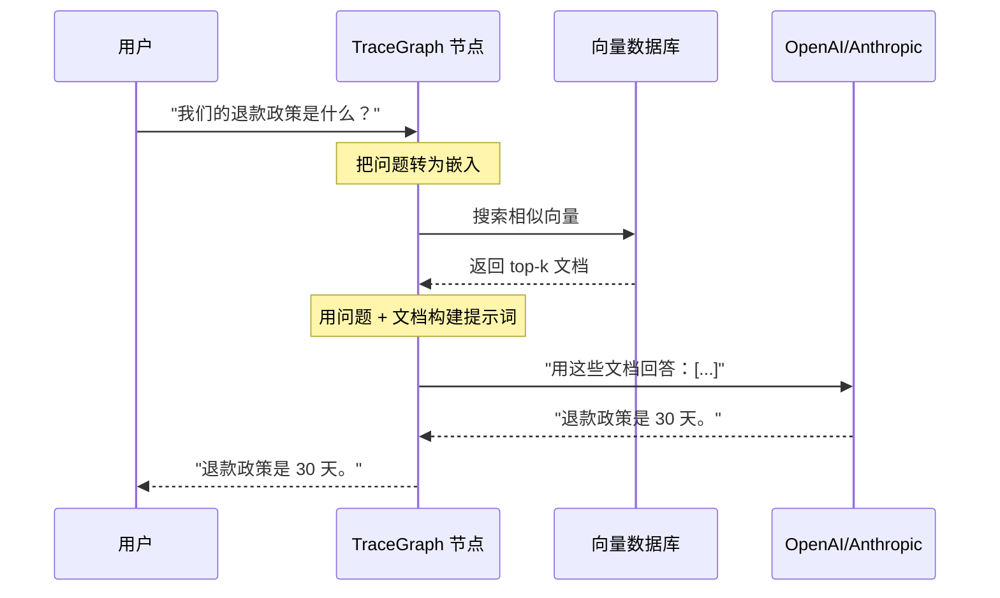

# RAG（检索增强生成）

`tracegraph-rag` 提供在 TraceGraph 图内构建检索增强工作流的工具：嵌入客户端、向量库、检索器与 RAG 流水线。

> 🌐 本页为 AI 机翻草稿，需人工校对。English: **[[RAG]]**

## 为什么需要 RAG

LLM 只知道训练过的内容——不知道你的私有 wiki、今天的新闻或你的数据库。RAG 修复这点：

1. **检索（Retrieve）** 向量库中的相关文档。
2. **增强（Augment）** 把这些文档贴入用户提示词。
3. **生成（Generate）** 基于贴入文档的答案。



## 提供的组件

| 组件 | 示例 |
|---|---|
| 嵌入客户端 | `OpenAiEmbeddingClient`、`OllamaEmbeddingClient`、`GeminiEmbeddingClient`、`CohereEmbeddingClient` |
| 向量库 | 内存、Qdrant、Weaviate、Pinecone、PgVector |
| 检索器 | `VectorStoreRetriever` |
| 流水线 | RAG 流水线辅助 |

## 设置检索器

```java
import site.tracegraph.rag.retriever.VectorStoreRetriever;

VectorStoreRetriever retriever = VectorStoreRetriever.builder()
    .collectionName("company_policies")
    .topK(3)
    .build();
```

## 检索节点

在 LLM 节点之前检索，把文档存入状态：

```java
public class RetrieveDocsNode implements Node<RagState> {
    private final VectorStoreRetriever retriever;
    public RetrieveDocsNode(VectorStoreRetriever retriever) { this.retriever = retriever; }

    @Override
    public RagState apply(RagState state, Context ctx) {
        List<String> docs = retriever.retrieve(state.question());
        return state.withContextDocuments(docs);   // LLM 节点接下来读取
    }
}
```

随后把 `RetrieveDocsNode` 接到一个 `ChatNode`（见 **[[zh-LLM-Connectors|LLM 连接器]]**），其 `requestBuilder` 把检索到的文档贴入提示词。

## Spring Boot

starter 中的 `EmbeddingAutoConfiguration` 经 `tracegraph.rag.embedding.provider` 属性选择嵌入提供方。见 **[[zh-Spring-Boot-Integration|Spring Boot 集成]]**。

## 可运行示例

```bash
mvn -f examples/rag-agent/pom.xml exec:java
```

> **记忆 vs RAG：** `MemoryStore`（见 **[[zh-Memory|记忆]]**）是跨运行状态的作用域键值存储；向量/语义检索由 `tracegraph-rag` 提供，而非记忆 SPI。

---

**相关：** **[[zh-LLM-Connectors|LLM 连接器]]** · **[[zh-Memory|记忆]]** · **[[zh-Multi-Agent-Patterns|多智能体模式]]**
