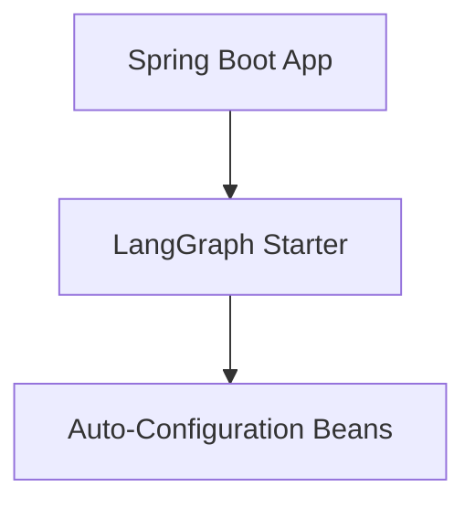

# LangGraph Spring Boot Starter

## Overview
This module serves as a Spring Boot starter designed for integrating graph-based agent orchestration within the Spring ecosystem. Note: Consult the core documentation or `tracegraph-spring-boot-starter` for the most actively maintained starter.

## Architecture

## Features
- Spring Boot auto-configuration support
- Component scanning for agent beans
