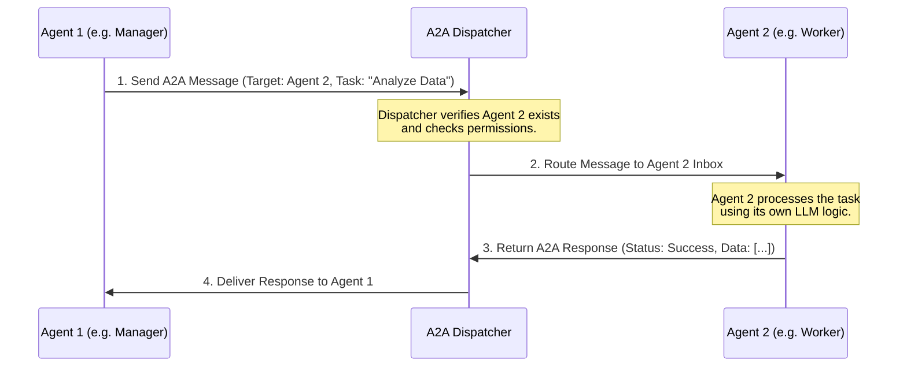

# TraceGraph :: A2A (Agent-to-Agent Communication)

## 📖 Introduction to Agent-to-Agent (A2A)
Welcome to the `tracegraph-a2a` module! If you're building systems where multiple autonomous AI agents need to talk to each other, you are in the right place. 

In single-agent systems, one AI handles all user queries. But in complex systems (like an AI software team with a "Manager Agent," a "Coder Agent," and a "QA Agent"), agents need a way to pass messages, hand off tasks, and share context securely and reliably. The `tracegraph-a2a` module provides the protocol and routing mechanisms to make this happen.

### Key Concepts
- **Agent**: An autonomous unit executing a specific graph or task.
- **Dispatcher**: The central router that knows which agents are available and how to reach them.
- **Message Protocol**: The standardized JSON-based format used so agents speak the same "language."

## 🏗️ Architecture & Message Flow

Here is a detailed flowchart of how Agent 1 sends a task to Agent 2 and receives the result.



## 🚀 How to Use It

### 1. Defining an A2A Message
Messages are defined using standard classes. This ensures type safety when agents communicate.

```java
import site.tracegraph.a2a.A2AMessage;

// Create a message from Agent1 to Agent2
A2AMessage request = A2AMessage.builder()
    .from("manager_agent")
    .to("worker_agent")
    .payload("{\"task\": \"summarize_logs\"}")
    .build();
```

### 2. Dispatching the Message
Use the `A2ADispatcher` to send the message.

```java
import site.tracegraph.a2a.A2ADispatcher;

public class ManagerAgentNode {
    private final A2ADispatcher dispatcher;

    public ManagerAgentNode(A2ADispatcher dispatcher) {
        this.dispatcher = dispatcher;
    }

    public void handoffTask() {
        A2AMessage request = // ... build message
        A2AMessage response = dispatcher.sendAndWait(request);
        
        System.out.println("Worker replied: " + response.getPayload());
    }
}
```
