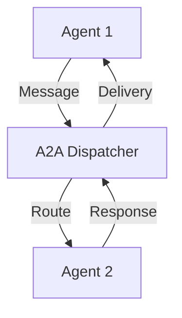

# TraceGraph :: A2A (Agent-to-Agent)

## Overview
The `tracegraph-a2a` module provides robust protocol support for Agent-to-Agent communication within the TraceGraph ecosystem. It enables autonomous agents to securely exchange messages, share state, and collaborate on complex tasks through standardized messaging patterns.

## Architecture

## Features
- Standardized message formats
- Inter-agent state synchronization
- Jackson-based serialization
