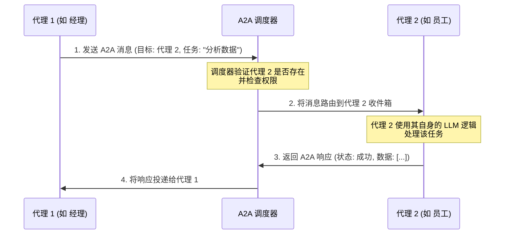

# TraceGraph :: A2A (Agent-to-Agent 代理间通信)

## 📖 代理间通信 (A2A) 简介

欢迎使用 `tracegraph-a2a` 模块！如果您正在构建多个自主 AI 代理需要相互通信的系统，那么您来对地方了。

在单代理系统中，一个 AI 处理所有的用户查询。但是在复杂的系统中（比如一个包含“经理代理”、“程序员代理”和“QA 测试代理”的 AI 软件团队），代理们需要一种方法来可靠、安全地传递消息、移交任务并共享上下文。`tracegraph-a2a` 模块提供了实现这一目标所需的协议和路由机制。

### 核心概念
- **代理 (Agent)**: 执行特定图或任务的自主计算单元。
- **调度器 (Dispatcher)**: 中央路由器，它知道哪些代理可用以及如何联系它们。
- **消息协议 (Message Protocol)**: 基于 JSON 的标准化格式，确保所有代理使用相同的“语言”进行通信。

## 🏗️ 架构与消息流

这是代理 1 将任务发送给代理 2 并接收结果的详细流程图。



## 🚀 如何使用

### 1. 定义 A2A 消息

消息通过标准 Java 类来定义。这确保了代理通信时的类型安全性。

```java
import site.tracegraph.a2a.A2AMessage;

// 创建一个从代理1到代理2的消息
A2AMessage request = A2AMessage.builder()
    .from("manager_agent")
    .to("worker_agent")
    .payload("{\"task\": \"summarize_logs\"}")
    .build();
```

### 2. 调度消息

使用 `A2ADispatcher` 来发送消息。

```java
import site.tracegraph.a2a.A2ADispatcher;

public class ManagerAgentNode {
    private final A2ADispatcher dispatcher;

    public ManagerAgentNode(A2ADispatcher dispatcher) {
        this.dispatcher = dispatcher;
    }

    public void handoffTask() {
        A2AMessage request = // ... 构建消息
        A2AMessage response = dispatcher.sendAndWait(request);
        
        System.out.println("员工回复: " + response.getPayload());
    }
}
```
