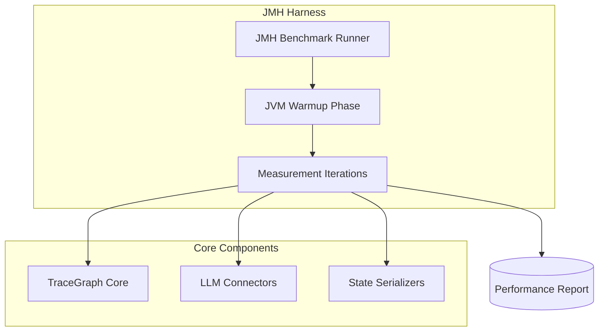

# TraceGraph :: Benchmarks

## 📖 Introduction to Benchmarking
Welcome to the `tracegraph-bench` module! When building AI agents and state graphs, performance matters. If an agent's state transitions take too long, or if JSON serialization uses too much memory, your application will lag.

This module uses **JMH (Java Microbenchmark Harness)** to run highly accurate, mathematically rigorous performance tests. It doesn't just measure how fast something is; it warms up the Java Virtual Machine (JVM) and avoids common benchmarking pitfalls (like dead code elimination).

### Why Do We Need This?
- **Throughput Measurement**: How many state graph transitions can we process per second?
- **Memory Profiling**: Are we creating too many temporary objects and triggering Garbage Collection pauses?
- **Regression Testing**: If someone changes core routing logic, did they accidentally make it 10x slower?

## 🏗️ Benchmarking Architecture



## 🚀 Running the Benchmarks

To run the benchmarks, you need to compile the Uber-JAR and execute it. 

### 1. Build the Benchmark JAR
Open your terminal and run:
```bash
mvn clean package -pl tracegraph-bench -am
```
*This packages the benchmarks into a single runnable JAR file.*

### 2. Run the Benchmarks
Run the compiled JAR. Be aware this might take several minutes as JMH warms up the JVM.
```bash
java -jar tracegraph-bench/target/benchmarks.jar
```

### 3. Writing a Custom Benchmark
Here is an example of what a benchmark looks like in the code:
```java
package site.tracegraph.bench;

import org.openjdk.jmh.annotations.*;
import java.util.concurrent.TimeUnit;

@State(Scope.Thread)
@BenchmarkMode(Mode.Throughput)
@OutputTimeUnit(TimeUnit.SECONDS)
public class GraphStateBenchmark {

    @Benchmark
    public void testStateCopying() {
        // Code to test the performance of copying graph state maps
        // JMH will run this millions of times to find the average throughput.
    }
}
```
