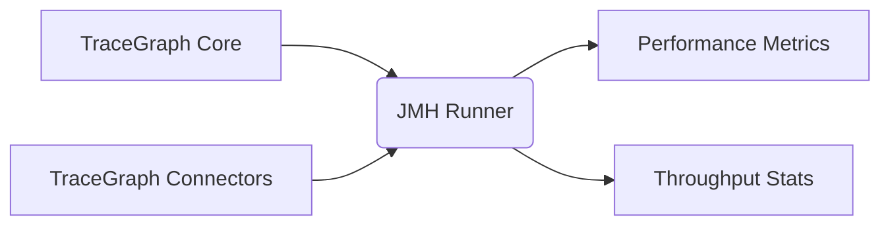

# TraceGraph :: Benchmarks

## Overview
The `tracegraph-bench` module is dedicated to performance testing and benchmarking the core TraceGraph components using the Java Microbenchmark Harness (JMH). It is crucial for ensuring that the graph execution remains highly performant and allocation-efficient.

## Benchmark Flow

## Features
- High-precision microbenchmarks
- Profiling of core graph execution pathways
- JMH annotation processor integration
