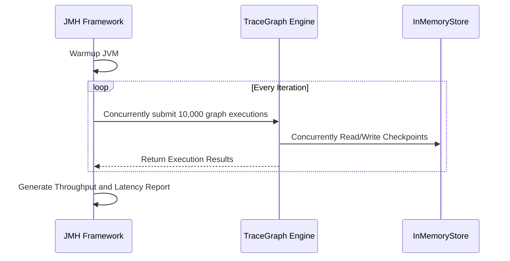

# TraceGraph :: Benchmarks

## 📖 What are Benchmarks?
Welcome to `tracegraph-bench`! Building a framework that can run a single AI agent is one thing, but building a framework that can handle thousands of concurrent graph executions without exhausting memory is entirely different.

This module contains microbenchmarks for TraceGraph's core components (the execution engine, state management, and routing logic). It uses the **JMH (Java Microbenchmark Harness)** framework to precisely detect throughput bottlenecks, lock contention, and concurrency limits.

### Core Goals
- **Prevent Performance Regressions**: Ensure that newly introduced code (like more complex routing logic) does not degrade the Operations Per Second (OPS) of the graph execution.
- **Allocation Profiling**: Monitor Garbage Collection (GC) pressure and memory allocation rates as State objects are passed between nodes.
- **Concurrency Optimization**: Verify the effectiveness of Virtual Threads and ensure shared components like `MemoryStore` do not become bottlenecks under high load.

## 🏗️ Testing Architecture

Benchmarks do not simulate full HTTP requests; instead, they stress the core execution loop directly at the JVM level.



## 🚀 How to Run Benchmarks

JMH tests should not be run via normal JUnit runners, as they require JVM warmup and isolation to produce statistically significant results.

### 1. Compile the Project
For the most accurate results, benchmarks should be packaged into an Uber JAR and run independently.
```bash
mvn clean install -DskipTests
cd tracegraph-bench
```

### 2. Execute Benchmarks
Run the packaged benchmark JAR. Depending on the classes tested, this can take anywhere from a few minutes to half an hour.
```bash
java -jar target/benchmarks.jar
```

### 3. Understanding the Output
JMH will output detailed statistics. Key metrics include:
- `Score`: Represents the number of executions per second (for Throughput mode).
- `Error`: The statistical variance of the measurement.
- `GC Allocation Rate`: If the GC profiler is enabled, it shows how many MBs of objects are allocated per second.
