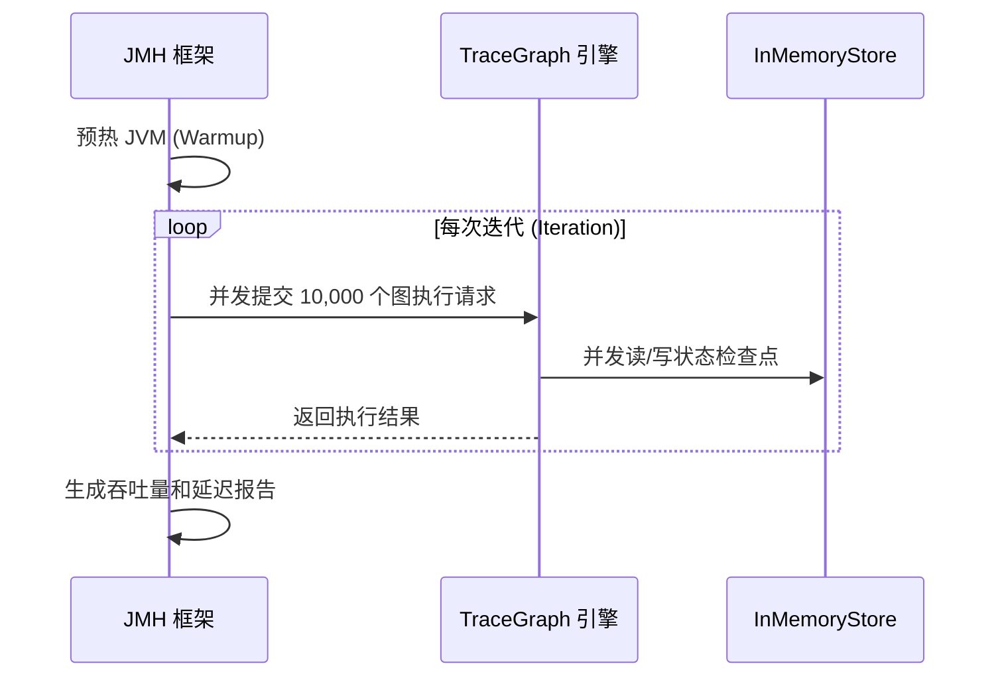

# TraceGraph :: Benchmarks (性能基准测试)

## 📖 什么是基准测试？
欢迎使用 `tracegraph-bench` 模块！构建一个能够运行单个 AI 代理的框架是一回事，但是构建一个能够同时处理数千个并发图执行且不会耗尽内存的框架则完全是另一回事。

此模块包含针对 TraceGraph 核心组件（执行引擎、状态管理、图路由）的微基准测试（Microbenchmarks）。它使用 **JMH (Java Microbenchmark Harness)** 框架，用于精准检测执行时的吞吐量瓶颈、锁争用（Lock Contention）和并发限制。

### 核心目标
- **防止性能衰退**: 确保新引入的代码（如引入更复杂的路由逻辑时）不会降低执行图的每秒操作数（OPS）。
- **对象分配分析**: 监控状态（State）在节点之间传递时的垃圾回收（GC）压力和内存分配率。
- **并发优化**: 验证虚拟线程（Virtual Threads）的有效性，并确保 `MemoryStore` 等共享组件在高并发下不会成为瓶颈。

## 🏗️ 测试架构

基准测试不模拟完整的 HTTP 请求，而是直接在 JVM 级别对核心执行循环施加压力。



## 🚀 如何运行基准测试

JMH 测试不应通过普通的 JUnit 运行器运行，因为它们需要对 JVM 进行预热和隔离。

### 1. 编译项目
为了获得最准确的结果，应将基准测试打包为超级 JAR（Uber JAR）并独立运行。
```bash
mvn clean install -DskipTests
cd tracegraph-bench
```

### 2. 执行基准测试
运行打包好的基准测试 JAR。根据您测试的类，这可能需要几分钟到半小时不等。
```bash
java -jar target/benchmarks.jar
```

### 3. 理解输出
JMH 将输出详细的统计数据。关键指标包括：
- `Score`: 表示每秒执行的次数（针对吞吐量模式）。
- `Error`: 测量的统计方差。
- `GC Allocation Rate`: 如果启用了 GC profiler，它将显示每秒分配了多少 MB 的对象。
