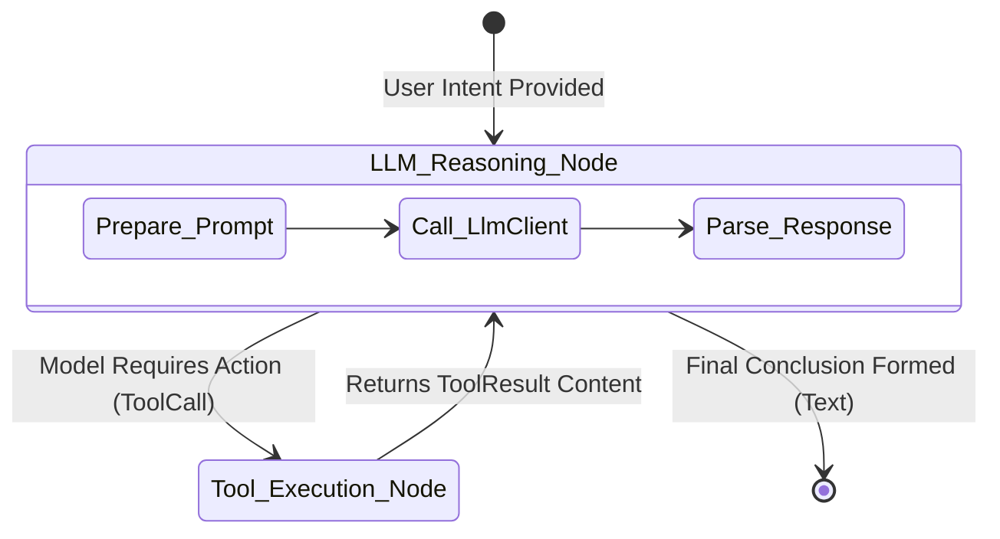

# TraceGraph :: Connectors

## 📖 Introduction to Connectors
Welcome to `tracegraph-connectors`! While `tracegraph-core` provides the engine for executing graphs, it knows nothing about Large Language Models, Vector Databases, or third-party APIs. 

The `connectors` module bridges this gap. It provides out-of-the-box adapters that align external ecosystem layers (like OpenAI, Anthropic, or custom internal APIs) directly with the graph runtime in a type-safe, observable way.

### Why Do I Need This?
- **Vendor-Neutral SPI**: Offers an abstract `LlmClient` interface. You can swap from OpenAI to Anthropic without changing your graph logic.
- **Ready-To-Use Adapters**: Contains native, highly-optimized HTTP adaptations for OpenAI (`OpenAiLlmClient`) and Anthropic (`AnthropicLlmClient`).
- **Graph Nodes Integration**: Provides pre-built nodes like `ChatNode` that automatically handle LLM boundaries, state extraction, and token usage reporting.
- **ReAct Abstractions**: Boilerplated `Tool` frameworks allowing rapid construction of dynamic ReAct (Reasoning and Acting) agents.

## 🏗️ Agent ReAct Loop Architecture

The following diagram illustrates how the `ChatNode` utilizes the `LlmClient` and interacts with tools in a standard ReAct loop.



## 🚀 How to Implement Connectors

### 1. Initialize an LLM Client
You can initialize a client manually, or let the Spring Boot starter do it for you.

```java
import site.tracegraph.connectors.llm.openai.OpenAiLlmClient;

OpenAiLlmClient llmClient = OpenAiLlmClient.builder()
    .apiKey("sk-...")
    .model("gpt-4-turbo")
    .temperature(0.7)
    .build();
```

### 2. Add the ChatNode to Your Graph
The `ChatNode` automatically invokes the LLM using the messages stored in your state, and appends the LLM's response back into the state.

```java
import site.tracegraph.connectors.nodes.ChatNode;

Graph<MyState> graph = Graph.<MyState>builder()
    // The ChatNode uses your LlmClient and extracts messages from your state
    .node("llm_call", new ChatNode<>(llmClient, MyState::messages, MyState::withNewMessage))
    // ... add tool execution nodes
    .entry("llm_call")
    .build();
```

### 3. Tool Calling
If you are building an agent that can interact with APIs, you can register tools with the client:

```java
import site.tracegraph.connectors.tools.Tool;

Tool weatherTool = Tool.builder()
    .name("get_weather")
    .description("Get the weather for a location")
    .function((args) -> weatherService.fetch(args.get("city").asText()))
    .build();

OpenAiLlmClient agentClient = OpenAiLlmClient.builder()
    .apiKey("sk-...")
    .tools(List.of(weatherTool))
    .build();
```