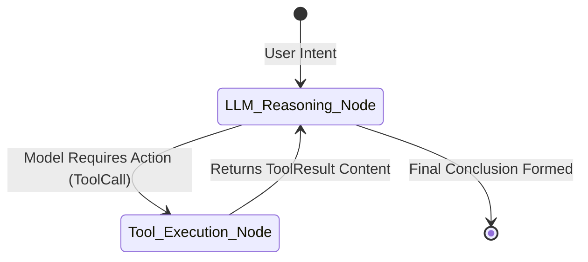

# TraceGraph Connectors

`tracegraph-connectors` provides adapters aligning external ecosystem layers (LLMs, Search, Tools) directly with the graph runtime.

## Features
- **Vendor-Neutral SPI**: Offers an `LlmClient` interface smoothing over exact LLM payload designs natively.
- **Ready-To-Use Adapters**: Contains native adaptations for OpenAI (`OpenAiLlmClient`) and Anthropic (`AnthropicLlmClient`).
- **Graph Nodes**: Integrates seamlessly with pre-built classes like `ChatNode` keeping LLM boundary walls explicit.
- **ReAct Abstractions**: Boilerplated `Tool` frameworks allowing rapid construction of dynamic `ReActAgent`s.

## Agent ReAct Loop Flow

