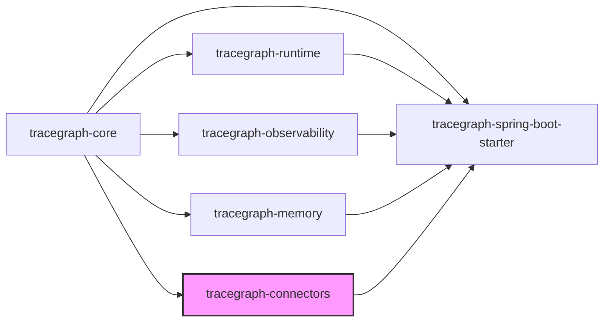
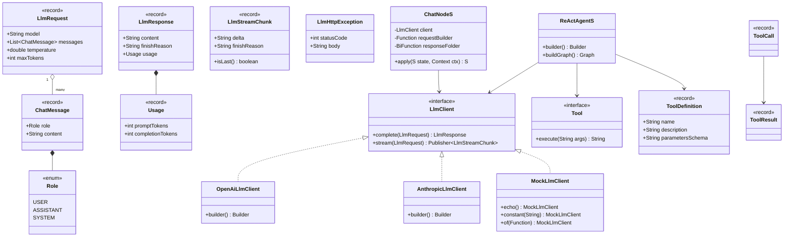
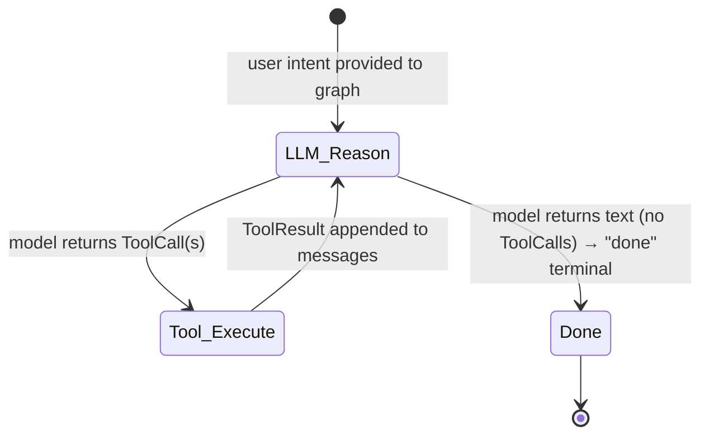
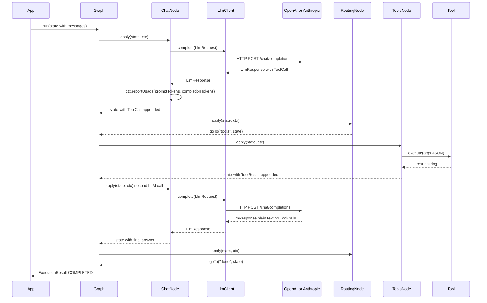

# tracegraph-connectors

[](https://central.sonatype.com/artifact/io.tracegraph/tracegraph-connectors)
[](LICENSE)
[](https://adoptium.net/)

Vendor-neutral LLM adapters, ChatNode bridge, and ReAct agent factory for the TraceGraph JVM runtime.

---

## What it does

`tracegraph-connectors` provides the bridge between the TraceGraph graph runtime and Large Language Models (LLMs). It defines a vendor-neutral `LlmClient` SPI so you can swap providers without changing graph logic. It ships concrete HTTP adapters for OpenAI-compatible endpoints and the Anthropic Messages API, each built on the JDK's `HttpClient` with no extra HTTP dependencies. `ChatNode<S>` adapts any `LlmClient` to a typed `Node<S>`, forwarding token usage to `NodeListener` automatically. `ReActAgent<S>` is a factory that wires the full Reason+Act loop — LLM node, tools node, and terminal — into a `Graph<S>` in a single builder call. The module has no mandatory dependencies beyond `tracegraph-core`; Jackson is pulled in only when you use an HTTP adapter.

---

## System Context

The following diagram shows all six TraceGraph modules. `tracegraph-connectors` is highlighted; it depends on `tracegraph-core` for the `Node<S>` and `Graph<S>` contracts and is consumed optionally by `tracegraph-spring-boot-starter`.



---

## Internal Architecture



---

## ReAct Loop State Diagram

The ReAct loop implemented by `ReActAgent<S>` cycles between reasoning (LLM call) and acting (tool execution) until the model returns a plain text response with no tool calls.



---

## Sequence Diagram: ChatNode and Tool Loop



---

## Core Concepts

### LlmClient — Vendor-Neutral SPI

`LlmClient` is the central interface. It has two methods: `complete` for blocking request/response, and `stream` for incremental token delivery. The default `stream` implementation wraps `complete()` into a single-chunk `Flow.Publisher`; providers with native streaming support override it.

```java
import io.tracegraph.connectors.llm.LlmClient;
import io.tracegraph.connectors.llm.LlmRequest;
import io.tracegraph.connectors.llm.LlmResponse;
import io.tracegraph.connectors.llm.LlmStreamChunk;
import java.util.concurrent.Flow;

public interface LlmClient {
    LlmResponse complete(LlmRequest request);

    default Flow.Publisher<LlmStreamChunk> stream(LlmRequest request) {
        // Default wraps complete() into a single-chunk publisher.
        // Providers with native streaming support override this method.
        LlmResponse response = complete(request);
        LlmStreamChunk chunk = new LlmStreamChunk(response.content(), response.finishReason());
        SubmissionPublisher<LlmStreamChunk> publisher = new SubmissionPublisher<>();
        publisher.submit(chunk);
        publisher.close();
        return publisher;
    }
}
```

Swapping from OpenAI to Anthropic means replacing one line — the `LlmClient` implementation — while all graph logic, tool definitions, and state types stay unchanged.

### LlmRequest and LlmResponse Records

```java
import io.tracegraph.connectors.llm.LlmRequest;
import io.tracegraph.connectors.llm.LlmResponse;
import io.tracegraph.connectors.llm.ChatMessage;
import io.tracegraph.connectors.llm.Role;

// Build a request
LlmRequest request = new LlmRequest(
    "gpt-4o",
    List.of(
        new ChatMessage(Role.SYSTEM, "You are a helpful assistant."),
        new ChatMessage(Role.USER, "What is the capital of France?")
    ),
    0.7,
    1024
);

// Inspect a response
LlmResponse response = client.complete(request);
System.out.println(response.content());
System.out.println("Prompt tokens:     " + response.usage().promptTokens());
System.out.println("Completion tokens: " + response.usage().completionTokens());
System.out.println("Finish reason:     " + response.finishReason());
```

### OpenAiLlmClient

`OpenAiLlmClient` is a production-ready adapter for OpenAI-compatible endpoints. It is built on `java.net.http.HttpClient` and Jackson (the Jackson dependency is optional; it is only pulled in when you use this adapter). Non-2xx responses from the provider surface as `LlmHttpException`, which carries `statusCode()` and `body()`.

```java
import io.tracegraph.connectors.llm.OpenAiLlmClient;
import io.tracegraph.connectors.llm.LlmHttpException;

OpenAiLlmClient client = OpenAiLlmClient.builder()
    .apiKey(System.getenv("OPENAI_API_KEY"))
    .model("gpt-4o")
    .temperature(0.7)
    .maxTokens(2048)
    // .endpoint("https://api.openai.com/v1")  // default; override for Azure/Ollama
    // .httpClient(customHttpClient)            // custom JDK HttpClient
    // .requestTimeout(Duration.ofSeconds(60)) // default 30s
    .build();

try {
    LlmResponse response = client.complete(request);
    System.out.println(response.content());
} catch (LlmHttpException e) {
    System.err.println("Provider error " + e.statusCode() + ": " + e.body());
}
```

### AnthropicLlmClient

`AnthropicLlmClient` adapts the Anthropic Messages API (`POST /v1/messages`). It automatically lifts `Role.SYSTEM` messages out of the `messages` list into the top-level `system` field that Anthropic's API requires. Multiple content blocks in the response are concatenated into a single `content` string. Authentication uses `x-api-key` and `anthropic-version` headers set automatically.

```java
import io.tracegraph.connectors.llm.AnthropicLlmClient;

AnthropicLlmClient client = AnthropicLlmClient.builder()
    .apiKey(System.getenv("ANTHROPIC_API_KEY"))
    .model("claude-3-5-sonnet-20241022")
    .temperature(0.5)
    .maxTokens(4096)
    // .endpoint("https://api.anthropic.com")  // default
    .build();
```

### MockLlmClient — Test Double

`MockLlmClient` provides three construction modes so you can test graph logic without hitting a real LLM provider:

```java
import io.tracegraph.connectors.llm.MockLlmClient;

// Echo mode: response content equals the last user message content
LlmClient echo = MockLlmClient.echo();

// Constant mode: always returns the same content string regardless of input
LlmClient constant = MockLlmClient.constant("The capital of France is Paris.");

// Lambda mode: full control — inspect the full LlmRequest and return any LlmResponse
LlmClient lambda = MockLlmClient.of(req -> {
    String lastUserMessage = req.messages().getLast().content();
    return new LlmResponse(
        "Mock reply to: " + lastUserMessage,
        "stop",
        new LlmResponse.Usage(10, 5)
    );
});
```

### ChatNode — LLM Bridge for Graph Nodes

`ChatNode<S>` adapts any `LlmClient` to a `Node<S>`. You provide two functions:

- `requestBuilder`: `Function<S, LlmRequest>` — builds the LLM request from the current state
- `responseFolder`: `BiFunction<S, LlmResponse, S>` — folds the LLM response back into state

After the call completes, `ChatNode` automatically fires `ctx.reportUsage(promptTokens, completionTokens)` so `NodeListener` implementations receive accurate token counts.

```java
import io.tracegraph.connectors.llm.ChatNode;

record ConversationState(List<ChatMessage> messages, String finalAnswer) {
    ConversationState withMessage(ChatMessage msg) {
        var updated = new ArrayList<>(messages);
        updated.add(msg);
        return new ConversationState(List.copyOf(updated), finalAnswer);
    }
    ConversationState withAnswer(String answer) {
        return new ConversationState(messages, answer);
    }
}

ChatNode<ConversationState> chatNode = new ChatNode<>(
    client,
    // requestBuilder
    state -> new LlmRequest("gpt-4o", state.messages(), 0.7, 1024),
    // responseFolder
    (state, response) -> state
        .withMessage(new ChatMessage(Role.ASSISTANT, response.content()))
        .withAnswer(response.content())
);
```

### Tool and ToolDefinition

`Tool` is a functional SAM interface — `execute(String args) → String` — where `args` is a JSON object string whose shape is described by `ToolDefinition.parametersSchema()`. `ToolDefinition` is a record combining the tool name, natural-language description for the LLM, and a JSON Schema string sent in the tool list.

```java
import io.tracegraph.connectors.tools.Tool;
import io.tracegraph.connectors.tools.ToolDefinition;

ToolDefinition weatherDef = new ToolDefinition(
    "get_weather",
    "Returns current weather conditions for a city.",
    """
    {
      "type": "object",
      "properties": {
        "city": { "type": "string", "description": "The city name." }
      },
      "required": ["city"]
    }
    """
);

Tool weatherTool = args -> {
    // args is a JSON string: {"city":"Tokyo"}
    String city = parseCity(args);
    return weatherService.getCurrent(city).toJson();
};
```

### ReActAgent — Full Reason+Act Graph Factory

`ReActAgent<S>` produces a complete `Graph<S>` implementing the ReAct loop. The built graph contains three named nodes: `llm` (routing node that calls the LLM), `tools` (executes all tool calls present in state), and `done` (terminal node). You supply the LLM client, tool definitions, a request factory, and two folding functions.

```java
import io.tracegraph.connectors.react.ReActAgent;

Graph<AgentState> agentGraph = ReActAgent.<AgentState>builder()
    .client(client)
    .tool(weatherDef, weatherTool)
    .tool(searchDef, searchTool)
    .requestFactory(state ->
        new LlmRequest("gpt-4o", state.messages(), 0.5, 4096))
    .responseFolder((state, response) ->
        state.withMessage(new ChatMessage(Role.ASSISTANT, response.content())))
    .toolResultFolder((state, results) -> {
        var msgs = new ArrayList<>(state.messages());
        for (ToolResult r : results) {
            msgs.add(new ChatMessage(Role.USER, "Tool result: " + r.content()));
        }
        return new AgentState(List.copyOf(msgs), state.finalAnswer());
    })
    .build()
    .buildGraph();
```

### Streaming

Any `LlmClient` exposes `stream(LlmRequest)` returning `Flow.Publisher<LlmStreamChunk>`. Each chunk carries a `delta` string (incremental token text) and a `finishReason`. `isLast()` returns true on the final chunk.

```java
import io.tracegraph.connectors.llm.LlmStreamChunk;
import java.util.concurrent.Flow;

Flow.Publisher<LlmStreamChunk> publisher = client.stream(request);
publisher.subscribe(new Flow.Subscriber<>() {
    @Override
    public void onSubscribe(Flow.Subscription subscription) {
        subscription.request(Long.MAX_VALUE);
    }

    @Override
    public void onNext(LlmStreamChunk chunk) {
        System.out.print(chunk.delta());
        if (chunk.isLast()) {
            System.out.println();
        }
    }

    @Override
    public void onError(Throwable throwable) {
        throwable.printStackTrace();
    }

    @Override
    public void onComplete() {
        System.out.println("[stream complete]");
    }
});
```

---

## Multi-Agent Patterns (0.3.0)

`ReActAgent` is the single-agent primitive. The 0.3.0 release adds four ways to compose multiple ReAct agents into a `Graph<S>`.

### HandoffNode — Peer-to-Peer Delegation

`HandoffNode<S>` lets one agent hand control directly to another by reading a target name from state — no central supervisor in the loop. The reserved selector value `"continue"` falls through to the next declared target; `null` or an unknown name terminates at `"done"`.

```java
Graph<ChatState> graph = HandoffNode.<ChatState>builder()
        .client(llmClient)
        .requestFactory(state -> LlmRequest.of(state.messages()))
        .responseFolder((state, resp) -> state.withMessage(resp.content()))
        .handoffSelector(state -> state.routeTo())
        .target("alice", aliceAgentGraph)
        .target("bob", bobAgentGraph)
        .build()
        .buildGraph();
```

### AgentProfile — Per-Agent Role and Tool Isolation

`AgentProfile<S>` is a `(name, systemPrompt, List<Tool>, List<ToolDefinition>, memoryScope)` record that overrides the tools and role prompt on a `ReActAgent.Builder`. Calling `.profile(...)` replaces any prior `tool(...)` registrations so two agents on the same `LlmClient` cannot see each other's tools.

```java
AgentProfile<S> researcher = new AgentProfile<>(
        "researcher",
        "You are a research analyst.",
        List.of(searchTool, fetchTool),
        List.of(searchDef, fetchDef),
        Function.identity());

Graph<S> graph = ReActAgent.<S>builder()
        .client(llmClient)
        .profile(researcher)
        .requestFactory(...)
        .responseFolder(...)
        .toolResultFolder(...)
        .build()
        .buildGraph();
```

### GroupChatAgent — Round-Robin or LLM-Selected Speakers

`GroupChatAgent<S>` rotates N named `ReActAgent`s using a `SpeakerSelector<S>` strategy and halts on a user-supplied `terminationPredicate`.

```java
Graph<S> chat = GroupChatAgent.<S>builder()
        .agent("alice", aliceGraph)
        .agent("bob", bobGraph)
        .agent("carol", carolGraph)
        .speakerSelector(SpeakerSelector.roundRobin())   // or .llm(...)
        .terminationPredicate(state -> state.rounds() >= 4)
        .build()
        .buildGraph();
```

### VotingNode — Parallel Consensus

`VotingNode<S>` fans out across candidate ReAct subgraphs using `parallel(...)`, then aggregates their states through a `Tally`. Built-in tallies: `Tally.majority(Function<S, String>)` and `Tally.firstNonNull(Function<S, String>)`.

```java
Node<S> vote = VotingNode.<S>builder()
        .candidate("alice", aliceGraph)
        .candidate("bob", bobGraph)
        .candidate("carol", carolGraph)
        .tally(Tally.majority(State::answer))
        .build();
```

Layer in `TerminationListener<S>` from `tracegraph-observability` for `maxTurns` / `afterNode` / `stateMatches` convergence guarantees that work across all four patterns.

---

## Complete Usage Walkthrough

### Step 1: Add the Maven Dependency

```xml
<dependency>
    <groupId>io.tracegraph</groupId>
    <artifactId>tracegraph-connectors</artifactId>
    <version>0.3.0</version>
</dependency>
```

Jackson is an optional transitive dependency. If you use `OpenAiLlmClient` or `AnthropicLlmClient`, Jackson must be on the classpath:

```xml
<dependency>
    <groupId>com.fasterxml.jackson.core</groupId>
    <artifactId>jackson-databind</artifactId>
    <version>2.17.0</version>
</dependency>
```

### Step 2: Set Up OpenAiLlmClient

```java
import io.tracegraph.connectors.llm.OpenAiLlmClient;

OpenAiLlmClient client = OpenAiLlmClient.builder()
    .apiKey(System.getenv("OPENAI_API_KEY"))
    .model("gpt-4o")
    .temperature(0.7)
    .maxTokens(2048)
    .build();
```

For local models such as Ollama or LM Studio that expose an OpenAI-compatible endpoint:

```java
OpenAiLlmClient localClient = OpenAiLlmClient.builder()
    .apiKey("local")
    .endpoint("http://localhost:11434/v1")
    .model("llama3.1:8b")
    .build();
```

### Step 3: Set Up AnthropicLlmClient

```java
import io.tracegraph.connectors.llm.AnthropicLlmClient;

AnthropicLlmClient client = AnthropicLlmClient.builder()
    .apiKey(System.getenv("ANTHROPIC_API_KEY"))
    .model("claude-3-5-sonnet-20241022")
    .maxTokens(4096)
    .build();
```

### Step 4: MockLlmClient for Tests

```java
import io.tracegraph.connectors.llm.MockLlmClient;
import io.tracegraph.connectors.llm.LlmResponse;

// Constant — every call returns the same content
LlmClient constantClient = MockLlmClient.constant("The weather in Tokyo is sunny, 24 degrees.");

// Lambda — simulate a tool-call followed by a final answer
int[] callCount = {0};
LlmClient sequencedClient = MockLlmClient.of(req -> {
    callCount[0]++;
    if (callCount[0] == 1) {
        // First call: return a tool call JSON in content
        return new LlmResponse(
            "{\"tool_calls\":[{\"name\":\"get_weather\",\"arguments\":{\"city\":\"Tokyo\"}}]}",
            "tool_calls",
            new LlmResponse.Usage(25, 10)
        );
    }
    // Second call: return plain text final answer
    return new LlmResponse(
        "The weather in Tokyo is sunny, 24 degrees.",
        "stop",
        new LlmResponse.Usage(40, 15)
    );
});
```

### Step 5: Wire ChatNode into a Graph

```java
import io.tracegraph.core.Graph;
import io.tracegraph.core.ExecutionResult;
import io.tracegraph.connectors.llm.ChatNode;
import io.tracegraph.connectors.llm.LlmRequest;
import io.tracegraph.connectors.llm.ChatMessage;
import io.tracegraph.connectors.llm.Role;

record ChatState(List<ChatMessage> messages, String answer) {}

ChatNode<ChatState> chatNode = new ChatNode<>(
    client,
    state -> new LlmRequest("gpt-4o", state.messages(), 0.7, 1024),
    (state, response) -> new ChatState(
        appendAssistantMessage(state.messages(), response.content()),
        response.content()
    )
);

Graph<ChatState> graph = Graph.<ChatState>builder()
    .node("chat", chatNode)
    .entry("chat")
    .terminal("chat")
    .build();

ChatState initial = new ChatState(
    List.of(new ChatMessage(Role.USER, "What is 2 + 2?")),
    null
);

ExecutionResult<ChatState> result = graph.run(initial);
System.out.println(result.state().answer());
```

### Step 6: Define Tools with JSON Schema

```java
import io.tracegraph.connectors.tools.ToolDefinition;
import io.tracegraph.connectors.tools.Tool;

ToolDefinition searchDef = new ToolDefinition(
    "web_search",
    "Searches the web and returns the top results as a JSON array.",
    """
    {
      "type": "object",
      "properties": {
        "query": {
          "type": "string",
          "description": "The search query string."
        },
        "maxResults": {
          "type": "integer",
          "description": "Maximum number of results.",
          "default": 5
        }
      },
      "required": ["query"]
    }
    """
);

Tool searchTool = args -> {
    SearchQuery q = parseSearchQuery(args);
    return searchService.search(q.query(), q.maxResults()).toJson();
};
```

### Step 7: Build a Full ReActAgent Graph

```java
import io.tracegraph.connectors.react.ReActAgent;

record AgentState(List<ChatMessage> messages, String finalAnswer) {
    AgentState withMessage(ChatMessage m) {
        var msgs = new ArrayList<>(messages);
        msgs.add(m);
        return new AgentState(List.copyOf(msgs), finalAnswer);
    }
    AgentState withAnswer(String a) {
        return new AgentState(messages, a);
    }
}

Graph<AgentState> agentGraph = ReActAgent.<AgentState>builder()
    .client(client)
    .tool(searchDef, searchTool)
    .tool(weatherDef, weatherTool)
    .requestFactory(state -> new LlmRequest("gpt-4o", state.messages(), 0.5, 4096))
    .responseFolder((state, response) ->
        state.withMessage(new ChatMessage(Role.ASSISTANT, response.content()))
             .withAnswer(response.content()))
    .toolResultFolder((state, results) -> {
        var msgs = new ArrayList<>(state.messages());
        for (ToolResult r : results) {
            msgs.add(new ChatMessage(Role.USER,
                "Tool result for " + r.toolName() + ": " + r.content()));
        }
        return new AgentState(List.copyOf(msgs), state.finalAnswer());
    })
    .build()
    .buildGraph();

AgentState initial = new AgentState(
    List.of(
        new ChatMessage(Role.SYSTEM, "You are a helpful research assistant."),
        new ChatMessage(Role.USER, "What is the current weather in Paris?")
    ),
    null
);

ExecutionResult<AgentState> result = agentGraph.run(initial);
System.out.println(result.state().finalAnswer());
```

### Step 8: Streaming Output

```java
import io.tracegraph.connectors.llm.LlmStreamChunk;
import java.util.concurrent.Flow;

LlmRequest streamRequest = new LlmRequest(
    "gpt-4o",
    List.of(new ChatMessage(Role.USER, "Tell me a short story.")),
    0.9,
    512
);

client.stream(streamRequest).subscribe(new Flow.Subscriber<>() {
    private Flow.Subscription sub;

    @Override
    public void onSubscribe(Flow.Subscription s) {
        this.sub = s;
        s.request(Long.MAX_VALUE);
    }

    @Override
    public void onNext(LlmStreamChunk chunk) {
        System.out.print(chunk.delta());
        if (chunk.isLast()) {
            System.out.println();
        }
    }

    @Override
    public void onError(Throwable t) {
        t.printStackTrace();
    }

    @Override
    public void onComplete() {
        System.out.println("[done]");
    }
});
```

### Step 9: Handling LlmHttpException

```java
import io.tracegraph.connectors.llm.LlmHttpException;

try {
    LlmResponse response = client.complete(request);
    process(response);
} catch (LlmHttpException e) {
    if (e.statusCode() == 429) {
        System.err.println("Rate limited. Retry after back-off. Body: " + e.body());
    } else if (e.statusCode() >= 500) {
        System.err.println("Provider error. Status: " + e.statusCode());
    } else {
        throw e; // unexpected; let it propagate
    }
}
```

---

## Configuration Reference

### OpenAiLlmClient Builder Options

| Option | Type | Default | Description |
|---|---|---|---|
| `apiKey` | `String` | required | OpenAI API key (`sk-...`) |
| `endpoint` | `String` | `https://api.openai.com/v1` | Base URL; override for Azure, Ollama, LM Studio, etc. |
| `model` | `String` | required | Model name, e.g. `gpt-4o` |
| `temperature` | `double` | `1.0` | Sampling temperature (0.0–2.0) |
| `maxTokens` | `int` | `1024` | Maximum tokens in the response |
| `httpClient` | `HttpClient` | JDK default | Custom `java.net.http.HttpClient` instance |
| `requestTimeout` | `Duration` | `30s` | Per-request read timeout |

### AnthropicLlmClient Builder Options

| Option | Type | Default | Description |
|---|---|---|---|
| `apiKey` | `String` | required | Anthropic API key |
| `endpoint` | `String` | `https://api.anthropic.com` | Base URL |
| `model` | `String` | required | Model name, e.g. `claude-3-5-sonnet-20241022` |
| `temperature` | `double` | `1.0` | Sampling temperature |
| `maxTokens` | `int` | `1024` | Maximum tokens in the response |
| `httpClient` | `HttpClient` | JDK default | Custom `java.net.http.HttpClient` instance |
| `requestTimeout` | `Duration` | `30s` | Per-request read timeout |

---

## Integration with Other Modules

### With tracegraph-observability: Token Cost Tracking

`ChatNode` fires `ctx.reportUsage(promptTokens, completionTokens)` after every LLM call. The `LlmCostListener` in `tracegraph-observability` accumulates these totals per-execution and per-node. `OtelNodeListener` emits `llm.usage.input_tokens`, `llm.usage.output_tokens`, and `llm.usage.total_tokens` as span attributes.

```java
import io.tracegraph.observability.LlmCostListener;

LlmCostListener costListener = new LlmCostListener();

Graph<AgentState> graph = Graph.<AgentState>builder()
    .node("chat", chatNode)
    .entry("chat")
    .terminal("chat")
    .listener(costListener)
    .build();

graph.run(initial);

System.out.println("Total prompt tokens:     " + costListener.totalPromptTokens());
System.out.println("Total completion tokens: " + costListener.totalCompletionTokens());
```

### With tracegraph-spring-boot-starter: LLM Auto-Configuration

When `tracegraph-spring-boot-starter` is on the classpath and `tracegraph-connectors` is present, `LlmAutoConfiguration` creates an `LlmClient` bean from properties. You then inject it directly into your `@Bean Graph<S>`:

```java
// application.properties
// tracegraph.llm.provider=openai
// tracegraph.llm.api-key=${OPENAI_API_KEY}
// tracegraph.llm.model=gpt-4o
// tracegraph.llm.temperature=0.7

@Configuration
public class GraphConfig {

    @Bean
    public Graph<AgentState> agentGraph(LlmClient llmClient) {
        ChatNode<AgentState> chat = new ChatNode<>(
            llmClient,
            state -> new LlmRequest("gpt-4o", state.messages(), 0.7, 1024),
            (state, resp) -> state.withAnswer(resp.content())
        );
        return Graph.<AgentState>builder()
            .node("chat", chat)
            .entry("chat")
            .terminal("chat")
            .build();
    }
}
```

### With tracegraph-runtime: Retry on LLM Errors

`ChatNode` is a standard `Node<S>` and integrates with `RetryPolicy` identically to any other node. Configure retry on the node to handle transient provider errors such as rate limiting:

```java
import io.tracegraph.core.RetryPolicy;

Graph<AgentState> graph = Graph.<AgentState>builder()
    .node("chat", chatNode,
        RetryPolicy.builder()
            .maxAttempts(3)
            .backoff(Duration.ofSeconds(2))
            .build())
    .entry("chat")
    .terminal("chat")
    .build();
```

`ctx.idempotencyKey()` is available inside any node — use it for LLM call deduplication if your provider supports idempotency keys.

---

## Testing Guidance

### Verify ChatNode Calls reportUsage

```java
import io.tracegraph.core.spi.NodeListener;
import io.tracegraph.connectors.llm.MockLlmClient;
import io.tracegraph.connectors.llm.ChatNode;
import org.junit.jupiter.api.Test;
import static org.assertj.core.api.Assertions.assertThat;

class ChatNodeUsageTest {

    record TestState(List<ChatMessage> messages, String answer) {}

    @Test
    void chatNodeReportsTokenUsageAfterEachCall() {
        List<int[]> usageCaptures = new ArrayList<>();

        NodeListener<TestState> capturingListener = new NodeListener<>() {
            @Override
            public void onUsage(String nodeName, int promptTokens, int completionTokens) {
                usageCaptures.add(new int[]{promptTokens, completionTokens});
            }
        };

        LlmClient mockClient = MockLlmClient.of(req ->
            new LlmResponse("Hello!", "stop", new LlmResponse.Usage(15, 5)));

        ChatNode<TestState> chatNode = new ChatNode<>(
            mockClient,
            state -> new LlmRequest("test-model", state.messages(), 0.0, 10),
            (state, resp) -> new TestState(state.messages(), resp.content())
        );

        Graph<TestState> graph = Graph.<TestState>builder()
            .node("chat", chatNode)
            .entry("chat")
            .terminal("chat")
            .listener(capturingListener)
            .build();

        graph.run(new TestState(List.of(new ChatMessage(Role.USER, "Hi")), null));

        assertThat(usageCaptures).hasSize(1);
        assertThat(usageCaptures.get(0)[0]).isEqualTo(15); // promptTokens
        assertThat(usageCaptures.get(0)[1]).isEqualTo(5);  // completionTokens
    }
}
```

### Verify ReActAgent Terminates at "done" After Tool Call

```java
class ReActAgentTerminationTest {

    record AgentState(List<ChatMessage> messages, String finalAnswer) {}

    @Test
    void agentTerminatesAtDoneAfterOneToolCall() {
        int[] callCount = {0};
        LlmClient mockClient = MockLlmClient.of(req -> {
            callCount[0]++;
            if (callCount[0] == 1) {
                return new LlmResponse(
                    "{\"tool_calls\":[{\"name\":\"get_weather\",\"arguments\":{\"city\":\"Paris\"}}]}",
                    "tool_calls",
                    new LlmResponse.Usage(20, 8)
                );
            }
            return new LlmResponse(
                "It is sunny in Paris, 21 degrees.",
                "stop",
                new LlmResponse.Usage(30, 12)
            );
        });

        ToolDefinition weatherDef = new ToolDefinition(
            "get_weather", "Get weather for a city.", "{\"type\":\"object\"}");
        Tool weatherTool = args -> "{\"temp\":\"21C\",\"conditions\":\"sunny\"}";

        Graph<AgentState> graph = ReActAgent.<AgentState>builder()
            .client(mockClient)
            .tool(weatherDef, weatherTool)
            .requestFactory(state -> new LlmRequest("test", state.messages(), 0.0, 100))
            .responseFolder((state, resp) ->
                new AgentState(state.messages(), resp.content()))
            .toolResultFolder((state, results) -> state)
            .build()
            .buildGraph();

        AgentState initial = new AgentState(
            List.of(new ChatMessage(Role.USER, "Weather in Paris?")), null);
        ExecutionResult<AgentState> result = graph.run(initial);

        assertThat(result.status()).isEqualTo(Status.COMPLETED);
        assertThat(result.state().finalAnswer()).contains("sunny");
        assertThat(callCount[0]).isEqualTo(2);
    }
}
```

### Test LlmHttpException on Non-2xx Response

```java
@Test
void openAiClientThrowsLlmHttpExceptionOnNon2xx() {
    HttpClient stubbedHttp = buildStubbedHttpClient(429, "{\"error\":\"rate limited\"}");

    OpenAiLlmClient client = OpenAiLlmClient.builder()
        .apiKey("sk-test")
        .model("gpt-4o")
        .httpClient(stubbedHttp)
        .build();

    LlmRequest request = new LlmRequest(
        "gpt-4o",
        List.of(new ChatMessage(Role.USER, "Hello")),
        0.7,
        10
    );

    assertThatThrownBy(() -> client.complete(request))
        .isInstanceOf(LlmHttpException.class)
        .satisfies(ex -> {
            LlmHttpException e = (LlmHttpException) ex;
            assertThat(e.statusCode()).isEqualTo(429);
            assertThat(e.body()).contains("rate limited");
        });
}
```

---

## FAQ

**Q: How do I swap from OpenAI to Anthropic without changing graph logic?**

Replace one line — the `LlmClient` construction. The `ChatNode`, `ReActAgent`, tool definitions, and your state type are completely unchanged because `LlmClient` is the only dependency:

```java
// OpenAI
LlmClient client = OpenAiLlmClient.builder()
    .apiKey(System.getenv("OPENAI_API_KEY")).model("gpt-4o").build();

// Anthropic — all other code stays identical
LlmClient client = AnthropicLlmClient.builder()
    .apiKey(System.getenv("ANTHROPIC_API_KEY")).model("claude-3-5-sonnet-20241022").build();
```

---

**Q: What happens when the LLM provider returns a non-2xx HTTP status?**

Both `OpenAiLlmClient` and `AnthropicLlmClient` throw `LlmHttpException`, which carries `statusCode()` and `body()`. This exception propagates through `ChatNode.apply()` and is treated as a node failure by the graph executor. If a `RetryPolicy` is configured on the node, the executor retries the entire LLM call. A 429 Rate Limit response is the canonical use case for retry with exponential backoff.

---

**Q: Does streaming work with ChatNode and ReActAgent?**

`ChatNode` uses `complete()`, not `stream()`. Streaming (`client.stream(request)`) is for use cases where you want to forward incremental token deltas to a UI in real time. The `TraceStreamController` in `tracegraph-spring-boot-starter` wraps graph-level events (node enter, node exit, failure, completion) in SSE — these are separate from token-level streaming.

---

**Q: How does tool call parsing work inside ReActAgent?**

`ReActAgent` and its internal `tools` node handle all parsing of tool calls from the LLM response. The LLM returns a `content` string that the routing node inspects; if it contains `tool_calls`, the graph routes to the `tools` node. A plain `ChatNode` by itself does not parse tool calls — it folds the raw `LlmResponse.content()` into state using your `responseFolder`, giving you full control over the state shape.

---

**Q: Can I use a local model such as Ollama with OpenAiLlmClient?**

Yes. Local servers that implement the OpenAI Chat Completions specification work without modification:

```java
OpenAiLlmClient client = OpenAiLlmClient.builder()
    .apiKey("local")
    .endpoint("http://localhost:11434/v1")
    .model("llama3.1:8b")
    .build();
```
