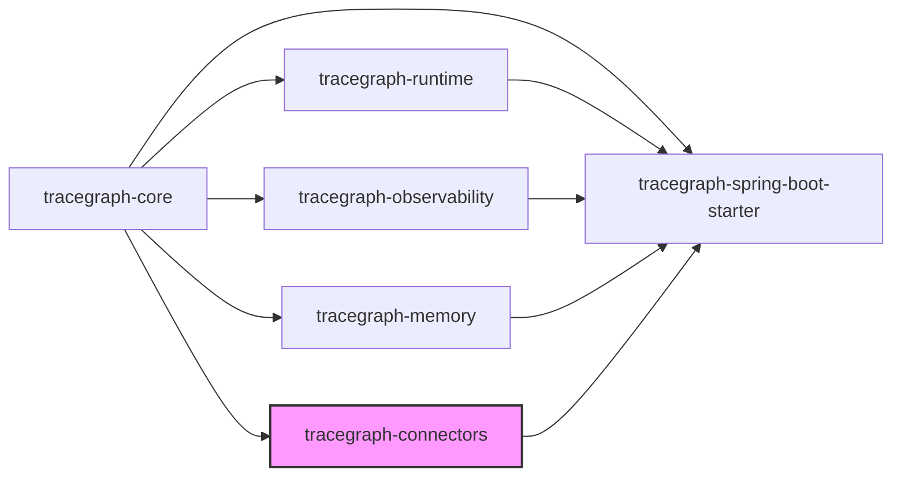
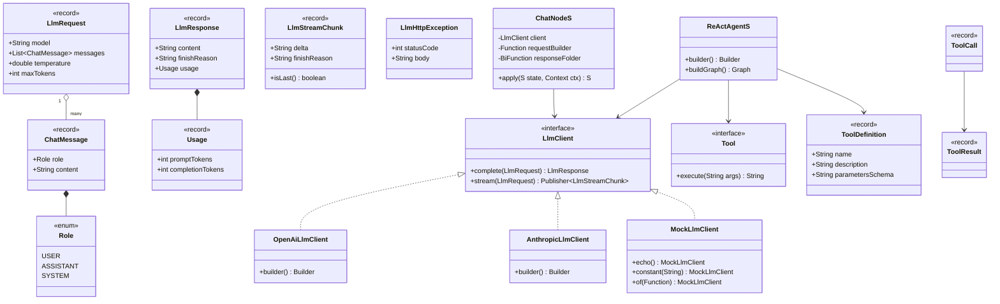
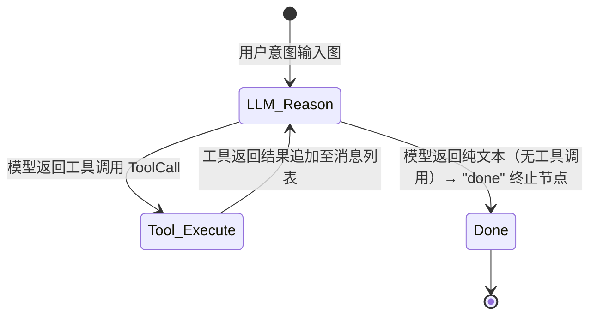
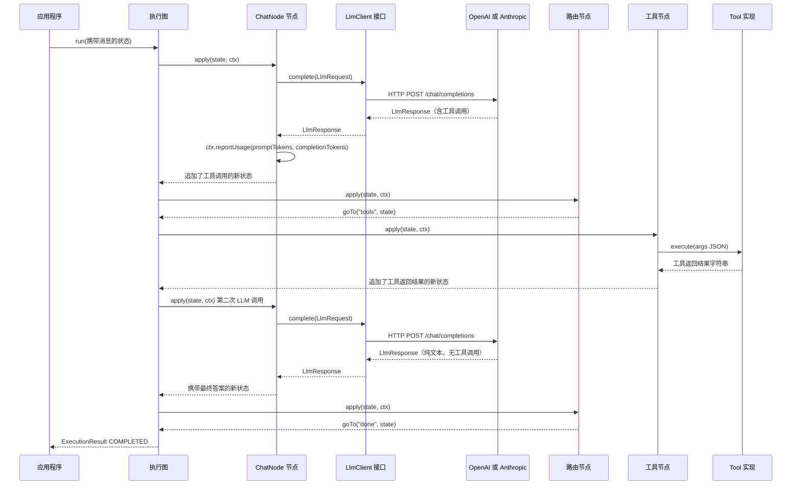

# tracegraph-connectors

[](https://central.sonatype.com/artifact/io.tracegraph/tracegraph-connectors)
[](LICENSE)
[](https://adoptium.net/)

面向 TraceGraph JVM 运行时的厂商无关大语言模型（LLM）适配器、ChatNode 桥接节点与 ReAct（推理与行动）代理工厂。

---

## 模块功能简介

`tracegraph-connectors` 提供了 TraceGraph 图运行时与大语言模型（LLM）之间的桥接层。它定义了厂商无关的 `LlmClient` 服务提供接口（SPI），使您可以在不修改图逻辑的情况下随时切换 LLM 提供商。模块内置了基于 JDK `HttpClient` 实现的 OpenAI 兼容端点适配器与 Anthropic Messages API 适配器，无需额外的 HTTP 依赖。`ChatNode<S>` 将任意 `LlmClient` 适配为类型化的 `Node<S>`，并自动将 Token 用量上报给 `NodeListener`。`ReActAgent<S>` 是一个工厂类，通过单次 Builder 调用即可将完整的 ReAct 推理与行动循环——LLM 节点、工具节点与终止节点——组装成一个 `Graph<S>`。本模块除 `tracegraph-core` 外无任何必选依赖；Jackson 仅在使用 HTTP 适配器时才会被引入。

---

## 系统上下文

下图展示了 TraceGraph 的全部六个模块，其中 `tracegraph-connectors` 以高亮显示。它依赖 `tracegraph-core` 提供的 `Node<S>` 和 `Graph<S>` 契约，并被 `tracegraph-spring-boot-starter` 可选地消费。



---

## 内部架构



---

## ReAct（推理与行动）循环状态图

`ReActAgent<S>` 实现的 ReAct 循环在推理（LLM 调用）与行动（工具调用执行）之间循环，直到模型返回不含工具调用的纯文本响应为止。



---

## 时序图：ChatNode 与工具调用循环



---

## 核心概念

### LlmClient — 厂商无关的服务提供接口（SPI）

`LlmClient` 是核心接口，提供两个方法：`complete` 用于阻塞式请求/响应，`stream` 用于流式输出增量 Token。默认的 `stream` 实现将 `complete()` 的结果包装为单块 `Flow.Publisher`；支持原生流式输出的提供商可以覆盖该方法。

```java
import io.tracegraph.connectors.llm.LlmClient;
import io.tracegraph.connectors.llm.LlmRequest;
import io.tracegraph.connectors.llm.LlmResponse;
import io.tracegraph.connectors.llm.LlmStreamChunk;
import java.util.concurrent.Flow;

// LlmClient 接口定义（概念说明）
public interface LlmClient {
    LlmResponse complete(LlmRequest request);

    // 默认实现将 complete() 包装为单块 Publisher
    // 支持原生流式输出的提供商可覆盖此方法
    default Flow.Publisher<LlmStreamChunk> stream(LlmRequest request) {
        LlmResponse response = complete(request);
        LlmStreamChunk chunk = new LlmStreamChunk(response.content(), response.finishReason());
        SubmissionPublisher<LlmStreamChunk> publisher = new SubmissionPublisher<>();
        publisher.submit(chunk);
        publisher.close();
        return publisher;
    }
}
```

切换提供商只需替换一行代码——`LlmClient` 的实现——图逻辑、工具定义和状态类型完全不变。

### LlmRequest 与 LlmResponse 记录类

```java
import io.tracegraph.connectors.llm.LlmRequest;
import io.tracegraph.connectors.llm.LlmResponse;
import io.tracegraph.connectors.llm.ChatMessage;
import io.tracegraph.connectors.llm.Role;

// 构建请求
LlmRequest request = new LlmRequest(
    "gpt-4o",
    List.of(
        new ChatMessage(Role.SYSTEM, "你是一个有帮助的助手。"),
        new ChatMessage(Role.USER, "法国的首都是哪里？")
    ),
    0.7,
    1024
);

// 解析响应
LlmResponse response = client.complete(request);
System.out.println(response.content());
System.out.println("Prompt tokens：     " + response.usage().promptTokens());
System.out.println("Completion tokens：" + response.usage().completionTokens());
System.out.println("完成原因：           " + response.finishReason());
```

### OpenAiLlmClient

`OpenAiLlmClient` 是针对 OpenAI 兼容端点的生产级适配器，基于 `java.net.http.HttpClient` 和 Jackson 构建（Jackson 为可选依赖，仅在使用此适配器时才引入）。提供商返回非 2xx 状态码时会抛出 `LlmHttpException`，携带 `statusCode()` 和 `body()`。

```java
import io.tracegraph.connectors.llm.OpenAiLlmClient;
import io.tracegraph.connectors.llm.LlmHttpException;

OpenAiLlmClient client = OpenAiLlmClient.builder()
    .apiKey(System.getenv("OPENAI_API_KEY"))
    .model("gpt-4o")
    .temperature(0.7)
    .maxTokens(2048)
    // .endpoint("https://api.openai.com/v1")  // 默认值；可覆盖以使用 Azure/Ollama
    // .httpClient(customHttpClient)            // 自定义 JDK HttpClient
    // .requestTimeout(Duration.ofSeconds(60)) // 默认 30 秒
    .build();

try {
    LlmResponse response = client.complete(request);
    System.out.println(response.content());
} catch (LlmHttpException e) {
    System.err.println("提供商错误 " + e.statusCode() + "：" + e.body());
}
```

### AnthropicLlmClient

`AnthropicLlmClient` 适配 Anthropic Messages API（`POST /v1/messages`）。它会自动将 `Role.SYSTEM` 角色的消息从 `messages` 列表中提取出来，放入 Anthropic API 所要求的顶层 `system` 字段。响应中的多个内容块会被拼接为单个 `content` 字符串。认证所需的 `x-api-key` 和 `anthropic-version` 请求头会自动设置。

```java
import io.tracegraph.connectors.llm.AnthropicLlmClient;

AnthropicLlmClient client = AnthropicLlmClient.builder()
    .apiKey(System.getenv("ANTHROPIC_API_KEY"))
    .model("claude-3-5-sonnet-20241022")
    .temperature(0.5)
    .maxTokens(4096)
    // .endpoint("https://api.anthropic.com")  // 默认值
    .build();
```

### MockLlmClient — 测试替身

`MockLlmClient` 提供三种构建模式，让您无需调用真实 LLM 提供商即可测试图逻辑：

```java
import io.tracegraph.connectors.llm.MockLlmClient;

// 回声模式：响应内容等于最后一条用户消息的内容
LlmClient echo = MockLlmClient.echo();

// 常量模式：每次调用都返回相同的内容字符串
LlmClient constant = MockLlmClient.constant("法国的首都是巴黎。");

// Lambda 模式：完全控制——检查完整的 LlmRequest 并返回任意 LlmResponse
LlmClient lambda = MockLlmClient.of(req -> {
    String lastUserMessage = req.messages().getLast().content();
    return new LlmResponse(
        "模拟回复：" + lastUserMessage,
        "stop",
        new LlmResponse.Usage(10, 5)
    );
});
```

### ChatNode — 图节点的 LLM 桥接器

`ChatNode<S>` 将任意 `LlmClient` 适配为 `Node<S>`，需要提供两个函数：

- `requestBuilder`：`Function<S, LlmRequest>`——从当前状态构建 LLM 请求
- `responseFolder`：`BiFunction<S, LlmResponse, S>`——将 LLM 响应折叠回状态

调用完成后，`ChatNode` 会自动触发 `ctx.reportUsage(promptTokens, completionTokens)`，让 `NodeListener` 实现类接收到准确的 Token 用量数据。

```java
import io.tracegraph.connectors.llm.ChatNode;

record ConversationState(List<ChatMessage> messages, String finalAnswer) {
    ConversationState withMessage(ChatMessage msg) {
        var updated = new ArrayList<>(messages);
        updated.add(msg);
        return new ConversationState(List.copyOf(updated), finalAnswer);
    }
    ConversationState withAnswer(String answer) {
        return new ConversationState(messages, answer);
    }
}

ChatNode<ConversationState> chatNode = new ChatNode<>(
    client,
    // requestBuilder：状态 → LlmRequest
    state -> new LlmRequest("gpt-4o", state.messages(), 0.7, 1024),
    // responseFolder：(状态, 响应) → 新状态
    (state, response) -> state
        .withMessage(new ChatMessage(Role.ASSISTANT, response.content()))
        .withAnswer(response.content())
);
```

### Tool 与 ToolDefinition

`Tool` 是一个函数式 SAM 接口——`execute(String args) → String`，其中 `args` 是一个 JSON 对象字符串，其结构由 `ToolDefinition.parametersSchema()` 描述。`ToolDefinition` 是一个记录类，包含工具名称、供 LLM 参考的自然语言描述，以及发送给 LLM 的 JSON Schema 字符串。

```java
import io.tracegraph.connectors.tools.Tool;
import io.tracegraph.connectors.tools.ToolDefinition;

ToolDefinition weatherDef = new ToolDefinition(
    "get_weather",
    "返回指定城市的当前天气状况。",
    """
    {
      "type": "object",
      "properties": {
        "city": { "type": "string", "description": "城市名称。" }
      },
      "required": ["city"]
    }
    """
);

Tool weatherTool = args -> {
    // args 是 LLM 工具调用传入的 JSON 字符串，例如：{"city":"东京"}
    String city = parseCity(args);
    return weatherService.getCurrent(city).toJson();
};
```

### ReActAgent — 完整的 ReAct 图工厂

`ReActAgent<S>` 生成一个实现 ReAct 循环的完整 `Graph<S>`。所构建的图包含三个具名节点：`llm`（调用 LLM 的路由节点）、`tools`（执行状态中所有工具调用的节点）和 `done`（终止节点）。您需要提供 LLM 客户端、工具定义及实现、请求工厂函数，以及两个状态折叠函数。

```java
import io.tracegraph.connectors.react.ReActAgent;

record AgentState(List<ChatMessage> messages, String finalAnswer) {
    AgentState withMessage(ChatMessage m) {
        var msgs = new ArrayList<>(messages);
        msgs.add(m);
        return new AgentState(List.copyOf(msgs), finalAnswer);
    }
    AgentState withAnswer(String a) {
        return new AgentState(messages, a);
    }
}

Graph<AgentState> agentGraph = ReActAgent.<AgentState>builder()
    .client(client)
    .tool(weatherDef, weatherTool)
    .tool(searchDef, searchTool)
    .requestFactory(state -> new LlmRequest("gpt-4o", state.messages(), 0.5, 4096))
    .responseFolder((state, response) ->
        state.withMessage(new ChatMessage(Role.ASSISTANT, response.content()))
             .withAnswer(response.content()))
    .toolResultFolder((state, results) -> {
        var msgs = new ArrayList<>(state.messages());
        for (ToolResult r : results) {
            msgs.add(new ChatMessage(Role.USER,
                "工具 " + r.toolName() + " 的返回结果：" + r.content()));
        }
        return new AgentState(List.copyOf(msgs), state.finalAnswer());
    })
    .build()
    .buildGraph();
```

### 流式输出

任意 `LlmClient` 都暴露了 `stream(LlmRequest)` 方法，返回 `Flow.Publisher<LlmStreamChunk>`。每个块携带 `delta` 字符串（增量 Token 文本）和 `finishReason`。`isLast()` 在最后一个块上返回 `true`。

```java
import io.tracegraph.connectors.llm.LlmStreamChunk;
import java.util.concurrent.Flow;

Flow.Publisher<LlmStreamChunk> publisher = client.stream(request);
publisher.subscribe(new Flow.Subscriber<>() {
    @Override
    public void onSubscribe(Flow.Subscription subscription) {
        subscription.request(Long.MAX_VALUE);
    }

    @Override
    public void onNext(LlmStreamChunk chunk) {
        System.out.print(chunk.delta());
        if (chunk.isLast()) {
            System.out.println();
        }
    }

    @Override
    public void onError(Throwable throwable) {
        throwable.printStackTrace();
    }

    @Override
    public void onComplete() {
        System.out.println("[流式输出完成]");
    }
});
```

---

## 多智能体模式（0.3.0）

`ReActAgent` 是单智能体原语。0.3.0 在此基础上提供了四种将多个 ReAct 智能体组合到 `Graph<S>` 的方式。

### HandoffNode —— 点对点交接

`HandoffNode<S>` 让一个智能体根据状态中的目标名称直接把控制权交给另一个智能体，无需中心调度。保留名 `"continue"` 表示落到下一个声明的目标；`null` 或未知目标终止于 `"done"`。

```java
Graph<ChatState> graph = HandoffNode.<ChatState>builder()
        .client(llmClient)
        .requestFactory(state -> LlmRequest.of(state.messages()))
        .responseFolder((state, resp) -> state.withMessage(resp.content()))
        .handoffSelector(state -> state.routeTo())
        .target("alice", aliceAgentGraph)
        .target("bob", bobAgentGraph)
        .build()
        .buildGraph();
```

### AgentProfile —— 每个智能体的角色与工具隔离

`AgentProfile<S>` 是一个 `(name, systemPrompt, List<Tool>, List<ToolDefinition>, memoryScope)` 记录，会覆盖 `ReActAgent.Builder` 的工具和角色提示。调用 `.profile(...)` 会替换之前的 `tool(...)` 注册，使共享同一 `LlmClient` 的两个智能体彼此看不到对方的工具。

```java
AgentProfile<S> researcher = new AgentProfile<>(
        "researcher",
        "You are a research analyst.",
        List.of(searchTool, fetchTool),
        List.of(searchDef, fetchDef),
        Function.identity());

Graph<S> graph = ReActAgent.<S>builder()
        .client(llmClient)
        .profile(researcher)
        .requestFactory(...)
        .responseFolder(...)
        .toolResultFolder(...)
        .build()
        .buildGraph();
```

### GroupChatAgent —— 轮询或 LLM 选择发言

`GroupChatAgent<S>` 使用 `SpeakerSelector<S>` 策略轮换 N 个 `ReActAgent`，并在 `terminationPredicate` 命中时终止。

```java
Graph<S> chat = GroupChatAgent.<S>builder()
        .agent("alice", aliceGraph)
        .agent("bob", bobGraph)
        .agent("carol", carolGraph)
        .speakerSelector(SpeakerSelector.roundRobin())   // 或 .llm(...)
        .terminationPredicate(state -> state.rounds() >= 4)
        .build()
        .buildGraph();
```

### VotingNode —— 并行共识

`VotingNode<S>` 通过 `parallel(...)` 在候选 ReAct 子图上扇出，并使用 `Tally` 聚合状态。内置策略：`Tally.majority(Function<S, String>)` 与 `Tally.firstNonNull(Function<S, String>)`。

```java
Node<S> vote = VotingNode.<S>builder()
        .candidate("alice", aliceGraph)
        .candidate("bob", bobGraph)
        .candidate("carol", carolGraph)
        .tally(Tally.majority(State::answer))
        .build();
```

可叠加 `tracegraph-observability` 的 `TerminationListener<S>`，通过 `maxTurns` / `afterNode` / `stateMatches` 对这四种模式给出统一的收敛保证。

---

## 完整使用步骤

### 第一步：添加 Maven 依赖

```xml
<dependency>
    <groupId>io.tracegraph</groupId>
    <artifactId>tracegraph-connectors</artifactId>
    <version>0.3.0</version>
</dependency>
```

Jackson 是可选的传递依赖。若使用 `OpenAiLlmClient` 或 `AnthropicLlmClient`，Jackson 必须在类路径上：

```xml
<dependency>
    <groupId>com.fasterxml.jackson.core</groupId>
    <artifactId>jackson-databind</artifactId>
    <version>2.17.0</version>
</dependency>
```

### 第二步：配置 OpenAiLlmClient

```java
import io.tracegraph.connectors.llm.OpenAiLlmClient;

OpenAiLlmClient client = OpenAiLlmClient.builder()
    .apiKey(System.getenv("OPENAI_API_KEY"))
    .model("gpt-4o")
    .temperature(0.7)
    .maxTokens(2048)
    .build();
```

对于 Ollama、LM Studio 等实现了 OpenAI 兼容端点的本地模型：

```java
OpenAiLlmClient localClient = OpenAiLlmClient.builder()
    .apiKey("local")
    .endpoint("http://localhost:11434/v1")
    .model("llama3.1:8b")
    .build();
```

### 第三步：配置 AnthropicLlmClient

```java
import io.tracegraph.connectors.llm.AnthropicLlmClient;

AnthropicLlmClient client = AnthropicLlmClient.builder()
    .apiKey(System.getenv("ANTHROPIC_API_KEY"))
    .model("claude-3-5-sonnet-20241022")
    .maxTokens(4096)
    .build();
```

### 第四步：使用 MockLlmClient 进行测试

```java
import io.tracegraph.connectors.llm.MockLlmClient;
import io.tracegraph.connectors.llm.LlmResponse;

// 常量响应——适用于确定性单元测试
LlmClient constantClient = MockLlmClient.constant("东京当前天气晴，气温 24 摄氏度。");

// Lambda 响应——模拟先工具调用后最终答案的序列
int[] callCount = {0};
LlmClient sequencedClient = MockLlmClient.of(req -> {
    callCount[0]++;
    if (callCount[0] == 1) {
        // 第一次调用：返回工具调用 JSON
        return new LlmResponse(
            "{\"tool_calls\":[{\"name\":\"get_weather\",\"arguments\":{\"city\":\"东京\"}}]}",
            "tool_calls",
            new LlmResponse.Usage(25, 10)
        );
    }
    // 第二次调用：返回纯文本最终答案
    return new LlmResponse(
        "东京当前天气晴，气温 24 摄氏度。",
        "stop",
        new LlmResponse.Usage(40, 15)
    );
});
```

### 第五步：将 ChatNode 接入图

```java
import io.tracegraph.core.Graph;
import io.tracegraph.core.ExecutionResult;
import io.tracegraph.connectors.llm.ChatNode;
import io.tracegraph.connectors.llm.LlmRequest;
import io.tracegraph.connectors.llm.ChatMessage;
import io.tracegraph.connectors.llm.Role;

record ChatState(List<ChatMessage> messages, String answer) {}

ChatNode<ChatState> chatNode = new ChatNode<>(
    client,
    state -> new LlmRequest("gpt-4o", state.messages(), 0.7, 1024),
    (state, response) -> new ChatState(
        appendAssistantMessage(state.messages(), response.content()),
        response.content()
    )
);

Graph<ChatState> graph = Graph.<ChatState>builder()
    .node("chat", chatNode)
    .entry("chat")
    .terminal("chat")
    .build();

ChatState initial = new ChatState(
    List.of(new ChatMessage(Role.USER, "2 加 2 等于几？")),
    null
);

ExecutionResult<ChatState> result = graph.run(initial);
System.out.println(result.state().answer());
```

### 第六步：定义带 JSON Schema 的工具

```java
import io.tracegraph.connectors.tools.ToolDefinition;
import io.tracegraph.connectors.tools.Tool;

ToolDefinition searchDef = new ToolDefinition(
    "web_search",
    "搜索互联网并以 JSON 数组形式返回最相关的结果。",
    """
    {
      "type": "object",
      "properties": {
        "query": {
          "type": "string",
          "description": "搜索查询字符串。"
        },
        "maxResults": {
          "type": "integer",
          "description": "最大结果数量。",
          "default": 5
        }
      },
      "required": ["query"]
    }
    """
);

Tool searchTool = args -> {
    SearchQuery q = parseSearchQuery(args);
    return searchService.search(q.query(), q.maxResults()).toJson();
};
```

### 第七步：构建完整的 ReActAgent 图

```java
import io.tracegraph.connectors.react.ReActAgent;

Graph<AgentState> agentGraph = ReActAgent.<AgentState>builder()
    .client(client)
    .tool(searchDef, searchTool)
    .tool(weatherDef, weatherTool)
    .requestFactory(state -> new LlmRequest("gpt-4o", state.messages(), 0.5, 4096))
    .responseFolder((state, response) ->
        state.withMessage(new ChatMessage(Role.ASSISTANT, response.content()))
             .withAnswer(response.content()))
    .toolResultFolder((state, results) -> {
        var msgs = new ArrayList<>(state.messages());
        for (ToolResult r : results) {
            msgs.add(new ChatMessage(Role.USER,
                "工具 " + r.toolName() + " 的返回结果：" + r.content()));
        }
        return new AgentState(List.copyOf(msgs), state.finalAnswer());
    })
    .build()
    .buildGraph();

AgentState initial = new AgentState(
    List.of(
        new ChatMessage(Role.SYSTEM, "你是一个有帮助的研究助手。"),
        new ChatMessage(Role.USER, "巴黎现在的天气怎么样？")
    ),
    null
);

ExecutionResult<AgentState> result = agentGraph.run(initial);
System.out.println(result.state().finalAnswer());
```

### 第八步：流式输出

```java
import io.tracegraph.connectors.llm.LlmStreamChunk;
import java.util.concurrent.Flow;

LlmRequest streamRequest = new LlmRequest(
    "gpt-4o",
    List.of(new ChatMessage(Role.USER, "讲一个简短的故事。")),
    0.9,
    512
);

client.stream(streamRequest).subscribe(new Flow.Subscriber<>() {
    private Flow.Subscription sub;

    @Override
    public void onSubscribe(Flow.Subscription s) {
        this.sub = s;
        s.request(Long.MAX_VALUE);
    }

    @Override
    public void onNext(LlmStreamChunk chunk) {
        System.out.print(chunk.delta());
        if (chunk.isLast()) {
            System.out.println();
        }
    }

    @Override
    public void onError(Throwable t) {
        t.printStackTrace();
    }

    @Override
    public void onComplete() {
        System.out.println("[完成]");
    }
});
```

### 第九步：处理 LlmHttpException

```java
import io.tracegraph.connectors.llm.LlmHttpException;

try {
    LlmResponse response = client.complete(request);
    process(response);
} catch (LlmHttpException e) {
    if (e.statusCode() == 429) {
        System.err.println("频率限制，请等待后重试。响应体：" + e.body());
    } else if (e.statusCode() >= 500) {
        System.err.println("提供商服务端错误。状态码：" + e.statusCode());
    } else {
        throw e; // 非预期错误，向上传播
    }
}
```

---

## 配置参考

### OpenAiLlmClient Builder 选项

| 选项 | 类型 | 默认值 | 说明 |
|---|---|---|---|
| `apiKey` | `String` | 必填 | OpenAI API 密钥（`sk-...`） |
| `endpoint` | `String` | `https://api.openai.com/v1` | 基础 URL；可覆盖以使用 Azure、Ollama 等 |
| `model` | `String` | 必填 | 模型名称，例如 `gpt-4o` |
| `temperature` | `double` | `1.0` | 采样温度（0.0–2.0） |
| `maxTokens` | `int` | `1024` | 响应中的最大 Token 数 |
| `httpClient` | `HttpClient` | JDK 默认 | 自定义 `java.net.http.HttpClient` 实例 |
| `requestTimeout` | `Duration` | `30s` | 单次请求读取超时时间 |

### AnthropicLlmClient Builder 选项

| 选项 | 类型 | 默认值 | 说明 |
|---|---|---|---|
| `apiKey` | `String` | 必填 | Anthropic API 密钥 |
| `endpoint` | `String` | `https://api.anthropic.com` | 基础 URL |
| `model` | `String` | 必填 | 模型名称，例如 `claude-3-5-sonnet-20241022` |
| `temperature` | `double` | `1.0` | 采样温度 |
| `maxTokens` | `int` | `1024` | 响应中的最大 Token 数 |
| `httpClient` | `HttpClient` | JDK 默认 | 自定义 `java.net.http.HttpClient` 实例 |
| `requestTimeout` | `Duration` | `30s` | 单次请求读取超时时间 |

---

## 与其他模块的集成

### 与 tracegraph-observability 集成：Token 费用追踪

`ChatNode` 在每次 LLM 调用完成后触发 `ctx.reportUsage(promptTokens, completionTokens)`。`tracegraph-observability` 中的 `LlmCostListener` 会按执行和按节点累计这些数据。`OtelNodeListener` 将其作为 `llm.usage.input_tokens`、`llm.usage.output_tokens`、`llm.usage.total_tokens` Span 属性发送。

```java
import io.tracegraph.observability.LlmCostListener;

LlmCostListener costListener = new LlmCostListener();

Graph<AgentState> graph = Graph.<AgentState>builder()
    .node("chat", chatNode)
    .entry("chat")
    .terminal("chat")
    .listener(costListener)
    .build();

graph.run(initial);

System.out.println("总 Prompt Token 数：     " + costListener.totalPromptTokens());
System.out.println("总 Completion Token 数：" + costListener.totalCompletionTokens());
```

### 与 tracegraph-spring-boot-starter 集成：LLM 自动配置

当 `tracegraph-spring-boot-starter` 在类路径上且 `tracegraph-connectors` 存在时，`LlmAutoConfiguration` 会从配置文件中创建 `LlmClient` Bean。您可以直接将其注入到 `@Bean Graph<S>` 中：

```java
// application.properties 配置示例：
// tracegraph.llm.provider=openai
// tracegraph.llm.api-key=${OPENAI_API_KEY}
// tracegraph.llm.model=gpt-4o
// tracegraph.llm.temperature=0.7

@Configuration
public class GraphConfig {

    @Bean
    public Graph<AgentState> agentGraph(LlmClient llmClient) {
        ChatNode<AgentState> chat = new ChatNode<>(
            llmClient,
            state -> new LlmRequest("gpt-4o", state.messages(), 0.7, 1024),
            (state, resp) -> state.withAnswer(resp.content())
        );
        return Graph.<AgentState>builder()
            .node("chat", chat)
            .entry("chat")
            .terminal("chat")
            .build();
    }
}
```

### 与 tracegraph-runtime 集成：LLM 错误重试

`ChatNode` 是标准的 `Node<S>`，与 `RetryPolicy` 的集成方式与其他节点完全相同。配置重试策略可处理瞬时提供商错误（如频率限制）：

```java
import io.tracegraph.core.RetryPolicy;

Graph<AgentState> graph = Graph.<AgentState>builder()
    .node("chat", chatNode,
        RetryPolicy.builder()
            .maxAttempts(3)
            .backoff(Duration.ofSeconds(2))
            .build())
    .entry("chat")
    .terminal("chat")
    .build();
```

---

## 测试指南

### 验证 ChatNode 调用了 reportUsage

```java
import io.tracegraph.core.spi.NodeListener;
import io.tracegraph.connectors.llm.MockLlmClient;
import io.tracegraph.connectors.llm.ChatNode;
import org.junit.jupiter.api.Test;
import static org.assertj.core.api.Assertions.assertThat;

class ChatNodeUsageTest {

    record TestState(List<ChatMessage> messages, String answer) {}

    @Test
    void chatNodeReportsTokenUsageAfterEachCall() {
        List<int[]> usageCaptures = new ArrayList<>();

        NodeListener<TestState> capturingListener = new NodeListener<>() {
            @Override
            public void onUsage(String nodeName, int promptTokens, int completionTokens) {
                usageCaptures.add(new int[]{promptTokens, completionTokens});
            }
        };

        LlmClient mockClient = MockLlmClient.of(req ->
            new LlmResponse("你好！", "stop", new LlmResponse.Usage(15, 5)));

        ChatNode<TestState> chatNode = new ChatNode<>(
            mockClient,
            state -> new LlmRequest("test-model", state.messages(), 0.0, 10),
            (state, resp) -> new TestState(state.messages(), resp.content())
        );

        Graph<TestState> graph = Graph.<TestState>builder()
            .node("chat", chatNode)
            .entry("chat")
            .terminal("chat")
            .listener(capturingListener)
            .build();

        graph.run(new TestState(List.of(new ChatMessage(Role.USER, "你好")), null));

        assertThat(usageCaptures).hasSize(1);
        assertThat(usageCaptures.get(0)[0]).isEqualTo(15); // promptTokens
        assertThat(usageCaptures.get(0)[1]).isEqualTo(5);  // completionTokens
    }
}
```

### 验证 ReActAgent 在工具调用后终止于 "done" 节点

```java
class ReActAgentTerminationTest {

    record AgentState(List<ChatMessage> messages, String finalAnswer) {}

    @Test
    void agentTerminatesAtDoneAfterOneToolCall() {
        int[] callCount = {0};
        LlmClient mockClient = MockLlmClient.of(req -> {
            callCount[0]++;
            if (callCount[0] == 1) {
                return new LlmResponse(
                    "{\"tool_calls\":[{\"name\":\"get_weather\",\"arguments\":{\"city\":\"巴黎\"}}]}",
                    "tool_calls",
                    new LlmResponse.Usage(20, 8)
                );
            }
            return new LlmResponse(
                "巴黎现在天晴，气温 21 摄氏度。",
                "stop",
                new LlmResponse.Usage(30, 12)
            );
        });

        ToolDefinition weatherDef = new ToolDefinition(
            "get_weather", "获取城市天气。", "{\"type\":\"object\"}");
        Tool weatherTool = args -> "{\"temp\":\"21C\",\"conditions\":\"sunny\"}";

        Graph<AgentState> graph = ReActAgent.<AgentState>builder()
            .client(mockClient)
            .tool(weatherDef, weatherTool)
            .requestFactory(state -> new LlmRequest("test", state.messages(), 0.0, 100))
            .responseFolder((state, resp) ->
                new AgentState(state.messages(), resp.content()))
            .toolResultFolder((state, results) -> state)
            .build()
            .buildGraph();

        AgentState initial = new AgentState(
            List.of(new ChatMessage(Role.USER, "巴黎天气怎么样？")), null);
        ExecutionResult<AgentState> result = graph.run(initial);

        assertThat(result.status()).isEqualTo(Status.COMPLETED);
        assertThat(result.state().finalAnswer()).contains("巴黎");
        assertThat(callCount[0]).isEqualTo(2); // 恰好调用两次 LLM
    }
}
```

### 测试非 2xx 响应时的 LlmHttpException

```java
@Test
void openAiClientThrowsLlmHttpExceptionOnNon2xx() {
    HttpClient stubbedHttp = buildStubbedHttpClient(429, "{\"error\":\"rate limited\"}");

    OpenAiLlmClient client = OpenAiLlmClient.builder()
        .apiKey("sk-test")
        .model("gpt-4o")
        .httpClient(stubbedHttp)
        .build();

    LlmRequest request = new LlmRequest(
        "gpt-4o",
        List.of(new ChatMessage(Role.USER, "你好")),
        0.7,
        10
    );

    assertThatThrownBy(() -> client.complete(request))
        .isInstanceOf(LlmHttpException.class)
        .satisfies(ex -> {
            LlmHttpException e = (LlmHttpException) ex;
            assertThat(e.statusCode()).isEqualTo(429);
            assertThat(e.body()).contains("rate limited");
        });
}
```

---

## 常见问题

**Q：如何在不修改图逻辑的情况下从 OpenAI 切换到 Anthropic？**

只需替换一行代码——`LlmClient` 的构建。`ChatNode`、`ReActAgent`、工具定义和状态类型完全不变：

```java
// OpenAI
LlmClient client = OpenAiLlmClient.builder()
    .apiKey(System.getenv("OPENAI_API_KEY")).model("gpt-4o").build();

// Anthropic——所有其他代码保持不变
LlmClient client = AnthropicLlmClient.builder()
    .apiKey(System.getenv("ANTHROPIC_API_KEY")).model("claude-3-5-sonnet-20241022").build();
```

---

**Q：LLM 提供商返回非 2xx HTTP 状态码时会发生什么？**

`OpenAiLlmClient` 和 `AnthropicLlmClient` 都会抛出 `LlmHttpException`，携带 `statusCode()` 和 `body()`。该异常通过 `ChatNode.apply()` 向上传播，被图执行器视为节点失败。若节点配置了 `RetryPolicy`，执行器会按策略重试整个 LLM 调用。429 频率限制是配置指数退避重试的典型场景。

---

**Q：流式输出能与 ChatNode 和 ReActAgent 配合使用吗？**

`ChatNode` 使用的是 `complete()` 而非 `stream()`。流式输出（`client.stream(request)`）适用于需要将增量 Token 实时推送到界面的场景。`tracegraph-spring-boot-starter` 中的 `TraceStreamController` 将图级别事件（节点进入、节点退出、失败、完成）包装为服务器发送事件（SSE），这与 Token 级别的流式输出是两个不同的概念。

---

**Q：ReActAgent 内部如何解析工具调用？**

`ReActAgent` 及其内部 `tools` 节点负责处理 LLM 响应中工具调用的全部解析工作。LLM 返回的 `content` 字符串由路由节点检查——若包含 `tool_calls`，图会路由到 `tools` 节点；否则路由到 `done` 节点。单独的 `ChatNode` 本身不解析工具调用——它通过您提供的 `responseFolder` 将原始 `LlmResponse.content()` 折叠进状态，将状态结构的完全控制权交给您。

---

**Q：可以使用 Ollama 等本地模型配合 OpenAiLlmClient 吗？**

可以。实现了 OpenAI Chat Completions 规范的本地服务无需任何修改即可使用：

```java
OpenAiLlmClient client = OpenAiLlmClient.builder()
    .apiKey("local")
    .endpoint("http://localhost:11434/v1")
    .model("llama3.1:8b")
    .build();
```
