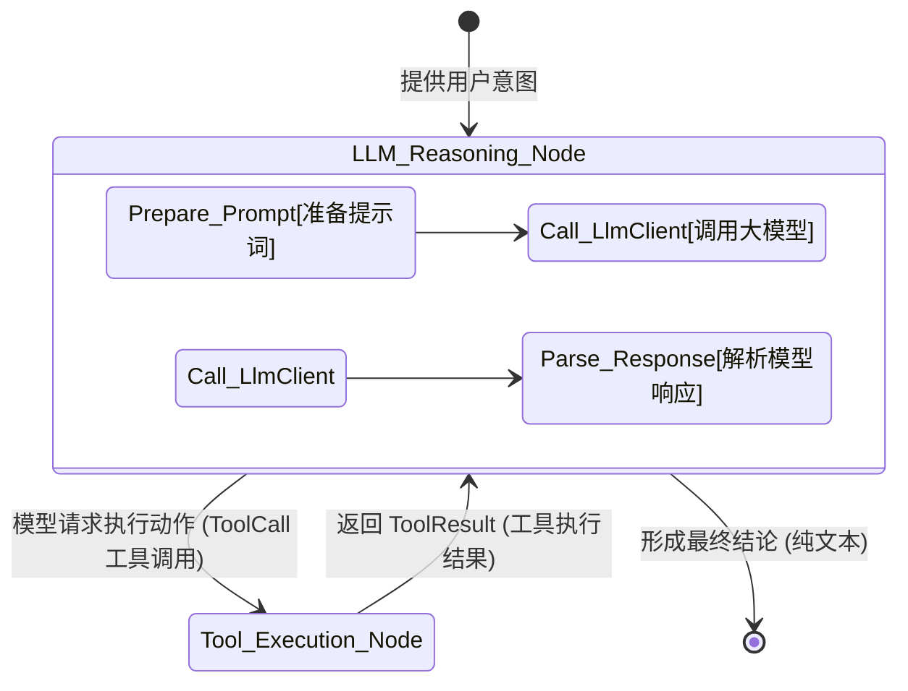

# TraceGraph :: Connectors (连接器模块)

## 📖 连接器简介
欢迎使用 `tracegraph-connectors` 模块！虽然 `tracegraph-core` 提供了执行图的引擎，但它本身并不了解大语言模型 (LLM)、向量数据库或第三方 API。

`connectors` 模块弥补了这一差距。它提供了开箱即用的适配器，以类型安全、可观测的方式将外部生态系统层（如 OpenAI、Anthropic 或自定义内部 API）直接与图运行时对齐。

### 为什么我需要这个？
- **厂商中立的 SPI**: 提供抽象的 `LlmClient` 接口。您可以在不更改图逻辑的情况下，无缝地从 OpenAI 切换到 Anthropic。
- **即用型适配器**: 包含针对 OpenAI (`OpenAiLlmClient`) 和 Anthropic (`AnthropicLlmClient`) 的原生、高度优化的 HTTP 适配实现。
- **图节点集成**: 提供诸如 `ChatNode` 之类的预构建节点，这些节点会自动处理 LLM 边界、状态提取以及 Token 消耗统计。
- **ReAct 抽象**: 提供了基于模板的 `Tool` (工具) 框架，允许快速构建动态的 ReAct（推理与行动）代理。

## 🏗️ 代理 ReAct 循环架构

下图说明了 `ChatNode` 如何在标准的 ReAct 循环中使用 `LlmClient` 并与工具进行交互。



## 🚀 如何实现连接器

### 1. 初始化 LLM 客户端
您可以手动初始化客户端，或者让 Spring Boot Starter 自动为您完成。

```java
import site.tracegraph.connectors.llm.openai.OpenAiLlmClient;

OpenAiLlmClient llmClient = OpenAiLlmClient.builder()
    .apiKey("sk-...")
    .model("gpt-4-turbo")
    .temperature(0.7)
    .build();
```

### 2. 将 ChatNode 添加到您的执行图中
`ChatNode` 会自动使用您的状态 (State) 中存储的消息来调用 LLM，并将 LLM 的响应追加回状态中。

```java
import site.tracegraph.connectors.nodes.ChatNode;

Graph<MyState> graph = Graph.<MyState>builder()
    // ChatNode 使用您的 LlmClient 并从您的状态中提取消息
    .node("llm_call", new ChatNode<>(llmClient, MyState::messages, MyState::withNewMessage))
    // ... 添加其他工具执行节点
    .entry("llm_call")
    .build();
```

### 3. 工具调用 (Tool Calling)
如果您正在构建一个可以与 API 交互的代理，您可以向客户端注册工具：

```java
import site.tracegraph.connectors.tools.Tool;

Tool weatherTool = Tool.builder()
    .name("get_weather")
    .description("获取某地的天气")
    .function((args) -> weatherService.fetch(args.get("city").asText()))
    .build();

OpenAiLlmClient agentClient = OpenAiLlmClient.builder()
    .apiKey("sk-...")
    .tools(List.of(weatherTool)) // 注册工具
    .build();
```
