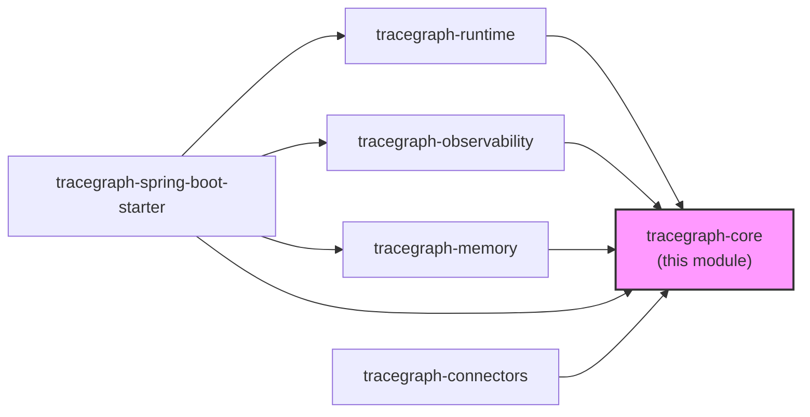
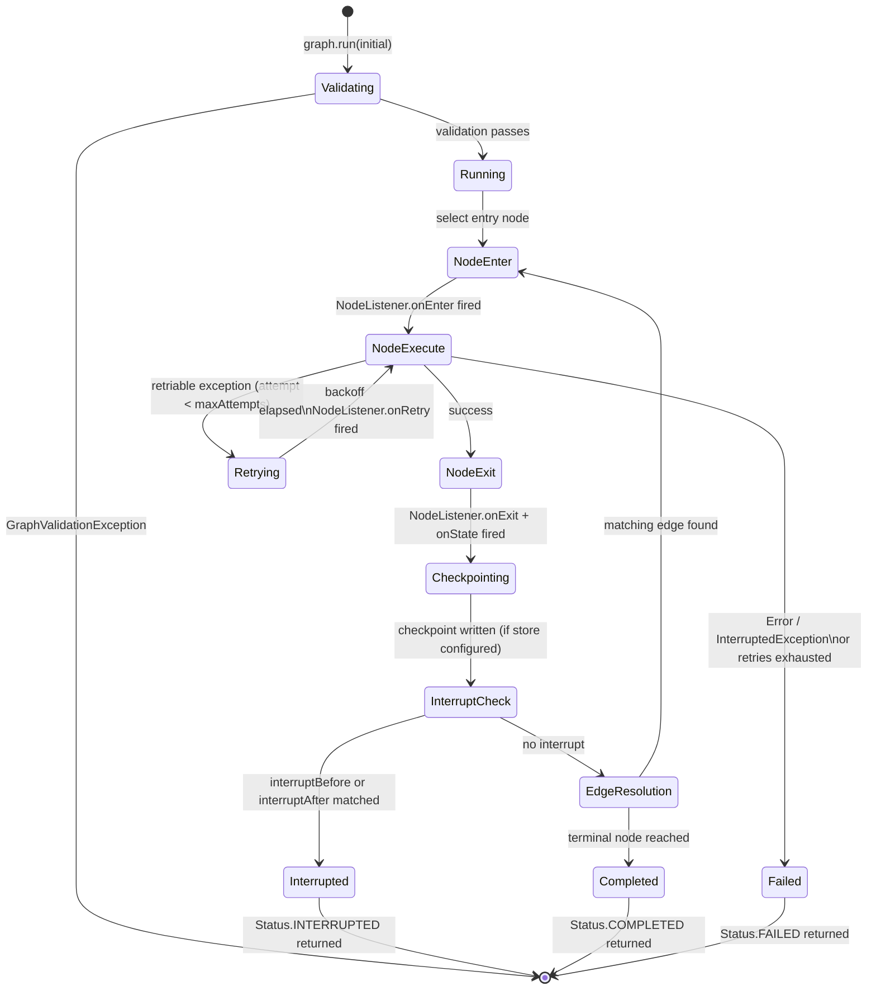
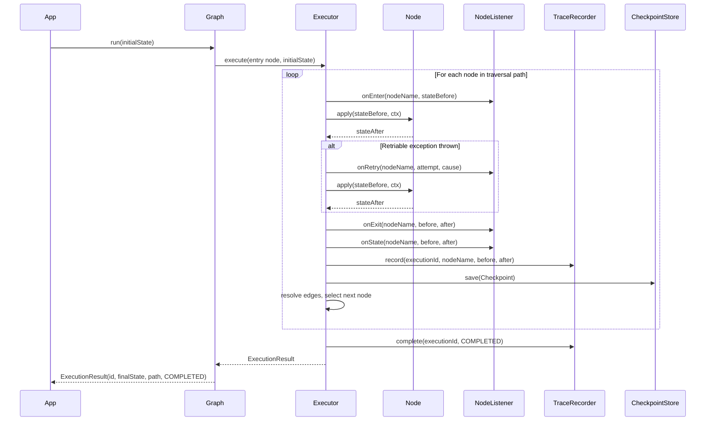

# tracegraph-core

[](https://central.sonatype.com/artifact/io.tracegraph/tracegraph-core)
[](https://opensource.org/licenses/Apache-2.0)
[](https://openjdk.org/projects/jdk/21/)

Pure graph definitions, the synchronous execution loop, and all SPI interfaces for the TraceGraph agent runtime — zero heavy dependencies.

---

## What it does

`tracegraph-core` is the foundational layer of the TraceGraph project. It lets you compose typed, stateful workflows as directed graphs where nodes transform an immutable state record and edges route execution based on predicates evaluated against that state. The module is deliberately dependency-free — no Spring, no Jackson, no OpenTelemetry — so it can be embedded anywhere on the JVM without conflict.

The core solves a specific problem: agent workflows that need deterministic, auditable, and resumable control flow. Rather than encoding workflow logic in deeply nested if-else trees or chained `CompletableFuture` calls, you declare nodes, edges, and retry policies once, and the executor handles traversal, retry backoff, listener notification, and checkpoint integration automatically.

The key differentiator is that every execution produces a first-class `ExecutionResult<S>` carrying the full traversal path, and every step is observable through the `NodeListener` SPI — making replay and debugging feasible at the framework level rather than requiring bespoke application-level instrumentation.

---

## System Context



`tracegraph-core` has no outbound dependencies on any other TraceGraph module. All other modules depend on it, and all SPI interfaces that higher modules implement (`NodeListener`, `CheckpointStore`, `TraceRecorder`, `MemoryStore`) are declared here.

---

## Internal Architecture

```mermaid
classDiagram
    class Graph~S~ {
        +run(S initial) ExecutionResult~S~
        +run(S initial, String executionId) ExecutionResult~S~
        +resume(String executionId) ExecutionResult~S~
        +stream(S initial) Publisher~NodeEvent~S~~
        +toMermaid() String
        +toPlantUml() String
        +builder() Builder~S~$
    }
    class Builder~S~ {
        +node(String name, Node~S~ fn) Builder~S~
        +asyncNode(String name, AsyncNode~S~ fn) Builder~S~
        +routingNode(String name, RoutingNode~S~ fn) Builder~S~
        +parallel(String name, List branches, Merger~S~) Builder~S~
        +subgraph(String name, Graph~S~ inner) Builder~S~
        +entry(String name) Builder~S~
        +edge(String from, String to) Builder~S~
        +edge(String from, String to, Predicate~S~ cond) Builder~S~
        +terminal(String name) Builder~S~
        +listener(NodeListener~S~ l) Builder~S~
        +traceRecorder(TraceRecorder~S~ r) Builder~S~
        +checkpointStore(CheckpointStore~S~ s) Builder~S~
        +memoryStore(MemoryStore s) Builder~S~
        +defaultRetryPolicy(RetryPolicy p) Builder~S~
        +executor(ExecutorService e) Builder~S~
        +interruptBefore(String names) Builder~S~
        +interruptAfter(String names) Builder~S~
        +build() Graph~S~
    }
    class Node~S~ {
        <<FunctionalInterface>>
        +apply(S state, Context ctx) S
    }
    class AsyncNode~S~ {
        <<FunctionalInterface>>
        +apply(S state, Context ctx) CompletableFuture~S~
    }
    class RoutingNode~S~ {
        <<FunctionalInterface>>
        +apply(S state, Context ctx) NodeResult~S~
    }
    class NodeResult~S~ {
        +goTo(String name, S state) NodeResult~S~$
        +of(S state) NodeResult~S~$
    }
    class Edge~S~ {
        <<record>>
        +from() String
        +to() String
        +condition() Optional~Predicate~S~~
    }
    class ExecutionResult~S~ {
        <<record>>
        +executionId() String
        +finalState() S
        +path() List~String~
        +status() Status
        +error() Optional~Throwable~
    }
    class Status {
        <<enum>>
        COMPLETED
        FAILED
        INTERRUPTED
    }
    class Context {
        <<interface>>
        +executionId() String
        +idempotencyKey() String
        +memory() MemoryStore
        +reportUsage(int promptTokens, int completionTokens)
    }
    class RetryPolicy {
        +fixed(int maxAttempts, Duration delay) RetryPolicy$
        +exponential(int max, Duration base, double mult, Duration cap) RetryPolicy$
    }
    class NodeListener~S~ {
        <<SPI interface>>
        +onEnter(String name, S state)
        +onExit(String name, S before, S after)
        +onError(String name, S state, Throwable t)
        +onRetry(String name, int attempt, Throwable t)
        +onState(String name, S before, S after)
        +onUsage(String name, int promptTokens, int completionTokens)
    }
    class CheckpointStore~S~ {
        <<SPI interface>>
        +save(Checkpoint~S~ checkpoint)
        +load(String executionId) Optional~Checkpoint~S~~
    }
    class TraceRecorder~S~ {
        <<SPI interface>>
        +record(String executionId, String nodeName, S before, S after)
        +complete(String executionId, Status status)
    }
    class MemoryStore {
        <<SPI interface>>
        +get(String scope, String key) Optional~Object~
        +put(String scope, String key, Object value)
        +delete(String scope, String key)
        +keys(String scope) Set~String~
        +noop() MemoryStore$
    }

    Graph~S~ +-- Builder~S~
    Graph~S~ --> Edge~S~
    Graph~S~ --> Node~S~
    Graph~S~ --> AsyncNode~S~
    Graph~S~ --> RoutingNode~S~
    Graph~S~ --> NodeListener~S~
    Graph~S~ --> CheckpointStore~S~
    Graph~S~ --> TraceRecorder~S~
    Graph~S~ --> MemoryStore
    Graph~S~ --> RetryPolicy
    Graph~S~ ..> ExecutionResult~S~
    ExecutionResult~S~ --> Status
    RoutingNode~S~ ..> NodeResult~S~
    Context --> MemoryStore
```

---

## Execution Lifecycle



---

## Sequence Diagram



---

## Core Concepts

### Graph\<S\>

`Graph<S>` is immutable after `build()` and safe to share across threads. The type parameter `S` is your state type — typically a Java record. Multiple concurrent `run()` calls on the same graph instance are fully supported.

```java
Graph<OrderState> graph = Graph.<OrderState>builder()
    .node("validate", (state, ctx) -> state.withValidated(true))
    .entry("validate")
    .terminal("validate")
    .build();

ExecutionResult<OrderState> result = graph.run(new OrderState("ord-1", false, false, false, null));
```

### Node\<S\>

`Node<S>` is a `@FunctionalInterface`. Its single method receives the current state and a `Context`, and returns the next state. Nodes must be stateless and thread-safe — they will be called from multiple threads when parallel branches are active.

```java
Node<OrderState> validateNode = (state, ctx) -> {
    if (state.orderId() == null) throw new IllegalArgumentException("orderId required");
    return state.withValidated(true);
};
```

### AsyncNode\<S\>

`AsyncNode<S>` is identical to `Node<S>` but returns `CompletableFuture<S>`. The executor integrates async nodes with retry and checkpoint logic identically to sync nodes. Use virtual threads (JDK 21) so blocking I/O does not pin carrier threads.

```java
AsyncNode<OrderState> chargeNode = (state, ctx) ->
    paymentClient.chargeAsync(state.orderId())
                 .thenApply(receipt -> state.withCharged(true).withReceiptId(receipt.id()));
```

### RoutingNode\<S\>

A `RoutingNode<S>` can jump to any named node by returning `NodeResult.goTo(name, state)`, bypassing normal edge resolution. Return `NodeResult.of(state)` to fall through to declared edges as usual. Jumping to an unknown node name throws `NodeExecutionException`.

```java
RoutingNode<OrderState> routeNode = (state, ctx) -> {
    if (!state.validated()) return NodeResult.goTo("reject", state);
    return NodeResult.of(state);  // continue via declared edges
};
```

### Edge\<S\>

Edges are first-class records with a `from` node, a `to` node, and an optional `Predicate<S>` condition. An edge without a condition is always taken. When multiple edges leave a node, the first one whose condition evaluates to `true` is followed.

```java
// Unconditional edge
builder.edge("validate", "charge");

// Conditional edges — evaluated in declaration order
builder.edge("validate", "reject", state -> !state.validated());
builder.edge("validate", "charge", OrderState::validated);
```

### RetryPolicy

Retry policies are declared at graph-definition time, not at runtime. A per-node policy overrides the graph's `defaultRetryPolicy`. `Error` and `InterruptedException` always skip retries regardless of the policy.

```java
RetryPolicy fixed       = RetryPolicy.fixed(3, Duration.ofMillis(200));
RetryPolicy exponential = RetryPolicy.exponential(5, Duration.ofMillis(100), 2.0, Duration.ofSeconds(10));

Graph<OrderState> graph = Graph.<OrderState>builder()
    .node("charge", chargeNode, RetryPolicy.fixed(3, Duration.ofMillis(500)))
    .defaultRetryPolicy(RetryPolicy.fixed(1, Duration.ofMillis(100)))
    // ... edges ...
    .build();
```

### NodeListener\<S\> and Listeners.compose

`NodeListener<S>` is the primary observability SPI. Implementations receive lifecycle callbacks for every node execution. Compose multiple listeners with `Listeners.compose(l1, l2)`.

```java
NodeListener<OrderState> logger = new NodeListener<>() {
    @Override public void onEnter(String name, OrderState state) {
        System.out.println("Entering " + name);
    }
    @Override public void onExit(String name, OrderState before, OrderState after) {
        System.out.println("Exited " + name);
    }
};

NodeListener<OrderState> combined = Listeners.compose(logger, metricsListener);

Graph<OrderState> graph = Graph.<OrderState>builder()
    // ... nodes and edges ...
    .listener(combined)
    .build();
```

### Context

`Context` is a per-execution, per-node object injected into every node call. It provides:

- `executionId()` — the UUID identifying this execution
- `idempotencyKey()` — a stable key combining executionId + nodeName, useful for deduplication against external systems
- `memory()` — access to the configured `MemoryStore` (defaults to no-op)
- `reportUsage(int, int)` — notify listeners of LLM token usage from within a node

```java
Node<OrderState> idempotentCharge = (state, ctx) -> {
    // Pass the idempotency key to your payment provider to prevent double charges
    String key = ctx.idempotencyKey();
    return paymentClient.charge(state.orderId(), key);
};
```

### MemoryStore SPI

`MemoryStore` is a scoped key-value store for data that must persist across executions — session history, long-term agent memory, cached results. The default is `MemoryStore.noop()`. Implementations in `tracegraph-memory` include `InMemoryMemoryStore`, `FileMemoryStore`, and `JdbcMemoryStore`.

```java
Node<AgentState> recallNode = (state, ctx) -> {
    Optional<Object> prev = ctx.memory().get("user-session", "lastQuery");
    ctx.memory().put("user-session", "lastQuery", state.query());
    return state.withHistory(prev.map(Object::toString).orElse(""));
};
```

---

## Complete Usage Walkthrough

### Step 1: Add the dependency

```xml
<dependency>
    <groupId>io.tracegraph</groupId>
    <artifactId>tracegraph-core</artifactId>
    <version>0.3.0</version>
</dependency>
```

### Step 2: Define your state record

State should be an immutable Java record. Write explicit `with*` wither methods to return modified copies — this keeps state transformations pure and testable.

```java
package com.example.orders;

public record OrderState(
    String orderId,
    boolean validated,
    boolean charged,
    boolean shipped,
    String errorMessage
) {
    public OrderState withValidated(boolean validated) {
        return new OrderState(orderId, validated, charged, shipped, errorMessage);
    }
    public OrderState withCharged(boolean charged) {
        return new OrderState(orderId, validated, charged, shipped, errorMessage);
    }
    public OrderState withShipped(boolean shipped) {
        return new OrderState(orderId, validated, charged, shipped, errorMessage);
    }
    public OrderState withErrorMessage(String msg) {
        return new OrderState(orderId, validated, charged, shipped, msg);
    }
}
```

### Step 3: Build the graph

```java
package com.example.orders;

import io.tracegraph.core.Graph;
import io.tracegraph.core.retry.RetryPolicy;

import java.time.Duration;

public class OrderGraph {

    public static Graph<OrderState> build() {
        return Graph.<OrderState>builder()

            // Validate the order: reject missing orderId
            .node("validate", (state, ctx) -> {
                if (state.orderId() == null || state.orderId().isBlank()) {
                    return state.withErrorMessage("Missing orderId");
                }
                return state.withValidated(true);
            })

            // Charge the customer — retry up to 3 times with a 500 ms fixed delay
            .node("charge",
                (state, ctx) -> chargeCustomer(state),
                RetryPolicy.fixed(3, Duration.ofMillis(500))
            )

            // Ship the order after successful charge
            .node("ship", (state, ctx) -> state.withShipped(true))

            // Rejection path for invalid orders
            .node("reject", (state, ctx) ->
                state.withErrorMessage("Order rejected: " + state.errorMessage())
            )

            // Declare the entry node
            .entry("validate")

            // Invalid orders go to reject; valid orders proceed to charge
            .edge("validate", "reject", state -> !state.validated())
            .edge("validate", "charge", OrderState::validated)

            // Charge always leads to ship
            .edge("charge", "ship")

            // Both terminal nodes end the execution
            .terminal("ship")
            .terminal("reject")

            .build();
    }

    private static OrderState chargeCustomer(OrderState state) {
        // Real implementation would call a payment API here
        return state.withCharged(true);
    }
}
```

### Step 4: Run the graph and inspect the result

```java
package com.example.orders;

import io.tracegraph.core.ExecutionResult;
import io.tracegraph.core.Status;

public class OrderApp {
    public static void main(String[] args) {
        Graph<OrderState> graph = OrderGraph.build();

        OrderState initial = new OrderState("ord-42", false, false, false, null);
        ExecutionResult<OrderState> result = graph.run(initial);

        System.out.println("Status:      " + result.status());
        System.out.println("Path:        " + result.path());
        System.out.println("ExecutionId: " + result.executionId());
        System.out.println("Final state: " + result.finalState());

        if (result.status() == Status.FAILED) {
            result.error().ifPresent(e -> System.err.println("Error: " + e.getMessage()));
        }
    }
}
```

For a valid order the output will be:

```
Status:      COMPLETED
Path:        [validate, charge, ship]
ExecutionId: 3f4a8c91-1d2e-4f5a-b6c7-...
Final state: OrderState[orderId=ord-42, validated=true, charged=true, shipped=true, errorMessage=null]
```

For an order with a missing `orderId`:

```
Status:      COMPLETED
Path:        [validate, reject]
Final state: OrderState[orderId=null, validated=false, charged=false, shipped=false, errorMessage=Order rejected: Missing orderId]
```

### Step 5: Attach a listener for audit logging

```java
import io.tracegraph.core.spi.NodeListener;

NodeListener<OrderState> auditListener = new NodeListener<>() {
    @Override
    public void onEnter(String name, OrderState state) {
        System.out.printf("[AUDIT] -> %s | orderId=%s%n", name, state.orderId());
    }

    @Override
    public void onExit(String name, OrderState before, OrderState after) {
        System.out.printf("[AUDIT] <- %s%n", name);
    }

    @Override
    public void onError(String name, OrderState state, Throwable t) {
        System.err.printf("[AUDIT] FAILED %s: %s%n", name, t.getMessage());
    }

    @Override
    public void onRetry(String name, int attempt, Throwable cause) {
        System.out.printf("[AUDIT] RETRY %s attempt=%d cause=%s%n", name, attempt, cause.getMessage());
    }
};

Graph<OrderState> graph = Graph.<OrderState>builder()
    .node("validate", (s, ctx) -> s.withValidated(true))
    .node("charge",   (s, ctx) -> chargeCustomer(s), RetryPolicy.fixed(3, Duration.ofMillis(500)))
    .node("ship",     (s, ctx) -> s.withShipped(true))
    .entry("validate")
    .edge("validate", "charge")
    .edge("charge",   "ship")
    .terminal("ship")
    .listener(auditListener)
    .build();
```

### Step 6: Generate a Mermaid diagram for visualization

```java
String mermaid = graph.toMermaid();
System.out.println(mermaid);
```

Output:

```
graph LR
    validate --> charge
    validate --> reject
    charge --> ship
```

Paste this into [Mermaid Live](https://mermaid.live) or any compatible renderer.

### Step 7: Add a default retry policy and run with a fixed executionId

```java
Graph<OrderState> graph = Graph.<OrderState>builder()
    .node("validate", (s, ctx) -> s.withValidated(true))
    .node("charge",   (s, ctx) -> chargeCustomer(s))
    .entry("validate")
    .edge("validate", "charge")
    .terminal("charge")
    .defaultRetryPolicy(RetryPolicy.exponential(4, Duration.ofMillis(50), 2.0, Duration.ofSeconds(5)))
    .build();

// Provide a deterministic executionId for idempotent retry tracking
String myId = "order-42-run-1";
ExecutionResult<OrderState> result = graph.run(initial, myId);
System.out.println(result.executionId()); // order-42-run-1
```

---

## Configuration Reference

### Graph.Builder\<S\> methods

| Method | Description |
|---|---|
| `.node(name, fn)` | Register a synchronous `Node<S>`. |
| `.node(name, fn, policy)` | Register a synchronous node with a per-node `RetryPolicy`. |
| `.asyncNode(name, fn)` | Register an `AsyncNode<S>` returning `CompletableFuture<S>`. |
| `.asyncNode(name, fn, policy)` | Async node with a per-node retry policy. |
| `.routingNode(name, fn)` | Register a `RoutingNode<S>` that returns `NodeResult<S>`. |
| `.parallel(name, branches, merger)` | Fan-out node: branches run concurrently on virtual threads, merged in declaration order. |
| `.subgraph(name, inner)` | Embed a compiled `Graph<S>` as a single node. Both graphs must share `<S>`. |
| `.entry(name)` | Set the entry node (required, exactly one per graph). |
| `.edge(from, to)` | Add an unconditional edge. |
| `.edge(from, to, condition)` | Add a conditional edge; `condition` is a `Predicate<S>`. |
| `.terminal(name)` | Mark a node as terminal; execution ends when this node exits successfully. |
| `.listener(l)` | Attach a `NodeListener<S>`. Use `Listeners.compose(l1, l2)` for multiple. |
| `.traceRecorder(r)` | Attach a `TraceRecorder<S>` for replay support (implemented in `tracegraph-observability`). |
| `.checkpointStore(s)` | Attach a `CheckpointStore<S>` for interrupt/resume (implemented in `tracegraph-runtime`). |
| `.memoryStore(s)` | Attach a `MemoryStore` for cross-execution data (implemented in `tracegraph-memory`). |
| `.defaultRetryPolicy(p)` | Graph-level retry policy applied to nodes that do not specify their own. |
| `.executor(e)` | Provide a custom `ExecutorService`. User-supplied executors are NOT shut down by the graph. |
| `.interruptBefore(names...)` | Pause execution before these nodes; checkpoint written with `interruptPending=true`. |
| `.interruptAfter(names...)` | Pause execution after these nodes exit; checkpoint written with normal `lastCompletedNode`. |

### RetryPolicy factory methods

| Factory | Description |
|---|---|
| `RetryPolicy.fixed(maxAttempts, delay)` | Retry up to `maxAttempts` times with a fixed `delay` between each attempt. |
| `RetryPolicy.exponential(max, base, mult, cap)` | Exponential backoff: delay = min(base × mult^attempt, cap). |

---

## Integration with Other Modules

### With tracegraph-observability (OpenTelemetry tracing + replay)

```java
import io.tracegraph.observability.OtelNodeListener;
import io.tracegraph.observability.replay.RecordingTraceRecorder;
import io.tracegraph.observability.replay.InMemoryTraceStore;
import io.tracegraph.core.spi.NodeListener;
import io.tracegraph.core.Listeners;

InMemoryTraceStore<OrderState> traceStore = new InMemoryTraceStore<>();
TraceRecorder<OrderState> recorder = new RecordingTraceRecorder<>(traceStore);
NodeListener<OrderState> otel = new OtelNodeListener<>(openTelemetry);

Graph<OrderState> graph = Graph.<OrderState>builder()
    .node("validate", (s, ctx) -> s.withValidated(true))
    .node("charge",   (s, ctx) -> s.withCharged(true))
    .entry("validate")
    .edge("validate", "charge")
    .terminal("charge")
    .listener(Listeners.compose(otel, auditListener))
    .traceRecorder(recorder)
    .build();
```

### With tracegraph-runtime (checkpoints and interrupts)

```java
import io.tracegraph.runtime.checkpoint.InMemoryCheckpointStore;
import io.tracegraph.core.Status;

CheckpointStore<OrderState> store = new InMemoryCheckpointStore<>();

Graph<OrderState> graph = Graph.<OrderState>builder()
    .node("validate",       (s, ctx) -> s.withValidated(true))
    .node("human_approval", (s, ctx) -> s)  // paused before this
    .node("charge",         (s, ctx) -> s.withCharged(true))
    .entry("validate")
    .edge("validate",       "human_approval")
    .edge("human_approval", "charge")
    .terminal("charge")
    .checkpointStore(store)
    .interruptBefore("human_approval")
    .build();

ExecutionResult<OrderState> paused = graph.run(initial);
assert paused.status() == Status.INTERRUPTED;

// ... after human approves in your UI ...
ExecutionResult<OrderState> done = graph.resume(paused.executionId());
assert done.status() == Status.COMPLETED;
```

### With tracegraph-memory (cross-execution memory)

```java
import io.tracegraph.memory.InMemoryMemoryStore;

Graph<AgentState> graph = Graph.<AgentState>builder()
    .node("recall", (state, ctx) -> {
        String history = ctx.memory()
            .get("session", "history")
            .map(Object::toString)
            .orElse("");
        return state.withHistory(history);
    })
    .node("respond", (state, ctx) -> state)
    .node("persist", (state, ctx) -> {
        ctx.memory().put("session", "history", state.latestResponse());
        return state;
    })
    .entry("recall")
    .edge("recall",  "respond")
    .edge("respond", "persist")
    .terminal("persist")
    .memoryStore(new InMemoryMemoryStore())
    .build();
```

### With tracegraph-connectors (LLM integration)

```java
import io.tracegraph.connectors.llm.OpenAiLlmClient;
import io.tracegraph.connectors.llm.LlmRequest;
import io.tracegraph.connectors.llm.ChatNode;

OpenAiLlmClient client = OpenAiLlmClient.builder()
    .endpoint("https://api.openai.com/v1")
    .apiKey(System.getenv("OPENAI_API_KEY"))
    .build();

Graph<AgentState> graph = Graph.<AgentState>builder()
    .node("llm", ChatNode.<AgentState>builder()
        .client(client)
        .requestBuilder(state -> LlmRequest.of("gpt-4o", state.messages()))
        .responseFolder((state, resp) -> state.withLastResponse(resp.text()))
        .build())
    .entry("llm")
    .terminal("llm")
    .build();
```

---

## Testing Guidance

Use JUnit 5 and AssertJ. Tests should cover observable behavior — final state, execution path, status — not internal implementation details. Functional interfaces and records make test doubles trivial to write without a mocking framework.

### Test: normal execution path

```java
import io.tracegraph.core.Graph;
import io.tracegraph.core.ExecutionResult;
import io.tracegraph.core.Status;
import org.junit.jupiter.api.Test;

import static org.assertj.core.api.Assertions.assertThat;

class OrderGraphTest {

    record OrderState(String orderId, boolean validated, boolean charged) {
        OrderState withValidated(boolean v) { return new OrderState(orderId, v, charged); }
        OrderState withCharged(boolean c)   { return new OrderState(orderId, validated, c); }
    }

    private final Graph<OrderState> graph = Graph.<OrderState>builder()
        .node("validate", (s, ctx) -> s.withValidated(true))
        .node("charge",   (s, ctx) -> s.withCharged(true))
        .entry("validate")
        .edge("validate", "charge")
        .terminal("charge")
        .build();

    @Test
    void completesWithExpectedPath() {
        ExecutionResult<OrderState> result = graph.run(new OrderState("o-1", false, false));

        assertThat(result.status()).isEqualTo(Status.COMPLETED);
        assertThat(result.path()).containsExactly("validate", "charge");
        assertThat(result.finalState().validated()).isTrue();
        assertThat(result.finalState().charged()).isTrue();
    }
}
```

### Test: exception propagation

```java
@Test
void propagatesExceptionAsFailed() {
    Graph<OrderState> failGraph = Graph.<OrderState>builder()
        .node("boom", (s, ctx) -> { throw new RuntimeException("payment down"); })
        .entry("boom")
        .terminal("boom")
        .build();

    ExecutionResult<OrderState> result = failGraph.run(new OrderState("o-2", false, false));

    assertThat(result.status()).isEqualTo(Status.FAILED);
    assertThat(result.error()).isPresent();
    assertThat(result.error().get()).hasMessageContaining("payment down");
}
```

### Test: conditional routing

```java
@Test
void routesInvalidOrderToReject() {
    Graph<OrderState> graph = Graph.<OrderState>builder()
        .node("validate", (s, ctx) -> s)           // no-op: orderId is null, validated stays false
        .node("reject",   (s, ctx) -> s)
        .node("charge",   (s, ctx) -> s.withCharged(true))
        .entry("validate")
        .edge("validate", "reject", s -> !s.validated())
        .edge("validate", "charge", OrderState::validated)
        .terminal("reject")
        .terminal("charge")
        .build();

    ExecutionResult<OrderState> result = graph.run(new OrderState(null, false, false));

    assertThat(result.path()).containsExactly("validate", "reject");
    assertThat(result.finalState().charged()).isFalse();
}
```

### Test: listener receives events

```java
@Test
void listenerReceivesEnterAndExitInOrder() {
    List<String> events = new ArrayList<>();

    NodeListener<OrderState> spy = new NodeListener<>() {
        @Override public void onEnter(String name, OrderState s) { events.add("enter:" + name); }
        @Override public void onExit(String name, OrderState b, OrderState a) { events.add("exit:" + name); }
    };

    Graph<OrderState> graph = Graph.<OrderState>builder()
        .node("validate", (s, ctx) -> s.withValidated(true))
        .entry("validate")
        .terminal("validate")
        .listener(spy)
        .build();

    graph.run(new OrderState("o-3", false, false));

    assertThat(events).containsExactly("enter:validate", "exit:validate");
}
```

### Test: retry policy fires expected number of times

```java
@Test
void retriesUpToMaxAttemptsBeforeFailing() {
    List<Integer> callCount = new ArrayList<>();

    Graph<OrderState> graph = Graph.<OrderState>builder()
        .node("flaky", (s, ctx) -> {
            callCount.add(1);
            throw new RuntimeException("transient");
        }, RetryPolicy.fixed(3, Duration.ofMillis(1)))
        .entry("flaky")
        .terminal("flaky")
        .build();

    ExecutionResult<OrderState> result = graph.run(new OrderState("o-4", false, false));

    assertThat(result.status()).isEqualTo(Status.FAILED);
    // 3 total calls: 1 initial attempt + 2 retries
    assertThat(callCount).hasSize(3);
}
```

---

## FAQ

**Q: Can I share a `Graph<S>` instance across threads?**

Yes. `Graph<S>` is immutable after `build()` and fully thread-safe. Multiple threads may call `run()`, `resume()`, or `stream()` concurrently on the same instance without any synchronization on your part.

**Q: Do I need `tracegraph-runtime` to use async nodes?**

No. `AsyncNode<S>` is declared in `tracegraph-core`. You can return `CompletableFuture<S>` from any node using only the core dependency. `tracegraph-runtime` adds `InMemoryCheckpointStore`, `JdbcCheckpointStore`, and the interrupt/resume mechanism on top.

**Q: What happens if two edges from the same node both match their conditions?**

The first matching edge in declaration order is taken. Only one outgoing edge is followed per node exit. Design your predicates to be mutually exclusive, or add an unconditional catch-all edge last.

**Q: How do I pass data between nodes that is not part of the state type?**

Use `Context.memory()` for cross-execution or cross-session data, or model the data as fields on the state record. Do not use `ThreadLocal` — it breaks under JDK 21 virtual thread semantics.

**Q: Can the same node name appear more than once in a graph?**

Node names are unique within a graph — you cannot register two nodes with the same name. A node can be the target of multiple incoming edges (converging paths are fine). If you need the same logic at two points, extract it into a shared method and register it under two different names.
