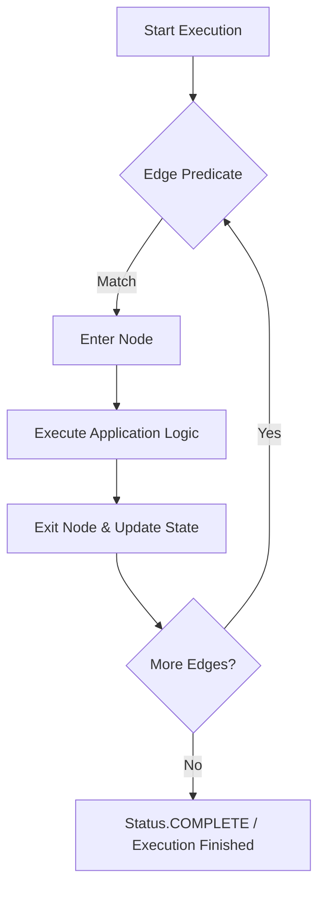

# TraceGraph Core

`tracegraph-core` is the foundational module of the TraceGraph project. It provides pure graph definitions and the synchronous execution loop, built to be extremely lightweight with zero heavy dependencies.

## Features
- **Graph Definition**: Fluent builder API for designing typed state machines.
- **Sync Execution**: The core execution engine for traversing nodes dynamically based on edge predicates.
- **SPIs (Service Provider Interfaces)**: Exposes interfaces (e.g., `NodeListener`, `CheckpointStore`, `TraceRecorder`, `MemoryStore`) that other modules (or users) can implement.

## Execution Flow

