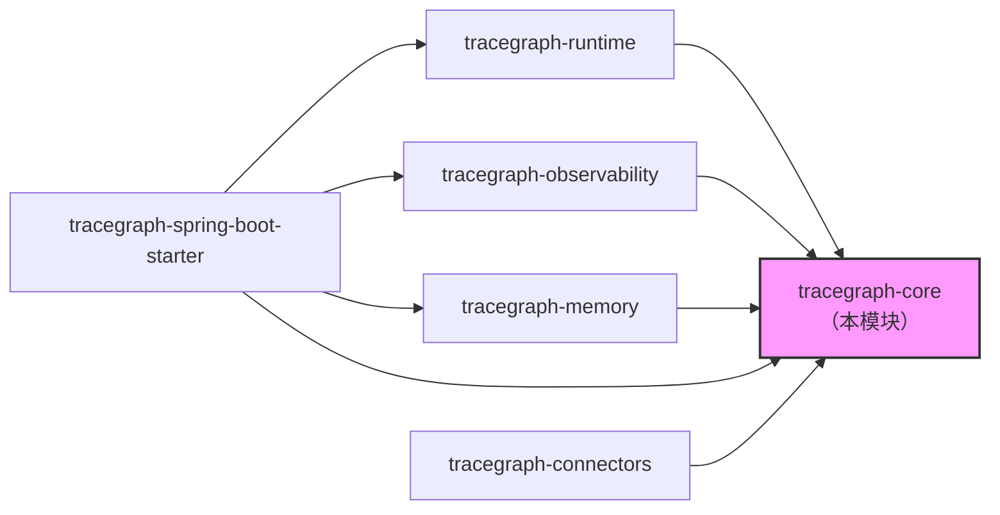
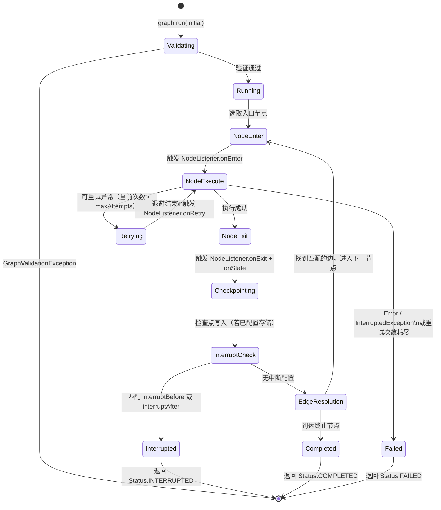
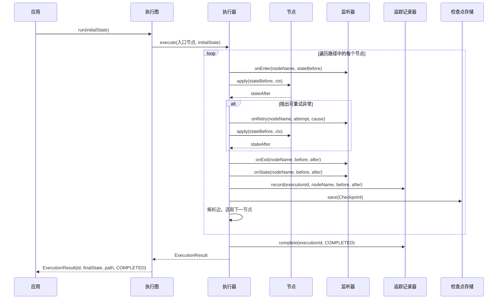

# tracegraph-core

[](https://central.sonatype.com/artifact/io.tracegraph/tracegraph-core)
[](https://opensource.org/licenses/Apache-2.0)
[](https://openjdk.org/projects/jdk/21/)

纯图定义、同步执行循环以及 TraceGraph 智能体运行时所有服务提供接口（SPI）——零重量级依赖。

---

## 模块职责

`tracegraph-core` 是 TraceGraph 项目的基础层。它允许你将带类型的、有状态的工作流组合为有向图：节点负责转换不可变的状态记录，边基于对状态的谓词判断来路由执行流程。本模块刻意保持零依赖——不引入 Spring、Jackson 或 OpenTelemetry——因此可以无冲突地嵌入任何 JVM 应用。

核心模块解决的核心问题是：需要确定性、可审计、可恢复控制流的智能体工作流。你无需将流程逻辑编码为深层嵌套的 if-else 树或链式 `CompletableFuture` 调用，只需一次性声明节点、边和重试策略，执行器就会自动处理图遍历、重试退避、监听器通知和检查点集成。

关键差异点在于：每次执行都会产生一个一等公民 `ExecutionResult<S>`，携带完整的遍历路径；每一步都可通过 `NodeListener` SPI 进行观测——这让重放和调试在框架层面成为可能，无需业务层自行埋点。

---

## 系统上下文



`tracegraph-core` 不依赖任何其他 TraceGraph 模块。所有其他模块都依赖它，且上层模块实现的所有 SPI 接口（`NodeListener`、`CheckpointStore`、`TraceRecorder`、`MemoryStore`）均在此声明。

---

## 内部架构

```mermaid
classDiagram
    class Graph~S~ {
        +run(S initial) ExecutionResult~S~
        +run(S initial, String executionId) ExecutionResult~S~
        +resume(String executionId) ExecutionResult~S~
        +stream(S initial) Publisher~NodeEvent~S~~
        +toMermaid() String
        +toPlantUml() String
        +builder() Builder~S~$
    }
    class Builder~S~ {
        +node(String name, Node~S~ fn) Builder~S~
        +asyncNode(String name, AsyncNode~S~ fn) Builder~S~
        +routingNode(String name, RoutingNode~S~ fn) Builder~S~
        +parallel(String name, List branches, Merger~S~) Builder~S~
        +subgraph(String name, Graph~S~ inner) Builder~S~
        +entry(String name) Builder~S~
        +edge(String from, String to) Builder~S~
        +edge(String from, String to, Predicate~S~ cond) Builder~S~
        +terminal(String name) Builder~S~
        +listener(NodeListener~S~ l) Builder~S~
        +traceRecorder(TraceRecorder~S~ r) Builder~S~
        +checkpointStore(CheckpointStore~S~ s) Builder~S~
        +memoryStore(MemoryStore s) Builder~S~
        +defaultRetryPolicy(RetryPolicy p) Builder~S~
        +executor(ExecutorService e) Builder~S~
        +interruptBefore(String names) Builder~S~
        +interruptAfter(String names) Builder~S~
        +build() Graph~S~
    }
    class Node~S~ {
        <<FunctionalInterface>>
        +apply(S state, Context ctx) S
    }
    class AsyncNode~S~ {
        <<FunctionalInterface>>
        +apply(S state, Context ctx) CompletableFuture~S~
    }
    class RoutingNode~S~ {
        <<FunctionalInterface>>
        +apply(S state, Context ctx) NodeResult~S~
    }
    class NodeResult~S~ {
        +goTo(String name, S state) NodeResult~S~$
        +of(S state) NodeResult~S~$
    }
    class Edge~S~ {
        <<record>>
        +from() String
        +to() String
        +condition() Optional~Predicate~S~~
    }
    class ExecutionResult~S~ {
        <<record>>
        +executionId() String
        +finalState() S
        +path() List~String~
        +status() Status
        +error() Optional~Throwable~
    }
    class Status {
        <<enum>>
        COMPLETED
        FAILED
        INTERRUPTED
    }
    class Context {
        <<interface>>
        +executionId() String
        +idempotencyKey() String
        +memory() MemoryStore
        +reportUsage(int promptTokens, int completionTokens)
    }
    class RetryPolicy {
        +fixed(int maxAttempts, Duration delay) RetryPolicy$
        +exponential(int max, Duration base, double mult, Duration cap) RetryPolicy$
    }
    class NodeListener~S~ {
        <<SPI interface>>
        +onEnter(String name, S state)
        +onExit(String name, S before, S after)
        +onError(String name, S state, Throwable t)
        +onRetry(String name, int attempt, Throwable t)
        +onState(String name, S before, S after)
        +onUsage(String name, int promptTokens, int completionTokens)
    }
    class CheckpointStore~S~ {
        <<SPI interface>>
        +save(Checkpoint~S~ checkpoint)
        +load(String executionId) Optional~Checkpoint~S~~
    }
    class TraceRecorder~S~ {
        <<SPI interface>>
        +record(String executionId, String nodeName, S before, S after)
        +complete(String executionId, Status status)
    }
    class MemoryStore {
        <<SPI interface>>
        +get(String scope, String key) Optional~Object~
        +put(String scope, String key, Object value)
        +delete(String scope, String key)
        +keys(String scope) Set~String~
        +noop() MemoryStore$
    }

    Graph~S~ +-- Builder~S~
    Graph~S~ --> Edge~S~
    Graph~S~ --> Node~S~
    Graph~S~ --> AsyncNode~S~
    Graph~S~ --> RoutingNode~S~
    Graph~S~ --> NodeListener~S~
    Graph~S~ --> CheckpointStore~S~
    Graph~S~ --> TraceRecorder~S~
    Graph~S~ --> MemoryStore
    Graph~S~ --> RetryPolicy
    Graph~S~ ..> ExecutionResult~S~
    ExecutionResult~S~ --> Status
    RoutingNode~S~ ..> NodeResult~S~
    Context --> MemoryStore
```

---

## 执行生命周期



---

## 时序图



---

## 核心概念

### Graph\<S\>（执行图）

`Graph<S>` 在 `build()` 之后不可变，可安全地跨线程共享。类型参数 `S` 是你的状态类型，通常是 Java record。多个线程可以同时在同一个图实例上调用 `run()`、`resume()` 或 `stream()`。

```java
Graph<OrderState> graph = Graph.<OrderState>builder()
    .node("validate", (state, ctx) -> state.withValidated(true))
    .entry("validate")
    .terminal("validate")
    .build();

ExecutionResult<OrderState> result = graph.run(new OrderState("ord-1", false, false, false, null));
```

### Node\<S\>（同步节点）

`Node<S>` 是一个 `@FunctionalInterface`。其唯一方法接收当前状态和 `Context`，返回新状态。节点必须无状态且线程安全——在并行分支激活时，节点会被多线程调用。

```java
Node<OrderState> validateNode = (state, ctx) -> {
    if (state.orderId() == null) throw new IllegalArgumentException("orderId 不能为空");
    return state.withValidated(true);
};
```

### AsyncNode\<S\>（异步节点）

`AsyncNode<S>` 与 `Node<S>` 完全一致，但返回 `CompletableFuture<S>`。执行器对异步节点的重试和检查点处理与同步节点完全相同。推荐使用 JDK 21 虚拟线程，避免阻塞载体线程。

```java
AsyncNode<OrderState> chargeNode = (state, ctx) ->
    paymentClient.chargeAsync(state.orderId())
                 .thenApply(receipt -> state.withCharged(true).withReceiptId(receipt.id()));
```

### RoutingNode\<S\>（路由节点）

`RoutingNode<S>` 通过返回 `NodeResult.goTo(name, state)` 跳转到任意命名节点，绕过普通的边解析。返回 `NodeResult.of(state)` 则按正常声明的边继续。跳转到未知节点名会抛出 `NodeExecutionException`。

```java
RoutingNode<OrderState> routeNode = (state, ctx) -> {
    if (!state.validated()) return NodeResult.goTo("reject", state);
    return NodeResult.of(state);  // 走正常声明的边
};
```

### Edge\<S\>（边）

边是一等公民记录，包含 `from` 节点、`to` 节点，以及可选的 `Predicate<S>` 条件。没有条件的边始终通过。当多条边从同一节点出发时，按声明顺序取第一条条件为真的边。

```java
// 无条件边
builder.edge("validate", "charge");

// 条件边——按声明顺序评估
builder.edge("validate", "reject", state -> !state.validated());
builder.edge("validate", "charge", OrderState::validated);
```

### RetryPolicy（重试策略）

重试策略在图定义时声明，而非运行时配置。节点级策略优先于图的 `defaultRetryPolicy`。无论策略如何，`Error` 和 `InterruptedException` 始终跳过重试。

```java
RetryPolicy fixed       = RetryPolicy.fixed(3, Duration.ofMillis(200));
RetryPolicy exponential = RetryPolicy.exponential(5, Duration.ofMillis(100), 2.0, Duration.ofSeconds(10));

Graph<OrderState> graph = Graph.<OrderState>builder()
    .node("charge", chargeNode, RetryPolicy.fixed(3, Duration.ofMillis(500)))
    .defaultRetryPolicy(RetryPolicy.fixed(1, Duration.ofMillis(100)))
    .build();
```

### NodeListener\<S\> 与 Listeners.compose（监听器）

`NodeListener<S>` 是主要的可观测性 SPI。实现类在每次节点执行的生命周期中收到回调。使用 `Listeners.compose(l1, l2)` 组合多个监听器。

```java
NodeListener<OrderState> logger = new NodeListener<>() {
    @Override public void onEnter(String name, OrderState state) {
        System.out.println("进入节点: " + name);
    }
    @Override public void onExit(String name, OrderState before, OrderState after) {
        System.out.println("退出节点: " + name);
    }
};

NodeListener<OrderState> combined = Listeners.compose(logger, metricsListener);

Graph<OrderState> graph = Graph.<OrderState>builder()
    .listener(combined)
    .build();
```

### Context（执行上下文）

`Context` 是每次执行、每次节点调用时注入的上下文对象。它提供：

- `executionId()` — 标识本次执行的 UUID
- `idempotencyKey()` — 由 executionId + 节点名组成的稳定键，用于对外部系统去重
- `memory()` — 访问已配置的 `MemoryStore`（默认为无操作实现）
- `reportUsage(int, int)` — 在节点内部向监听器报告 LLM token 用量

```java
Node<OrderState> idempotentCharge = (state, ctx) -> {
    // 将幂等键传给支付服务，防止重复扣款
    String key = ctx.idempotencyKey();
    return paymentClient.charge(state.orderId(), key);
};
```

### MemoryStore SPI（内存存储服务提供接口）

`MemoryStore` 是一个按作用域（scope）划分的键值存储，用于跨执行持久化数据——会话历史、长期智能体记忆、缓存结果等。默认实现为 `MemoryStore.noop()`。`tracegraph-memory` 模块提供 `InMemoryMemoryStore`、`FileMemoryStore` 和 `JdbcMemoryStore`。

```java
Node<AgentState> recallNode = (state, ctx) -> {
    Optional<Object> prev = ctx.memory().get("user-session", "lastQuery");
    ctx.memory().put("user-session", "lastQuery", state.query());
    return state.withHistory(prev.map(Object::toString).orElse(""));
};
```

---

## 完整使用示例

### 第一步：添加依赖

```xml
<dependency>
    <groupId>io.tracegraph</groupId>
    <artifactId>tracegraph-core</artifactId>
    <version>0.1.0</version>
</dependency>
```

### 第二步：定义状态记录

状态应为不可变的 Java record。手动编写 `with*` 方法以返回修改后的副本，保持状态转换纯粹且可测试。

```java
package com.example.orders;

public record OrderState(
    String orderId,
    boolean validated,
    boolean charged,
    boolean shipped,
    String errorMessage
) {
    public OrderState withValidated(boolean validated) {
        return new OrderState(orderId, validated, charged, shipped, errorMessage);
    }
    public OrderState withCharged(boolean charged) {
        return new OrderState(orderId, validated, charged, shipped, errorMessage);
    }
    public OrderState withShipped(boolean shipped) {
        return new OrderState(orderId, validated, charged, shipped, errorMessage);
    }
    public OrderState withErrorMessage(String msg) {
        return new OrderState(orderId, validated, charged, shipped, msg);
    }
}
```

### 第三步：构建执行图

```java
package com.example.orders;

import io.tracegraph.core.Graph;
import io.tracegraph.core.retry.RetryPolicy;

import java.time.Duration;

public class OrderGraph {

    public static Graph<OrderState> build() {
        return Graph.<OrderState>builder()

            // 验证订单：拒绝缺失 orderId 的情况
            .node("validate", (state, ctx) -> {
                if (state.orderId() == null || state.orderId().isBlank()) {
                    return state.withErrorMessage("缺少 orderId");
                }
                return state.withValidated(true);
            })

            // 向客户收款——最多重试 3 次，固定延迟 500ms
            .node("charge",
                (state, ctx) -> chargeCustomer(state),
                RetryPolicy.fixed(3, Duration.ofMillis(500))
            )

            // 成功收款后发货
            .node("ship", (state, ctx) -> state.withShipped(true))

            // 无效订单的拒绝路径
            .node("reject", (state, ctx) ->
                state.withErrorMessage("订单已拒绝: " + state.errorMessage())
            )

            // 声明入口节点
            .entry("validate")

            // 无效订单走拒绝路径；有效订单进行收款
            .edge("validate", "reject", state -> !state.validated())
            .edge("validate", "charge", OrderState::validated)

            // 收款后始终进入发货节点
            .edge("charge", "ship")

            // 两个终止节点——到达时执行结束
            .terminal("ship")
            .terminal("reject")

            .build();
    }

    private static OrderState chargeCustomer(OrderState state) {
        // 实际实现中此处调用支付 API
        return state.withCharged(true);
    }
}
```

### 第四步：运行图并检查结果

```java
package com.example.orders;

import io.tracegraph.core.ExecutionResult;
import io.tracegraph.core.Status;

public class OrderApp {
    public static void main(String[] args) {
        Graph<OrderState> graph = OrderGraph.build();

        OrderState initial = new OrderState("ord-42", false, false, false, null);
        ExecutionResult<OrderState> result = graph.run(initial);

        System.out.println("状态:        " + result.status());
        System.out.println("执行路径:    " + result.path());
        System.out.println("执行 ID:     " + result.executionId());
        System.out.println("最终状态:    " + result.finalState());

        if (result.status() == Status.FAILED) {
            result.error().ifPresent(e -> System.err.println("错误: " + e.getMessage()));
        }
    }
}
```

有效订单的输出示例：

```
状态:        COMPLETED
执行路径:    [validate, charge, ship]
执行 ID:     3f4a8c91-1d2e-4f5a-b6c7-...
最终状态:    OrderState[orderId=ord-42, validated=true, charged=true, shipped=true, errorMessage=null]
```

### 第五步：挂载审计监听器

```java
import io.tracegraph.core.spi.NodeListener;

NodeListener<OrderState> auditListener = new NodeListener<>() {
    @Override
    public void onEnter(String name, OrderState state) {
        System.out.printf("[审计] -> %s | orderId=%s%n", name, state.orderId());
    }

    @Override
    public void onExit(String name, OrderState before, OrderState after) {
        System.out.printf("[审计] <- %s%n", name);
    }

    @Override
    public void onError(String name, OrderState state, Throwable t) {
        System.err.printf("[审计] 失败 %s: %s%n", name, t.getMessage());
    }

    @Override
    public void onRetry(String name, int attempt, Throwable cause) {
        System.out.printf("[审计] 重试 %s 第 %d 次: %s%n", name, attempt, cause.getMessage());
    }
};

Graph<OrderState> graph = Graph.<OrderState>builder()
    .node("validate", (s, ctx) -> s.withValidated(true))
    .node("charge",   (s, ctx) -> chargeCustomer(s), RetryPolicy.fixed(3, Duration.ofMillis(500)))
    .node("ship",     (s, ctx) -> s.withShipped(true))
    .entry("validate")
    .edge("validate", "charge")
    .edge("charge",   "ship")
    .terminal("ship")
    .listener(auditListener)
    .build();
```

### 第六步：生成 Mermaid 流程图

```java
String mermaid = graph.toMermaid();
System.out.println(mermaid);
```

输出：

```
graph LR
    validate --> charge
    validate --> reject
    charge --> ship
```

将其粘贴到 [Mermaid Live](https://mermaid.live) 或任何兼容渲染器即可可视化。

### 第七步：指定执行 ID 并使用指数退避重试

```java
Graph<OrderState> graph = Graph.<OrderState>builder()
    .node("validate", (s, ctx) -> s.withValidated(true))
    .node("charge",   (s, ctx) -> chargeCustomer(s))
    .entry("validate")
    .edge("validate", "charge")
    .terminal("charge")
    .defaultRetryPolicy(RetryPolicy.exponential(4, Duration.ofMillis(50), 2.0, Duration.ofSeconds(5)))
    .build();

// 提供确定性执行 ID 用于幂等重试追踪
String myId = "order-42-run-1";
ExecutionResult<OrderState> result = graph.run(initial, myId);
System.out.println(result.executionId()); // order-42-run-1
```

---

## 配置参考

### Graph.Builder\<S\> 方法说明

| 方法 | 说明 |
|---|---|
| `.node(name, fn)` | 注册同步节点，`fn` 为 `Node<S>` 函数式接口。 |
| `.node(name, fn, policy)` | 注册带节点级重试策略的同步节点。 |
| `.asyncNode(name, fn)` | 注册返回 `CompletableFuture<S>` 的异步节点。 |
| `.asyncNode(name, fn, policy)` | 带节点级重试策略的异步节点。 |
| `.routingNode(name, fn)` | 注册返回 `NodeResult<S>` 的路由节点。 |
| `.parallel(name, branches, merger)` | 扇出节点：各分支在虚拟线程上并发执行，按声明顺序合并结果。 |
| `.subgraph(name, inner)` | 将已编译的 `Graph<S>` 嵌入为单个节点，两者必须共享相同的 `<S>`。 |
| `.entry(name)` | 设置入口节点（必须，且每个图只能有一个）。 |
| `.edge(from, to)` | 添加无条件边。 |
| `.edge(from, to, condition)` | 添加条件边，`condition` 为 `Predicate<S>`。 |
| `.terminal(name)` | 将节点标记为终止节点；该节点成功退出后执行结束。 |
| `.listener(l)` | 挂载 `NodeListener<S>`；多个监听器使用 `Listeners.compose(l1, l2)` 组合。 |
| `.traceRecorder(r)` | 挂载 `TraceRecorder<S>` 支持重放（由 `tracegraph-observability` 实现）。 |
| `.checkpointStore(s)` | 挂载 `CheckpointStore<S>` 支持中断/恢复（由 `tracegraph-runtime` 实现）。 |
| `.memoryStore(s)` | 挂载 `MemoryStore` 支持跨执行数据（由 `tracegraph-memory` 实现）。 |
| `.defaultRetryPolicy(p)` | 图级重试策略，应用于未指定节点级策略的节点。 |
| `.executor(e)` | 提供自定义 `ExecutorService`；用户提供的执行器不会被图关闭。 |
| `.interruptBefore(names...)` | 在指定节点执行前暂停，写入 `interruptPending=true` 的检查点。 |
| `.interruptAfter(names...)` | 在指定节点退出后暂停，写入正常的 `lastCompletedNode` 检查点。 |

### RetryPolicy 工厂方法

| 工厂方法 | 说明 |
|---|---|
| `RetryPolicy.fixed(maxAttempts, delay)` | 固定延迟重试，最多 `maxAttempts` 次，每次间隔 `delay`。 |
| `RetryPolicy.exponential(max, base, mult, cap)` | 指数退避：延迟 = min(base × mult^次数, cap)。 |

---

## 与其他模块集成

### 与 tracegraph-observability 集成（OpenTelemetry 追踪 + 重放）

```java
import io.tracegraph.observability.OtelNodeListener;
import io.tracegraph.observability.replay.RecordingTraceRecorder;
import io.tracegraph.observability.replay.InMemoryTraceStore;
import io.tracegraph.core.spi.NodeListener;
import io.tracegraph.core.Listeners;

InMemoryTraceStore<OrderState> traceStore = new InMemoryTraceStore<>();
TraceRecorder<OrderState> recorder = new RecordingTraceRecorder<>(traceStore);
NodeListener<OrderState> otel = new OtelNodeListener<>(openTelemetry);

Graph<OrderState> graph = Graph.<OrderState>builder()
    .node("validate", (s, ctx) -> s.withValidated(true))
    .node("charge",   (s, ctx) -> s.withCharged(true))
    .entry("validate")
    .edge("validate", "charge")
    .terminal("charge")
    .listener(Listeners.compose(otel, auditListener))
    .traceRecorder(recorder)
    .build();
```

### 与 tracegraph-runtime 集成（检查点与中断恢复）

```java
import io.tracegraph.runtime.checkpoint.InMemoryCheckpointStore;
import io.tracegraph.core.Status;

CheckpointStore<OrderState> store = new InMemoryCheckpointStore<>();

Graph<OrderState> graph = Graph.<OrderState>builder()
    .node("validate",       (s, ctx) -> s.withValidated(true))
    .node("human_approval", (s, ctx) -> s)  // 将在此节点前暂停
    .node("charge",         (s, ctx) -> s.withCharged(true))
    .entry("validate")
    .edge("validate",       "human_approval")
    .edge("human_approval", "charge")
    .terminal("charge")
    .checkpointStore(store)
    .interruptBefore("human_approval")
    .build();

ExecutionResult<OrderState> paused = graph.run(initial);
assert paused.status() == Status.INTERRUPTED;

// ... 人工审批后 ...
ExecutionResult<OrderState> done = graph.resume(paused.executionId());
assert done.status() == Status.COMPLETED;
```

### 与 tracegraph-memory 集成（跨执行记忆）

```java
import io.tracegraph.memory.InMemoryMemoryStore;

Graph<AgentState> graph = Graph.<AgentState>builder()
    .node("recall", (state, ctx) -> {
        String history = ctx.memory()
            .get("session", "history")
            .map(Object::toString)
            .orElse("");
        return state.withHistory(history);
    })
    .node("respond", (state, ctx) -> state)
    .node("persist", (state, ctx) -> {
        ctx.memory().put("session", "history", state.latestResponse());
        return state;
    })
    .entry("recall")
    .edge("recall",  "respond")
    .edge("respond", "persist")
    .terminal("persist")
    .memoryStore(new InMemoryMemoryStore())
    .build();
```

### 与 tracegraph-connectors 集成（LLM 接入）

```java
import io.tracegraph.connectors.llm.OpenAiLlmClient;
import io.tracegraph.connectors.llm.LlmRequest;
import io.tracegraph.connectors.llm.ChatNode;

OpenAiLlmClient client = OpenAiLlmClient.builder()
    .endpoint("https://api.openai.com/v1")
    .apiKey(System.getenv("OPENAI_API_KEY"))
    .build();

Graph<AgentState> graph = Graph.<AgentState>builder()
    .node("llm", ChatNode.<AgentState>builder()
        .client(client)
        .requestBuilder(state -> LlmRequest.of("gpt-4o", state.messages()))
        .responseFolder((state, resp) -> state.withLastResponse(resp.text()))
        .build())
    .entry("llm")
    .terminal("llm")
    .build();
```

---

## 测试指南

使用 JUnit 5 和 AssertJ。测试应覆盖可观测的行为——最终状态、执行路径、执行状态——而非内部实现细节。函数式接口与 record 使得测试替身的编写无需任何 mock 框架。

### 测试：正常执行路径

```java
import io.tracegraph.core.Graph;
import io.tracegraph.core.ExecutionResult;
import io.tracegraph.core.Status;
import org.junit.jupiter.api.Test;

import static org.assertj.core.api.Assertions.assertThat;

class OrderGraphTest {

    record OrderState(String orderId, boolean validated, boolean charged) {
        OrderState withValidated(boolean v) { return new OrderState(orderId, v, charged); }
        OrderState withCharged(boolean c)   { return new OrderState(orderId, validated, c); }
    }

    private final Graph<OrderState> graph = Graph.<OrderState>builder()
        .node("validate", (s, ctx) -> s.withValidated(true))
        .node("charge",   (s, ctx) -> s.withCharged(true))
        .entry("validate")
        .edge("validate", "charge")
        .terminal("charge")
        .build();

    @Test
    void completesWithExpectedPath() {
        ExecutionResult<OrderState> result = graph.run(new OrderState("o-1", false, false));

        assertThat(result.status()).isEqualTo(Status.COMPLETED);
        assertThat(result.path()).containsExactly("validate", "charge");
        assertThat(result.finalState().validated()).isTrue();
        assertThat(result.finalState().charged()).isTrue();
    }
}
```

### 测试：异常传播

```java
@Test
void propagatesExceptionAsFailed() {
    Graph<OrderState> failGraph = Graph.<OrderState>builder()
        .node("boom", (s, ctx) -> { throw new RuntimeException("支付服务不可用"); })
        .entry("boom")
        .terminal("boom")
        .build();

    ExecutionResult<OrderState> result = failGraph.run(new OrderState("o-2", false, false));

    assertThat(result.status()).isEqualTo(Status.FAILED);
    assertThat(result.error()).isPresent();
    assertThat(result.error().get()).hasMessageContaining("支付服务不可用");
}
```

### 测试：条件路由

```java
@Test
void routesInvalidOrderToReject() {
    Graph<OrderState> graph = Graph.<OrderState>builder()
        .node("validate", (s, ctx) -> s)       // 无操作：orderId 为 null，validated 保持 false
        .node("reject",   (s, ctx) -> s)
        .node("charge",   (s, ctx) -> s.withCharged(true))
        .entry("validate")
        .edge("validate", "reject", s -> !s.validated())
        .edge("validate", "charge", OrderState::validated)
        .terminal("reject")
        .terminal("charge")
        .build();

    ExecutionResult<OrderState> result = graph.run(new OrderState(null, false, false));

    assertThat(result.path()).containsExactly("validate", "reject");
    assertThat(result.finalState().charged()).isFalse();
}
```

### 测试：监听器按顺序收到事件

```java
@Test
void listenerReceivesEnterAndExitInOrder() {
    List<String> events = new ArrayList<>();

    NodeListener<OrderState> spy = new NodeListener<>() {
        @Override public void onEnter(String name, OrderState s) { events.add("enter:" + name); }
        @Override public void onExit(String name, OrderState b, OrderState a) { events.add("exit:" + name); }
    };

    Graph<OrderState> graph = Graph.<OrderState>builder()
        .node("validate", (s, ctx) -> s.withValidated(true))
        .entry("validate")
        .terminal("validate")
        .listener(spy)
        .build();

    graph.run(new OrderState("o-3", false, false));

    assertThat(events).containsExactly("enter:validate", "exit:validate");
}
```

### 测试：重试策略按预期次数触发

```java
@Test
void retriesUpToMaxAttemptsBeforeFailing() {
    List<Integer> callCount = new ArrayList<>();

    Graph<OrderState> graph = Graph.<OrderState>builder()
        .node("flaky", (s, ctx) -> {
            callCount.add(1);
            throw new RuntimeException("瞬时错误");
        }, RetryPolicy.fixed(3, Duration.ofMillis(1)))
        .entry("flaky")
        .terminal("flaky")
        .build();

    ExecutionResult<OrderState> result = graph.run(new OrderState("o-4", false, false));

    assertThat(result.status()).isEqualTo(Status.FAILED);
    // 共 3 次调用：1 次初始尝试 + 2 次重试
    assertThat(callCount).hasSize(3);
}
```

---

## 常见问题

**Q：`Graph<S>` 实例可以跨线程共享吗？**

可以。`Graph<S>` 在 `build()` 之后不可变，完全线程安全。多个线程可以同时在同一个实例上调用 `run()`、`resume()` 或 `stream()`，无需任何额外同步。

**Q：使用异步节点（AsyncNode）是否需要引入 `tracegraph-runtime`？**

不需要。`AsyncNode<S>` 在 `tracegraph-core` 中声明。仅依赖 core 模块就可以从节点中返回 `CompletableFuture<S>`。`tracegraph-runtime` 在此基础上额外提供了 `InMemoryCheckpointStore`、`JdbcCheckpointStore` 以及中断/恢复机制。

**Q：同一节点出发的多条边都满足条件时会怎样？**

按声明顺序取第一条条件为真的边，每次节点退出只走一条边。建议将各条件设计为互斥的，或在最后声明一条无条件兜底边。

**Q：如何在节点之间传递不属于状态类型的数据？**

对于跨执行或跨会话的数据，使用 `Context.memory()`；或直接将数据建模为状态 record 的字段。不要使用 `ThreadLocal`——它在 JDK 21 虚拟线程语义下会出现问题。

**Q：同一节点名可以在图中注册两次吗？**

不可以，节点名在图内唯一。一个节点可以是多条入边的目标（收敛路径完全支持），但不能注册两个同名节点。如果需要在两个位置使用相同逻辑，将其提取为共享方法，并以两个不同的名字注册。
