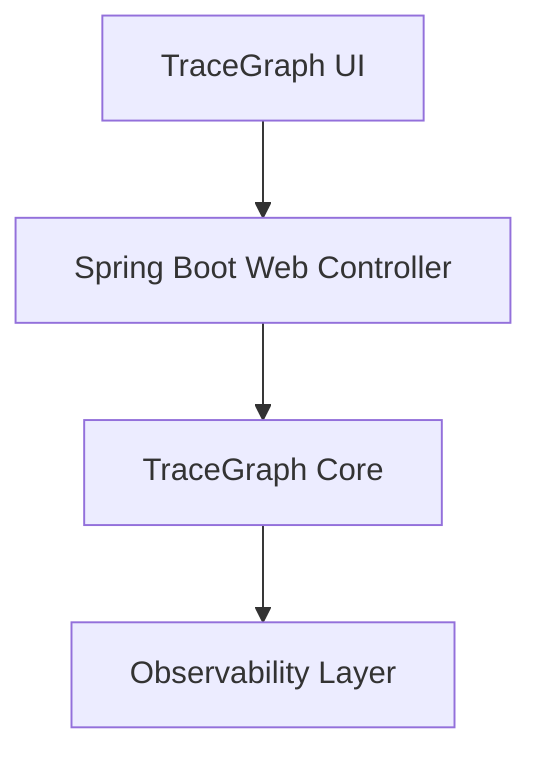

# TraceGraph :: Demo

## Overview
A comprehensive demonstration module for the TraceGraph framework. It integrates core libraries, observability, and the Spring Boot starter to provide ready-to-run examples of TraceGraph in action.

## Demo Architecture

## Features
- Fully functional Spring Boot web application
- Integrated UI and Observability modules
- Jackson and Spring Web MVC auto-configurations
