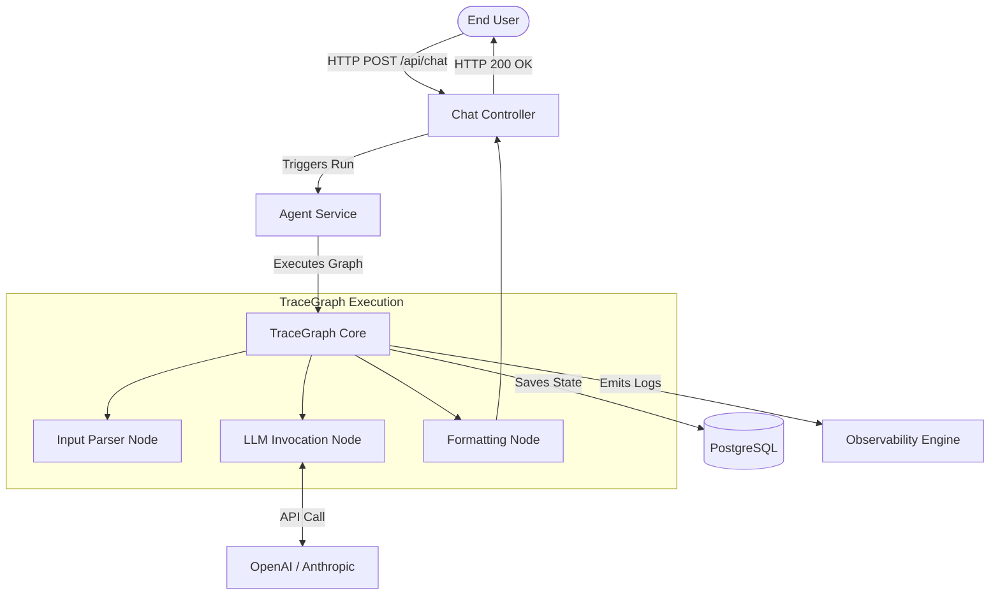

# TraceGraph :: Demo

## 📖 Introduction to the Demo Application
Welcome to `tracegraph-demo`! If you are new to TraceGraph and want to see how everything fits together in a real-world application, this is the perfect starting point.

This module is a fully functional **Spring Boot Web Application**. It takes the low-level agent logic from `tracegraph-core`, the database integrations from `tracegraph-memory`, and wraps them in a nice REST API. 

### What You Will Learn Here
- How to configure a TraceGraph inside a Spring Boot application.
- How to expose your agent via REST endpoints.
- How to wire up Observability (logging and tracing).
- How the UI connects to the backend.

## 🏗️ Demo Application Architecture

This diagram shows how a user's web request travels through the Spring Boot application, gets processed by the TraceGraph agent, and returns a response.



## 🚀 How to Run the Demo

### Prerequisites
Make sure you have your API keys set in your environment variables:
```bash
export OPENAI_API_KEY="your-api-key-here"
```

### Starting the Application
You can start the Spring Boot application using Maven:
```bash
mvn spring-boot:run -pl tracegraph-demo
```
The application will start on `http://localhost:8080`.

### Example Code Snippet: The Controller
Here is how the REST controller connects to the TraceGraph.

```java
@RestController
@RequestMapping("/api/chat")
public class ChatController {

    private final TraceGraph traceGraph; // Injected by Spring

    public ChatController(TraceGraph traceGraph) {
        this.traceGraph = traceGraph;
    }

    @PostMapping
    public ResponseEntity<String> chat(@RequestBody String userMessage) {
        // Run the agent graph with the user's message
        Map<String, Object> initialState = Map.of("input", userMessage);
        Map<String, Object> finalState = traceGraph.invoke(initialState);
        
        return ResponseEntity.ok(finalState.get("output").toString());
    }
}
```
