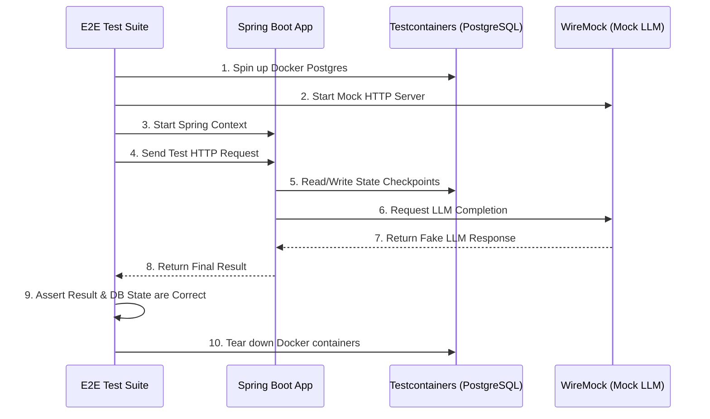

# TraceGraph :: End-to-End (E2E) Tests

## 📖 What is End-to-End Testing?
Welcome to `tracegraph-e2e`! Unit tests (like checking if 2+2=4) are great, but they don't prove that your entire system works when deployed to production. 

End-to-End (E2E) tests spin up your *entire application*, including real databases and simulated external APIs, and test the flow from start to finish. In this module, we use **Testcontainers** to spin up real PostgreSQL databases inside Docker, and **WireMock** to fake responses from LLM providers (so we don't spend money on API calls during tests).

### Why is this important?
- **Prevents "It works on my machine" bugs:** Code is executed against actual database images, identical to production.
- **Verifies Schema and Migrations:** Ensures that database schemas, constraints, and SQL queries are perfectly correct.
- **Resilience Testing:** Verifies the application handles network timeouts, API errors, and retries gracefully.
- **State Checkpointing Verification:** Confirms that TraceGraph correctly pauses and resumes state by writing to and reading from the persistent memory store.

## 🏗️ Testing Architecture

The following diagram illustrates how the E2E test suite orchestrates the environment before executing the test.



## 🚀 How to Run E2E Tests

Because these tests require Docker and take longer to run, they are typically skipped during standard builds and run explicitly.

### Prerequisites
- **Docker** must be installed and running on your machine (for Testcontainers).
- Java 21+ and Maven 3.9+.

### Running the Tests
```bash
# Run only integration tests
mvn verify -pl tracegraph-e2e
```

## 💻 Example Test Snippet

Here is how we use Testcontainers and WireMock in a test to validate a full multi-turn Agent workflow without paying for OpenAI credits:

```java
@SpringBootTest
@Testcontainers
public class AgentFlowE2ETest {

    // Spin up a real Postgres DB in Docker
    @Container
    static PostgreSQLContainer<?> postgres = new PostgreSQLContainer<>("postgres:15-alpine");

    @DynamicPropertySource
    static void configureProperties(DynamicPropertyRegistry registry) {
        registry.add("spring.datasource.url", postgres::getJdbcUrl);
        registry.add("spring.datasource.username", postgres::getUsername);
        registry.add("spring.datasource.password", postgres::getPassword);
    }

    @Test
    public void testFullAgentFlow() {
        // 1. Setup WireMock to fake OpenAI response
        stubFor(post(urlEqualTo("/v1/chat/completions"))
            .willReturn(aResponse()
                .withStatus(200)
                .withHeader("Content-Type", "application/json")
                .withBody("{\"choices\": [{\"message\": {\"content\": \"Task completed successfully!\"}}]}")));

        // 2. Execute the TraceGraph application flow via REST endpoint
        ResponseEntity<String> response = restTemplate.postForEntity("/api/agent/start", request, String.class);
        
        // 3. Assert HTTP status
        assertEquals(HttpStatus.OK, response.getStatusCode());

        // 4. Assert that the database saved the state correctly
        int records = jdbcTemplate.queryForObject("SELECT COUNT(*) FROM tracegraph_memory", Integer.class);
        assertEquals(1, records);
    }
}
```

## 🛠️ Debugging E2E Failures

If an E2E test fails, follow these steps to debug:
1. **Check Docker Status**: Ensure Docker Desktop / Daemon is running. Testcontainers will immediately fail if it cannot connect to the Docker socket.
2. **Review WireMock Logs**: If the LLM node throws an exception, check if WireMock received the request. You might have formatted the Mock URL incorrectly.
3. **Database Schema Issues**: Ensure your Flyway/Liquibase migrations or Hibernate auto-DDL configurations are being applied properly to the Testcontainer.
