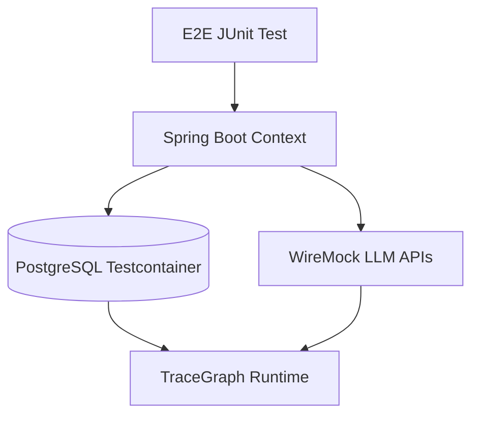

# TraceGraph :: E2E Tests

## Overview
The `tracegraph-e2e` module houses the end-to-end integration tests for the TraceGraph project. It uses Testcontainers and WireMock to simulate real-world databases and external API dependencies, ensuring that all components work together seamlessly.

## E2E Testing Flow

## Features
- Containerized database testing with PostgreSQL
- HTTP mock servers for predictable connector testing via WireMock
- Failsafe plugin integration for isolated integration testing
