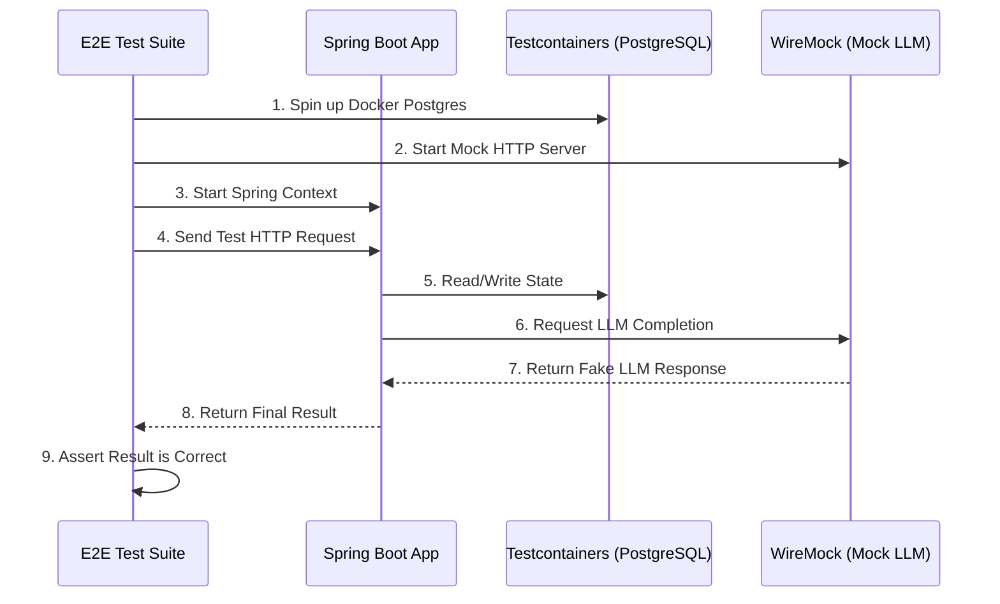

# TraceGraph :: End-to-End (E2E) Tests

## 📖 What is End-to-End Testing?
Welcome to `tracegraph-e2e`! Unit tests (like checking if 2+2=4) are great, but they don't prove that your entire system works when deployed to production. 

End-to-End (E2E) tests spin up your *entire application*, including real databases and simulated external APIs, and test the flow from start to finish. We use **Testcontainers** to spin up real PostgreSQL databases inside Docker, and **WireMock** to fake responses from LLM providers (so we don't spend money on API calls during tests).

### Why is this important?
- Prevents "It works on my machine" bugs.
- Verifies that database schemas and SQL queries are correct.
- Ensures the application handles network timeouts and API errors gracefully.

## 🏗️ Testing Architecture



## 🚀 How to Run E2E Tests

Because these tests require Docker and take longer to run, they are typically skipped during standard builds and run explicitly.

### Prerequisites
- **Docker** must be installed and running on your machine (for Testcontainers).

### Running the Tests
```bash
# Run only integration tests
mvn verify -pl tracegraph-e2e
```

### Example Test Snippet
Here is how we use Testcontainers and WireMock in a test:

```java
@SpringBootTest
@Testcontainers
public class AgentFlowE2ETest {

    // Spin up a real Postgres DB in Docker
    @Container
    static PostgreSQLContainer<?> postgres = new PostgreSQLContainer<>("postgres:15-alpine");

    @Test
    public void testFullAgentFlow() {
        // 1. Setup WireMock to fake OpenAI
        stubFor(post(urlEqualTo("/v1/chat/completions"))
            .willReturn(aResponse()
                .withStatus(200)
                .withBody("{\"choices\": [{\"message\": {\"content\": \"Hello!\"}}]}")));

        // 2. Execute the TraceGraph application flow
        // 3. Assert that the database saved the state correctly
    }
}
```
