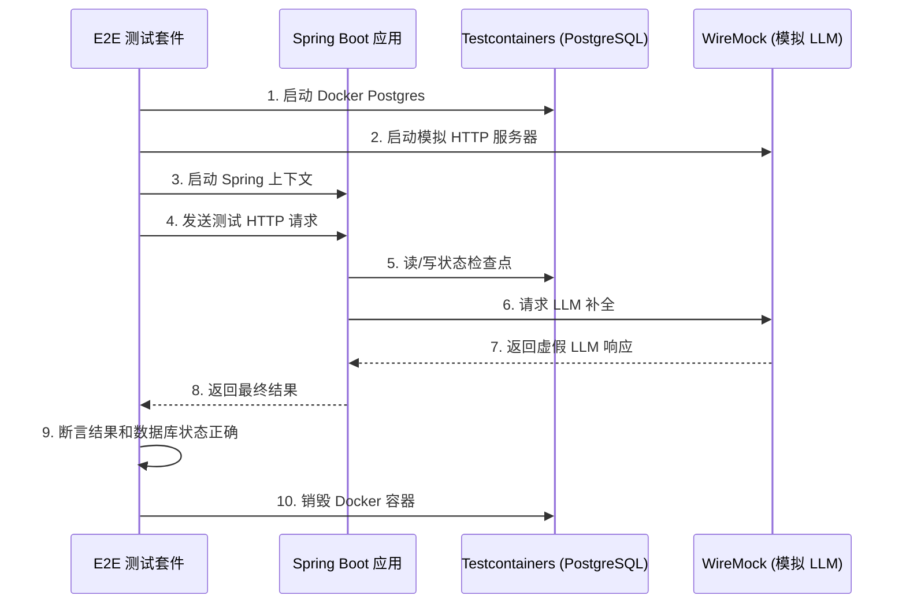

# TraceGraph :: End-to-End Tests (端到端测试)

## 📖 什么是端到端测试？
欢迎使用 `tracegraph-e2e` 模块！单元测试（比如检查 2+2=4）非常棒，但它们无法证明您的整个系统在部署到生产环境时能够正常工作。

端到端 (E2E) 测试会启动您的**整个应用程序**，包括真实的数据库和模拟的外部 API，并从头到尾测试整个流程。在此模块中，我们使用 **Testcontainers** 在 Docker 内部启动真正的 PostgreSQL 数据库，并使用 **WireMock** 来伪造来自 LLM 提供商的响应（这样我们在测试期间就不会花费真实的 API 调用费用）。

### 为什么这很重要？
- **防止“在我的机器上能跑”的错误:** 代码针对真实的数据库镜像执行，与生产环境完全一致。
- **验证数据库架构与迁移:** 确保数据库 Schema、约束和 SQL 查询绝对正确。
- **弹性与容错测试:** 验证应用程序是否能优雅地处理网络超时、API 错误和重试。
- **状态检查点验证:** 确认 TraceGraph 是否正确地将状态写入持久化内存存储并从中读取，从而实现状态的暂停和恢复。

## 🏗️ 测试架构

下图说明了 E2E 测试套件在执行测试之前如何编排环境。



## 🚀 如何运行 E2E 测试

由于这些测试需要 Docker 并且运行时间较长，因此在标准构建期间通常会跳过它们，需要显式运行。

### 先决条件
- **Docker** 必须已安装并在您的机器上运行（供 Testcontainers 使用）。
- Java 21+ 以及 Maven 3.9+。

### 运行测试
```bash
# 仅运行集成测试
mvn verify -pl tracegraph-e2e
```

## 💻 示例测试代码片段

以下是我们如何在测试中使用 Testcontainers 和 WireMock，在无需支付 OpenAI 费用的情况下验证完整的多轮 Agent 工作流程：

```java
@SpringBootTest
@Testcontainers
public class AgentFlowE2ETest {

    // 在 Docker 中启动真实的 Postgres 数据库
    @Container
    static PostgreSQLContainer<?> postgres = new PostgreSQLContainer<>("postgres:15-alpine");

    @DynamicPropertySource
    static void configureProperties(DynamicPropertyRegistry registry) {
        registry.add("spring.datasource.url", postgres::getJdbcUrl);
        registry.add("spring.datasource.username", postgres::getUsername);
        registry.add("spring.datasource.password", postgres::getPassword);
    }

    @Test
    public void testFullAgentFlow() {
        // 1. 设置 WireMock 以伪造 OpenAI 响应
        stubFor(post(urlEqualTo("/v1/chat/completions"))
            .willReturn(aResponse()
                .withStatus(200)
                .withHeader("Content-Type", "application/json")
                .withBody("{\"choices\": [{\"message\": {\"content\": \"Task completed successfully!\"}}]}")));

        // 2. 通过 REST 端点执行 TraceGraph 应用程序流程
        ResponseEntity<String> response = restTemplate.postForEntity("/api/agent/start", request, String.class);
        
        // 3. 断言 HTTP 状态
        assertEquals(HttpStatus.OK, response.getStatusCode());

        // 4. 断言数据库已正确保存状态
        int records = jdbcTemplate.queryForObject("SELECT COUNT(*) FROM tracegraph_memory", Integer.class);
        assertEquals(1, records);
    }
}
```

## 🛠️ 调试 E2E 失败

如果 E2E 测试失败，请按照以下步骤进行调试：
1. **检查 Docker 状态**: 确保 Docker Desktop / Daemon 正在运行。如果 Testcontainers 无法连接到 Docker 套接字，它将立即失败。
2. **查看 WireMock 日志**: 如果 LLM 节点抛出异常，请检查 WireMock 是否收到了请求。您可能格式化了错误的模拟 URL。
3. **数据库 Schema 问题**: 确保您的 Flyway/Liquibase 迁移脚本或 Hibernate auto-DDL 配置已正确应用到 Testcontainer。
