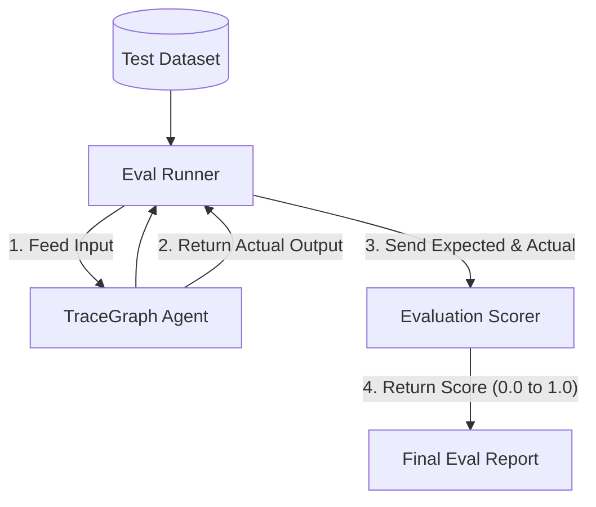

# TraceGraph :: Eval

## 📖 Introduction to Evaluation
Welcome to `tracegraph-eval`! When you write a normal program, you know exactly what the output should be for a given input (e.g. `2 + 2 = 4`). However, when you use Large Language Models (LLMs), the output is *non-deterministic* (it changes slightly every time) and often in natural language.

How do you know if your agent is actually getting better when you tweak its prompt or its graph logic? 

The `tracegraph-eval` module provides tools to scientifically **score** and **evaluate** your agents against a dataset of expected answers.

### Key Concepts
- **Dataset**: A list of `(Input, Expected Output)` pairs used as the ground truth.
- **Scorer (Judge)**: A function that compares the agent's actual output to the expected output. This could be an exact match, regex extraction, or even "LLM-as-a-Judge" (asking a larger model like GPT-4 to grade the output of a smaller model).
- **Evaluation Run**: The process of running your agent across the entire dataset automatically and generating an aggregate score (like 85% accuracy).

## 🏗️ Evaluation Workflow

The following diagram illustrates how the `EvalRunner` orchestrates the test dataset, your agent, and the scorer to produce a final report.



## 🚀 How to Use It

### 1. Creating a Scorer
You can create a custom scorer to define exactly how an output is graded. TraceGraph supports creating multiple scorers and aggregating their results.

```java
import site.tracegraph.eval.Scorer;

public class ExactMatchScorer implements Scorer {
    @Override
    public double score(String expected, String actual) {
        // Returns 1.0 if they match perfectly, 0.0 otherwise
        return expected.trim().equalsIgnoreCase(actual.trim()) ? 1.0 : 0.0;
    }
}
```

### 2. Running an Evaluation
Use the `EvalRunner` to execute your agent against a batch dataset and print the resulting accuracy.

```java
import site.tracegraph.eval.EvalRunner;
import site.tracegraph.eval.Dataset;
import site.tracegraph.eval.EvalReport;

public class MyAgentEvaluation {
    public static void main(String[] args) {
        TraceGraph myAgent = // ... initialize your tracegraph agent
        
        // Load your test questions and answers
        Dataset dataset = Dataset.fromCsv("src/test/resources/eval-data.csv");
        
        // Initialize runner with your agent and scorer
        EvalRunner runner = new EvalRunner(myAgent, new ExactMatchScorer());
        
        // Run the evaluation across the entire dataset!
        EvalReport report = runner.evaluate(dataset);
        
        System.out.println("=================================");
        System.out.println("Total Samples Evaluated: " + report.getTotalSamples());
        System.out.println("Agent Accuracy: " + (report.getAverageScore() * 100) + "%");
        System.out.println("Failed Examples: " + report.getFailedSamples().size());
        System.out.println("=================================");
    }
}
```

## 🧠 Advanced: LLM-as-a-Judge
For conversational agents, exact matching is usually too strict. Instead of `ExactMatchScorer`, you can configure an `LlmScorer`. This scorer passes the user's question, the expected output, and the actual output to an LLM, asking it to rate the actual output's correctness on a scale of 1 to 5.

## 🎯 0.3.0 Features

### Text Metrics — BLEU / ROUGE / F1

Whitespace-tokenized scorers for partial-overlap quality (NLG output, where exact match is too strict). Each takes a `passThreshold` and implements the standard `Metric<S>` SAM.

```java
EvalSuite<MyState> suite = EvalSuite.<MyState>builder()
        .metric(new BleuMetric<>(MyState::output, MyState::expected, 0.4))
        .metric(new RougeMetric<>(MyState::output, MyState::expected, 0.5))
        .metric(new TokenF1Metric<>(MyState::output, MyState::expected, 0.6))
        .addCases(cases)
        .build();
```

### CI Gating — `assertPassed` + `failFast` / `minPassRate`

Fail the build on regressions without writing custom assertion code.

```java
EvalSuite<S> suite = EvalSuite.<S>builder()
        .failFast(true)
        .minPassRate(0.95)
        .metric(metric)
        .addCases(cases)
        .build();
List<EvalResult<S>> results = suite.run(graph);
EvalSuite.assertPassed(results); // throws EvalAssertionException on regression
```

### Baseline Snapshots — Run-Over-Run Regression Detection

```java
EvalBaselineStore store = new EvalBaselineStore(Path.of("baselines/main.json"));
EvalBaseline baseline = store.load();
EvalReport.toComparisonMarkdown(currentResults, baseline); // → regression/improvement arrows
store.save(EvalBaseline.from(currentResults)); // promote on green
```

### Dataset Loaders — JSONL / CSV

Version-controllable datasets instead of hand-written Java cases.

```java
List<EvalCase<MyState>> cases = EvalCaseLoader.fromJsonl(
        Path.of("dataset.jsonl"),
        json -> new MyState(json.get("input").asText(), json.get("expected").asText()));

List<EvalCase<MyState>> csvCases = EvalCaseLoader.fromCsv(
        Path.of("dataset.csv"),
        row -> new MyState(row.get("input"), row.get("expected")));
```

### Parallel Execution — Virtual Threads

```java
List<EvalResult<S>> results = suite.runParallel(graph,
        Executors.newVirtualThreadPerTaskExecutor());
```

### Summary Stats — Pass Rate, Means, Latency Percentiles

```java
EvalSummary summary = EvalSummary.from(results);
// summary.passRate, summary.metricMeans, summary.latencyP50/P95/P99
String md = EvalReport.toSummaryMarkdown(results);
```

### Conditional Metric Skipping

Override `Metric.canScore(EvalCase<S>)` (defaults to `true`) so metrics gracefully no-op on cases they can't grade (e.g., `LlmJudgeMetric` on cases without `expected`). Skipped scores render as `—` in reports.

### Per-Step Golden Trace Assertions

Beyond final-state equality, grade intermediate behaviour (tool args, retrieved docs, retry counts) on captured `ExecutionTrace<S>`.

```java
EvalRunner<S> runner = EvalRunner.<S>builder()
        .graph(graph)
        .traceStore(traceStore)
        .assertion("retrieve", step ->
                step.after().docs().size() < 3
                        ? Optional.of("expected ≥3 docs, got " + step.after().docs().size())
                        : Optional.empty())
        .build();
```

